# "IronClad" Visual Search System Report

## Table of Contents

- [System Design](#system-design)
  - [1. Extraction Service](#1-extraction-service)
  - [2. Retrieval Service](#2-retrieval-service)
  - [3. Interface Service](#3-interface-service)
- [Metrics Definition](#metrics-definition)
  - [Offline Metrics](#offline-metrics)
  - [Online Metrics](#online-metrics)
- [Analysis 1 (Extraction): Alpha Parameter in Triplet Loss](#analysis-1-extraction-alpha-parameter-in-triplet-loss)
  - [Objective, Motivation, and Methods](#objective-motivation-and-methods)
  - [Justification of Design Decisions with Evidence](#justification-of-design-decisions-with-evidence)
  - [Documentation and Clarity](#documentation-and-clarity)
- [Analysis 2 (Extraction): Number of Images per Employee](#analysis-2-extraction-number-of-images-per-employee)
  - [Objective, Motivation, and Methods](#objective-motivation-and-methods-1)
  - [Justification of Design Decisions with Evidence](#justification-of-design-decisions-with-evidence-1)
  - [Documentation and Clarity](#documentation-and-clarity-1)
- [Analysis 3 (Extraction): Preprocessing Techniques (Noise, Blur, and Brightness)](#analysis-3-extraction-preprocessing-techniques-noise-blur-and-brightness)
  - [Objective, Motivation, and Methods](#objective-motivation-and-methods-2)
  - [Justification of Design Decisions with Evidence](#justification-of-design-decisions-with-evidence-2)
  - [Documentation and Clarity](#documentation-and-clarity-2)
- [Analysis 4 (Retrieval): System Parameter k for k-Nearest Neighbors Search](#analysis-4-retrieval-system-parameter-k-for-k-nearest-neighbors-search)
  - [Objective, Motivation, and Methods](#objective-motivation-and-methods-3)
  - [Justification of Design Decisions with Evidence](#justification-of-design-decisions-with-evidence-3)
  - [Documentation and Clarity](#documentation-and-clarity-3)
- [Analysis 5 (Retrieval): Indexing Type for k-Nearest Neighbors Search](#analysis-5-retrieval-indexing-type-for-k-nearest-neighbors-search)
  - [Objective, Motivation, and Methods](#objective-motivation-and-methods-4)
  - [Justification of Design Decisions with Evidence](#justification-of-design-decisions-with-evidence-4)
  - [Documentation and Clarity](#documentation-and-clarity-4)

# System Design

The system is divided into three core services: the Extraction Service, the Retrieval Service, and the Interface Service. Each service is independently designed to perform a specific function within the overall visual search system pipeline.

## 1. Extraction Service

The Extraction Service is responsible for preprocessing and extracting embeddings from input images. This service is composed of two main components: the Processing Module and the Embedding Module. The Processing Module prepares the input images by resizing them to 160x160 pixels and applying normalization to match the requirements of the embedding model. It utilizes torchvision's transforms to ensure that all images are resized, converted to tensors, and normalized appropriately. This consistent processing step is essential for obtaining effective embeddings and accurate similarity measurements. The Embedding Module takes the processed images and generates feature vectors using the InceptionResnetV1 model from facenet-pytorch, which can be pre-trained on either the CASIA-WebFace or VGGFace2 datasets. The choice of pre-trained model is configurable via the pretrained parameter, allowing the system to select the model that best suits the deployment environment and requirements. These models produce fixed-size vectors for each image that capture the essential features of the face, enabling efficient and meaningful comparisons between images. The output embeddings serve as compact representations of the images that can be used by the Retrieval Service for similarity search. Together, the Processing and Embedding Modules ensure that images are processed into a suitable format for subsequent analysis, providing a reliable foundation for the system's retrieval capabilities.

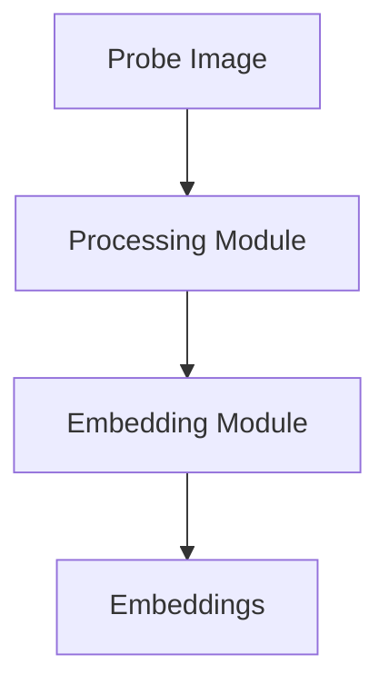

## 2. Retrieval Service

The Retrieval Service is responsible for indexing the embeddings generated from images and performing searches to find the most similar images given a query or "probe" image. This service uses FAISS (Facebook AI Similarity Search) to build an efficient index capable of scaling to billions of images, making it suitable for large-scale retrieval scenarios. The FaissIndex module is used to create an appropriate index, supporting multiple types such as Flat, IVF, and HNSW, based on system configuration. The FaissSearch module utilizes the index to perform nearest neighbor searches, finding the k-nearest neighbors of a probe embedding using different distance metrics like Euclidean or cosine similarity. The service provides a balance between scalability and efficiency, allowing for either exhaustive or approximate searches, and includes the capability to add new embeddings incrementally. By combining efficient indexing and flexible search options, the Retrieval Service ensures that similarity searches are both fast and scalable, providing meaningful results for the input query.

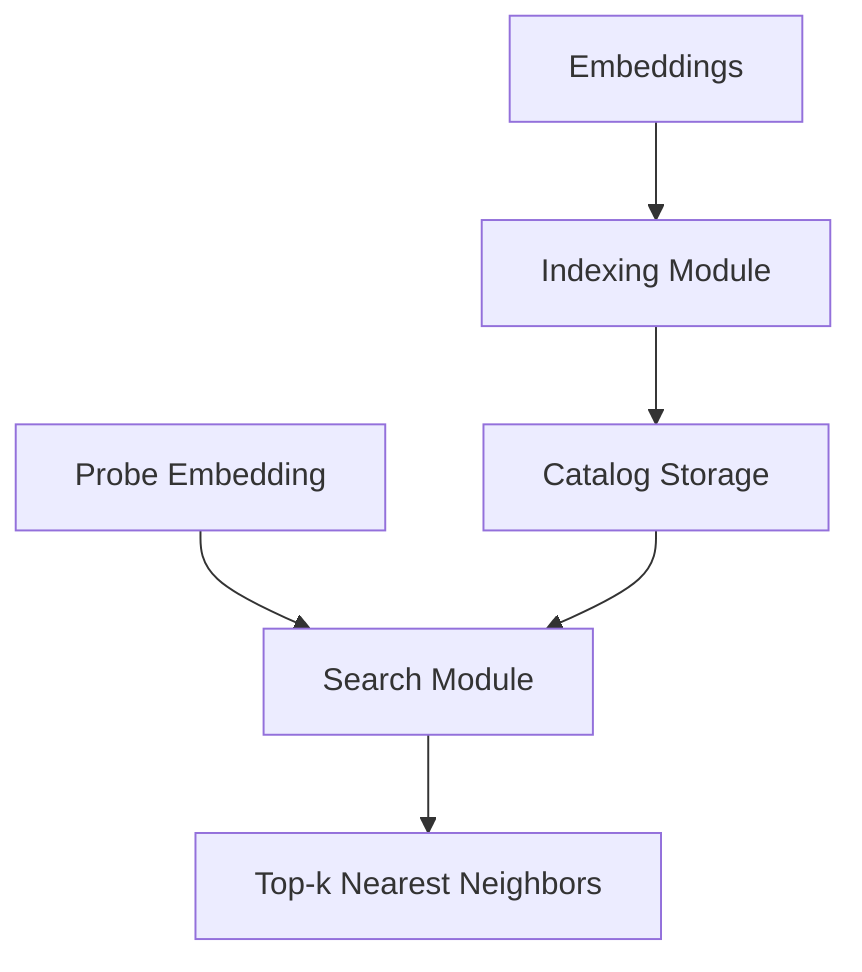

## 3. Interface Service

The Interface Service provides REST API endpoints through Flask, allowing users to interact with the system for adding new identities (/add), identifying images from the gallery (/identify), and accessing the history of search queries (/history). These endpoints together form the interface for all interactions with the image retrieval system. The /add endpoint allows authorized users to incrementally add new images into the gallery, which in turn enhances the retrieval capability of the /identify endpoint. When a user submits an image for identification, the /identify endpoint retrieves the top-k matching images based on the FAISS search through indexed embeddings, ensuring that the system can effectively identify similar entries. The history of all queries is maintained for transparency and auditability, accessible through the /history endpoint. Error handling and logging are used throughout these endpoints to monitor system activity and to debug issues as they arise. The interface is designed to provide simple yet effective user interaction while scaling to support many users and images, relying on a modular backend to distribute the load and improve maintainability.

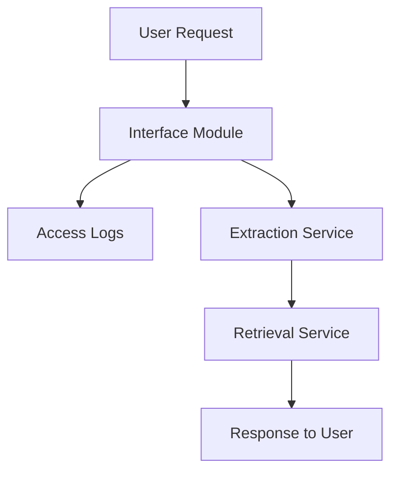

# Metrics Definition

## Offline Metrics

The offline metrics used to evaluate the system focus on understanding its performance before deployment, ensuring robustness, and tuning its parameters. One key offline metric is Average Precision at k (AP@k), which measures how well the system ranks the most similar images within the top k retrieved results. AP@k is calculated by evaluating the precision across different recall levels up to k, offering an insight into how accurately relevant images are ranked at each position. Another valuable metric is Mean Average Precision at k (MAP@k), which aggregates the AP@k across all probe images, providing a holistic measure of the system's ability to consistently identify similar images in various queries. These metrics are crucial in assessing the system's retrieval quality during testing, validation, and model training stages, allowing us to determine optimal configurations and ensure that the system meets accuracy standards before it is exposed to real users. They also allow us to compare different configurations of the retrieval pipeline (e.g., various types of FAISS indexes) and select the one with the best performance.

## Online Metrics

The online metrics are used to monitor the system's health, usability, and user experience in real-time once deployed. Key metrics include Response Time, Success Rate, and User Feedback. Response Time measures the latency of each endpoint request, such as /identify or /add, and helps determine if users are experiencing delays during interactions, directly impacting user satisfaction. Monitoring Response Time allows the team to identify potential bottlenecks, particularly as more images are added to the gallery. Success Rate captures the percentage of successful image identifications and additions versus failures due to issues like invalid input files or system errors. A high Success Rate ensures a stable user experience, while low rates indicate potential points of failure that require attention. User Feedback, collected through direct user ratings or comments, helps capture qualitative information regarding the effectiveness of retrievals. Real-time tracking of metrics like Response Time and Success Rate enables proactive response to issues, such as increasing latency or failed requests. Alerts can be configured for threshold breaches, allowing for timely intervention, which ultimately helps maintain system reliability, improve performance, and enhance user satisfaction.

# Analysis 1 (Extraction): Alpha Parameter in Triplet Loss

## Objective, Motivation, and Methods
The alpha parameter in the Triplet Loss function controls the margin by which the positive distance must be smaller than the negative distance. This means that the model must ensure that similar images (anchor and positive) are closer in the embedding space compared to dissimilar images (anchor and negative), with a separation greater than or equal to alpha. The objective of analyzing the alpha parameter is to find a value that ensures proper separation between different identities while also allowing embeddings of the same identity to remain close, ultimately improving recognition accuracy.

If the alpha value is too small, the model may fail to sufficiently separate embeddings of different classes, leading to misidentification issues. Conversely, if alpha is too large, embeddings could be over-separated, which may harm the generalization ability of the model and reduce recognition accuracy, as it may fail to tolerate small intra-class variations. Finding an optimal balance for alpha is therefore crucial for maintaining accuracy in the embedding space.

To analyze the impact of different alpha values, I experimented with values of 0.1, 0.3, 0.5, and 0.7. These values were chosen to represent a range from low to moderately high margins. The value 0.1 was selected to observe the behavior of the model with a very small margin, ensuring minimal separation between embeddings and testing whether this would lead to inadequate class separation. The value 0.3 was chosen as an intermediate step to see if a slightly larger margin could provide a balance between separation and generalization. The value 0.5 represents a moderate margin, which is often a reasonable choice in embedding-based learning, providing sufficient separation without causing over-segmentation of the embedding space. Lastly, the value 0.7 was chosen to explore the effects of a larger margin, aiming to evaluate if the increased separation could result in overfitting or hinder the model's generalization capabilities. By experimenting with these values, I aimed to cover a spectrum of possible outcomes, ranging from minimal to moderate levels of separation, to understand the trade-offs involved.

I trained both the Casia-Webface and VGGFace2 models with each value of alpha and plotted Triplet Loss and Accuracy versus alpha. The objective was to observe the effects of the alpha parameter on the training loss and the accuracy of distinguishing between different identities.

## Justification of Design Decisions with Evidence

### Trade-offs Analysis
The analysis revealed several key insights into the effect of the alpha parameter on both models, as shown in the graphs below:

**Triplet Loss vs. Alpha**: The triplet loss increased as the alpha value increased for both Casia and VGGFace2. However, the increase was more pronounced for Casia, indicating that it was more sensitive to changes in alpha. For example, as the alpha value increased from 0.1 to 0.7, the triplet loss for Casia grew significantly, from around 0.1 to almost 0.6. This suggests that higher alpha values cause more difficulty in maintaining a proper separation margin for the Casia embeddings, resulting in a reduced ability to distinguish between identities. On the other hand, VGGFace2 consistently achieved lower triplet losses, indicating better discrimination between anchor-positive and anchor-negative pairs across all alpha values. In contrast to Casia, the triplet loss for VGGFace2 increased only slightly, rising from right above 0.0 to approximately 0.3 over the same range of alpha values. This behavior demonstrates the superior capability of VGGFace2 to handle higher margins, likely due to the richer and more diverse dataset used for pretraining. For instance, at alpha = 0.5, the triplet loss for Casia was near 0.4, whereas for VGGFace2 it was only around 0.1. This significant difference shows that VGGFace2 embeddings are more discriminative, resulting in a more stable triplet loss compared to Casia. I chose to analyze triplet loss specifically because it serves as a direct measure of how well the embeddings of similar identities are being brought closer together while dissimilar ones are being pushed apart.

**Accuracy vs. Alpha**: For VGGFace2, the accuracy remained relatively stable across different alpha values, indicating that the model was less sensitive to the specific choice of alpha. As shown in the graph, the accuracy for VGGFace2 fluctuated only slightly around 0.95 across all alpha values, demonstrating its robustness. In contrast, Casia showed a slight fluctuation in accuracy with varying alpha values, although it consistently underperformed compared to VGGFace2. The accuracy for Casia started around 0.75 for alpha = 0.1 and remained in a similar range with minor dips. This indicates that Casia struggled to achieve comparable levels of identification accuracy, which may be due to its more limited training dataset. For instance, at alpha = 0.3, VGGFace2 achieved an accuracy of around 0.95, while Casia only reached 0.75. The stability of VGGFace2 across different alpha values suggests a stronger generalization capability, which is crucial for ensuring high recognition accuracy in diverse settings. I focused on accuracy as it is the ultimate metric that measures how effectively the model can correctly identify and differentiate between identities, which directly impacts the system's reliability in real-world scenarios.

### Impact on System Configuration
The choice of the alpha parameter directly affects the quality of the learned embeddings and, subsequently, the system's identification accuracy. Given the results, I concluded that:

- For VGGFace2, a lower alpha value (alpha = 0.1 to 0.3) is recommended to maintain a low triplet loss and high accuracy. The stability across alpha values implies that this model is suitable for environments requiring high accuracy with minimal parameter tuning.

- For Casia, alpha values of 0.1 or 0.3 are recommended, as these values resulted in a lower triplet loss. Casia's embeddings are more sensitive to alpha changes, which may require additional hyperparameter tuning or preprocessing steps to achieve similar performance to VGGFace2.

The evidence shows that the VGGFace2 model has a stronger ability to generalize and effectively separate identities. Hence, for a system that demands higher accuracy and robustness, VGGFace2 is a better choice, particularly when selecting an optimal alpha value to balance between separation and generalization. I chose these recommendations based on the observed trends in both triplet loss and accuracy, aiming for a balance between the embedding quality and the model's ability to generalize to unseen data.

### Balancing Cost and Performance
While VGGFace2 exhibits better performance, it might come at a computational cost due to its higher complexity and need for more preprocessing. On the other hand, Casia is a simpler model but might require more careful selection of hyperparameters, such as alpha, to reach acceptable performance levels. Depending on the deployment environment, the system could either use VGGFace2 with lower alpha values to ensure high accuracy or Casia for a more computationally efficient but potentially less robust solution. I considered the cost and performance trade-offs because resource availability, such as computational power and memory, can vary significantly across different deployment scenarios, and it is important to provide a solution that can adapt to those constraints.

### Overall System Design Impact
The findings from this analysis have significant implications for IronClad's employee access control system, particularly as the company continues to expand rapidly across multiple facilities with diverse operational requirements. The choice of the alpha parameter in the triplet loss function directly influences the system's ability to accurately and efficiently recognize employees, which is critical for maintaining security and operational efficiency.

For IronClad's access control system, deploying the VGGFace2 model with a lower alpha value (between 0.1 and 0.3) is advisable. The VGGFace2 model's robustness to changes in alpha and its consistently high accuracy across different alpha values make it well-suited for environments where high recognition accuracy is essential. This is particularly important in facilities with stringent security requirements, where misidentification could have serious consequences. By selecting an optimal alpha value within this range, the system can maintain low triplet loss and high accuracy, ensuring reliable performance even as the employee database grows.

However, it is important to consider the computational resources required to support the VGGFace2 model. Its higher complexity may necessitate more powerful hardware and efficient preprocessing pipelines to handle the increased computational load. In IronClad's rapidly scaling environment, this could impact the cost and scalability of the system. To mitigate these challenges, IronClad can invest in hardware acceleration solutions, such as GPUs or dedicated inference accelerators, to maintain performance without excessive cost increases.

Alternatively, in environments where computational resources are limited or where the system needs to be deployed quickly and cost-effectively, the Casia model could be utilized with careful selection of the alpha parameter. Using alpha values of 0.1 or 0.3, the Casia model can achieve acceptable performance levels with lower computational demands. This approach may be suitable for smaller facilities or areas where security requirements are less stringent, and slight reductions in recognition accuracy are acceptable.

By adopting a hybrid approach, IronClad can tailor the access control system to the specific needs of each facility. High-security locations can benefit from the VGGFace2 model's superior performance, while other sites can leverage the Casia model's efficiency. This strategy allows IronClad to optimize both cost and performance across its operations, ensuring that resources are allocated effectively according to the criticality of each environment.

Furthermore, the sensitivity of the Casia model to changes in alpha highlights the importance of ongoing system monitoring and parameter tuning. IronClad should implement regular performance evaluations to ensure that the selected alpha values continue to provide optimal results as the system scales and operational conditions evolve. This proactive approach can help identify any degradation in performance early, allowing for timely adjustments to maintain system reliability.

In terms of employee experience, ensuring high recognition accuracy is essential for seamless access control. Misidentifications can lead to delays and frustration, negatively impacting employee satisfaction and productivity. By carefully selecting the appropriate model and alpha parameter, IronClad can minimize such issues, providing a smooth and efficient entry process for employees.

From a security perspective, the choice of model and alpha parameter affects the system's ability to prevent unauthorized access. The VGGFace2 model's higher discriminative power reduces the likelihood of false acceptances, enhancing overall security. In critical areas, this can be a decisive factor in safeguarding sensitive assets and information.

In conclusion, the analysis underscores the importance of selecting the appropriate alpha parameter and model based on the specific operational requirements and resource constraints of each facility. By leveraging the strengths of both the VGGFace2 and Casia models and carefully tuning the alpha parameter, IronClad can deploy an access control system that balances accuracy, efficiency, and scalability, supporting the company's rapid growth while maintaining high security standards.

## Documentation and Clarity
The analysis is visually represented in the following plots, which show the relationship between alpha and the system metrics (triplet loss and accuracy). These visual aids help demonstrate the trade-offs between embedding separation and generalization for different alpha values and different models. The visual representations are crucial for understanding the nuanced impact of alpha on the models and for making informed decisions regarding model tuning. The accompanying code for this analysis can be found in `system_analysis.ipynb`.

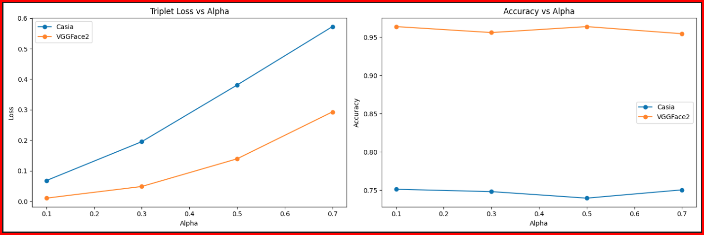

The graph on the left shows the Triplet Loss vs Alpha for both models, while the graph on the right shows Accuracy vs Alpha. The blue line represents the Casia model, and the orange line represents the VGGFace2 model. The evidence presented in these visual aids helps in making informed decisions on the appropriate alpha value for each model. The code that produces these visualizations is located in `system_analysis.ipynb`.

# Analysis 2 (Extraction): Number of Images per Employee

## Objective, Motivation, and Methods
The number of images per employee in the gallery significantly affects the quality of the extracted embeddings and, consequently, the system's recognition performance. The core objective of this analysis is to determine the optimal number of images per employee to ensure both high accuracy and efficient system operation. Capturing variability in appearance due to different lighting conditions, poses, facial expressions, and other environmental factors requires a diverse set of images per employee. However, there is also a point beyond which adding more images leads to redundancy and diminishing returns in performance. Therefore, it is crucial to determine the right balance to capture this variability while avoiding unnecessary computational costs.

If the number of images per employee is too small, the model may not adequately capture the various visual nuances of each person, leading to poor generalization. This would manifest as lower recognition accuracy, especially in real-world conditions where the input image may differ significantly from those in the gallery. Conversely, if there are too many images per employee, it could result in redundancy, increased computational costs, and longer training times, which may not lead to significant gains in performance. Hence, finding the optimal number of images for each employee is critical to ensure the quality of embeddings, good recognition performance, and efficient resource usage.

To conduct this analysis, I trained models with different numbers of images per employee, specifically evaluating 1 to 10 images per employee. The metrics used to evaluate system performance were Average Precision at k (AP@k) and Mean Average Precision (MAP), with a specific focus on understanding how MAP varied with the number of images. This approach helped identify the point of diminishing returns, where adding more images per employee no longer significantly improved the recognition performance.

## Justification of Design Decisions with Evidence

### Trade-offs Analysis
The results of this analysis, illustrated in the graph below, provided insights into the relationship between the number of images per employee and the system's recognition performance for both the Casia and VGGFace2 models.

**MAP vs. Number of Images per Employee**: The graph shows the Mean Average Precision (MAP) as a function of the number of images per employee. For both Casia and VGGFace2, the MAP increases with the number of images, but the rate of increase diminishes as the number of images per employee reaches higher values. This behavior highlights the concept of diminishing returns, where increasing the number of images beyond a certain threshold results in negligible performance gains.

- **VGGFace2 Model**: The VGGFace2 model exhibits a strong increase in MAP when the number of images per employee is increased from 1 to 4. Specifically, the MAP jumps from 0.0 with 1 image to around 0.7 with 4 images. Beyond 4 images, the performance gain becomes less significant, and after around 6 images, the MAP curve starts to plateau at around 0.85. This implies that for VGGFace2, having 4 to 6 images per employee is sufficient to achieve near-optimal recognition performance, and adding more images may not be necessary from a cost-benefit perspective.

- **Casia Model**: The Casia model shows a similar trend but achieves a lower MAP overall compared to VGGFace2. The MAP increases steadily with the number of images, from 0.0 with 1 image to around 0.3 with 6 images, after which the curve begins to plateau. The lower overall MAP for Casia suggests that the model struggles more with generalization, likely due to differences in training dataset diversity and model architecture compared to VGGFace2. However, like VGGFace2, Casia reaches a point of diminishing returns beyond which adding more images does not significantly improve performance.

These findings indicate that the VGGFace2 model is better at extracting discriminative features due to a combination of factors, including the more diverse training dataset it was trained on and the more complex network architecture. A diverse dataset, such as VGGFace2, helps the model learn to generalize well across different identities and environmental variations. The model's deeper architecture also enables it to capture more nuanced features, leading to more discriminative embeddings. As a result, the VGGFace2 model requires fewer images per employee to achieve high recognition accuracy compared to Casia. For Casia, the results suggest that more images may be required to achieve comparable results, but the overall accuracy still lags behind VGGFace2 due to its simpler architecture and less diverse training dataset.

### Impact on System Configuration
The number of images per employee impacts both the quality of embeddings and the efficiency of the system. Based on the results, I can conclude the following recommendations for system configuration:

- For VGGFace2, 4 to 6 images per employee are recommended to achieve high MAP while avoiding the computational burden of processing redundant images. This range captures sufficient variability in appearance while being computationally efficient.
- For Casia, at least 6 images per employee are recommended to achieve reasonable recognition performance, although the MAP remains lower compared to VGGFace2. Casia may require more extensive tuning or a greater number of images to achieve acceptable performance.

These recommendations help balance between achieving high recognition accuracy and minimizing computational cost. The choice of the number of images per employee is therefore a trade-off between system performance and resource efficiency. In deployment, VGGFace2 can achieve optimal accuracy with fewer images, making it preferable for environments where computational resources are a concern, while Casia may need more images to compensate for its lower generalization capability.

### Balancing Cost and Performance
The results of the analysis suggest that using more than 6 images per employee provides minimal benefit in terms of MAP for both models. This indicates a point of diminishing returns, where additional images do not contribute significantly to improving recognition performance. From a cost-performance perspective, increasing the number of images per employee beyond this threshold leads to increased storage, computational costs, and longer training times, with minimal gains in accuracy.

For environments with limited computational resources, using VGGFace2 with 4 to 6 images per employee is ideal, as it ensures high accuracy with efficient use of resources. In settings with higher computational power, VGGFace2 remains the preferred choice due to its superior recognition performance and generalization capabilities. Casia may be considered in scenarios where lower data availability or faster inference times are required, but it generally underperforms compared to VGGFace2. Depending on the specific use case and resource availability, these guidelines can be adapted to achieve an effective balance between accuracy and efficiency.

### Overall System Design Impact
The findings from this analysis have significant implications for IronClad's rapidly expanding employee access control system, especially as the company hires more employees across numerous facilities. Determining the optimal number of images per employee is crucial for balancing recognition accuracy, system scalability, and operational efficiency.

As IronClad's employee database grows, the storage and computational requirements for managing and processing facial images become increasingly significant. By recommending 4 to 6 images per employee for the VGGFace2 model, the system can achieve high recognition accuracy while minimizing the storage space needed for image data. This efficiency is particularly important when deploying the system across multiple facilities, where hardware resources and storage capacities may vary.

Using fewer images per employee also reduces the computational load during both the enrollment and recognition phases. During enrollment, processing fewer images speeds up the creation of facial embeddings for new employees, facilitating a smoother onboarding process. During recognition, the system can match probe images against a smaller set of embeddings per employee, leading to faster authentication times and reduced latency. This efficiency is vital for maintaining a seamless user experience, preventing delays at access points that could hinder employee productivity.

For IronClad, adopting the VGGFace2 model with 4 to 6 images per employee ensures that the system remains scalable as the workforce expands. The model's superior generalization capabilities mean that it can maintain high recognition accuracy even with a limited number of images per individual. This attribute is especially beneficial in a rapidly growing organization, as it reduces the overhead associated with collecting and managing large image datasets for each new employee.

In contrast, the Casia model requires at least 6 images per employee to achieve reasonable performance, and even then, its MAP is lower compared to VGGFace2. This implies that relying on Casia would necessitate collecting more images per employee, increasing storage and computational demands without achieving the same level of accuracy. For IronClad, which prioritizes both security and efficiency, the VGGFace2 model offers a more practical solution.

Moreover, limiting the number of images per employee simplifies the data management process. It reduces the burden on administrative staff responsible for collecting and maintaining employee images, ensuring that the system can be updated and scaled with minimal administrative overhead. This simplicity contributes to faster deployment of the access control system in new facilities, supporting IronClad's rapid expansion.

From a cost perspective, optimizing the number of images per employee directly impacts operational expenses. Reduced storage requirements lower the costs associated with data centers and cloud storage solutions. Decreased computational demands mean that existing hardware can handle more users without upgrades, leading to savings on infrastructure investments. These cost efficiencies are essential for IronClad as it seeks to expand without incurring disproportionate increases in operational costs.

In terms of employee experience, a system that operates efficiently with fewer images per employee ensures quick and reliable access control. Employees are less likely to experience delays during authentication, enhancing their overall satisfaction and productivity. Additionally, minimizing the number of images required during enrollment simplifies the onboarding process, making it less burdensome for new hires.

Furthermore, collecting fewer images per employee addresses potential privacy concerns. Employees may be more comfortable providing a limited number of images, knowing that the company is minimizing the amount of personal data collected. This approach aligns with best practices in data privacy and can improve trust between employees and the organization.

Finally, by adopting the VGGFace2 model with an optimized number of images per employee, IronClad positions itself to take advantage of future advancements in facial recognition technology. The system's efficiency and scalability ensure that it can accommodate updates or enhancements without significant reconfiguration, providing long-term value and adaptability.

In conclusion, the analysis supports the decision to use the VGGFace2 model with 4 to 6 images per employee in IronClad's access control system. This configuration balances high recognition accuracy with operational efficiency, supporting the company's rapid growth while maintaining security and user satisfaction. By carefully considering the trade-offs between the number of images per employee and system performance, IronClad can deploy a robust and scalable access control solution that meets its current and future needs.

## Documentation and Clarity
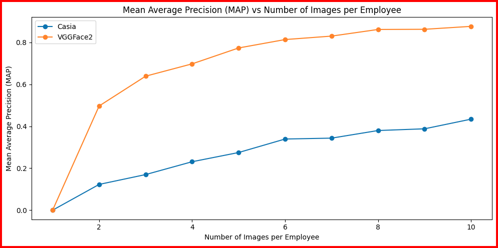

The analysis is visualized in the graph above, which shows the Mean Average Precision (MAP) as a function of the number of images per employee for both models. The blue line represents the Casia model, and the orange line represents the VGGFace2 model. The graph highlights how MAP increases with the number of images and identifies the point of diminishing returns for each model, helping to understand the impact of image count on system performance. This visual aid provides a solid basis for making informed decisions regarding optimal configurations, enhancing the documentation and clarity of the analysis. The code for generating these visualizations can be found in `system_analysis.ipynb`.

# Analysis 3 (Extraction): Preprocessing Techniques (Noise, Blur, and Brightness)

## Objective, Motivation, and Methods

The objective of this analysis is to understand the impact of different preprocessing techniques, specifically Gaussian noise, Gaussian blur, and brightness adjustments, on the resilience of embeddings generated by the Casia and VGGFace2 models. Preprocessing techniques are critical for ensuring that face recognition systems perform consistently despite real-world variability, such as changes in lighting, focus, and noise levels in input images. The choice of preprocessing directly affects the quality of embeddings produced by the models and subsequently influences the system's recognition performance.

Variability in image quality is a common challenge for face recognition systems in real-world deployments, especially when dealing with conditions like poor lighting, motion blur, or sensor noise. The goal is to determine which of the two models, Casia or VGGFace2, better withstands these image-quality transformations, and what preprocessing methods are necessary to maintain high recognition accuracy in different scenarios.

To assess this, I applied different levels of Gaussian noise, Gaussian blur, and brightness adjustments to images and observed their impact on cosine similarity scores of the generated embeddings. I plotted the mean similarity scores against the noise transformations to analyze how each model performed under these changes. This allowed me to quantify each model's robustness to variability in image quality and determine which model is better suited for deployment under different environmental conditions.

## Justification of Design Decisions with Evidence

### Trade-offs Analysis

The analysis revealed key insights into the performance trade-offs between the two models when subjected to various noise transformations:

**Gaussian Noise**:

The graph depicting model robustness to Gaussian noise shows that initially, the VGGFace2 model had a higher similarity score compared to Casia. Specifically, at a noise standard deviation of 0.05, VGGFace2 achieved a mean similarity score above 0.9, while Casia started slightly lower. However, as the noise level increased, the performance of VGG deteriorated more sharply. By a noise level of 0.20, VGG's mean similarity score dropped to around 0.3, whereas Casia's score was still near 0.5. The Casia model exhibited a more gradual decline, showing better robustness to increasing levels of Gaussian noise. The difference in the decline rates indicates that VGGFace2, while highly discriminative, may be more vulnerable to random noise compared to Casia.

**System Design Impact**: If the system is to be deployed in environments where the input images may suffer from random noise, such as outdoor locations with varying weather conditions, the Casia model is a better candidate due to its greater robustness to noise. However, if VGG is preferred due to its better discrimination capabilities, incorporating noise reduction techniques in preprocessing becomes essential to maintain its performance.

**Gaussian Blur**:

The impact of Gaussian blur was evaluated by increasing the blur kernel size, which simulates the effect of out-of-focus images. At a kernel size of 3.0, both VGGFace2 and Casia maintained similarity scores close to 0.998. However, as the kernel size increased to 7.0, the similarity score of VGG dropped below 0.986, whereas Casia still maintained a score around 0.988. The similarity scores for both models decreased with increasing kernel size, but the decline was more pronounced for VGG compared to Casia. Casia’s embeddings showed greater resilience to blurring, with a slower decline in similarity scores.

**System Design Impact**: In scenarios where images may be affected by motion blur or variable focus, such as employees quickly moving through checkpoints, Casia offers more stable recognition performance. If VGG is used in these environments, integrating deblurring algorithms in preprocessing could help mitigate the performance drop and ensure the model’s effective functioning.

**Brightness Adjustments**:

The analysis of brightness adjustments revealed that the VGG model showed a significant drop in similarity scores when the brightness factor deviated from the optimal level. When the brightness factor was 0.5 or 1.5, VGG's mean similarity score plummeted to around 0.5 and 0.2, respectively, while at the optimal brightness factor of 1.0, the score peaked above 0.9, almost reaching 1.0. In contrast, the Casia model demonstrated a more controlled decline, especially when brightness was decreased. Casia started with a mean similarity score of approximately 0.8 at a brightness factor of 0.5, peaked at 1.0, and maintained a score around 0.75 at 1.5. This shows that Casia adapts better to different illumination levels. Both models struggled more with brighter environments (brightness factor of 1.5) compared to dimmer environments (brightness factor of 0.5), indicating a greater sensitivity to overexposure.

**System Design Impact**: For environments with highly variable lighting, such as outdoor facilities with changing natural light or dimly lit indoor areas, Casia would provide more consistent performance. If VGG is used, implementing brightness normalization techniques during preprocessing would be necessary to ensure the system remains accurate despite fluctuations in lighting conditions.

### Balancing Cost and Performance
The results of this analysis clearly indicate the trade-offs between the two models when subjected to noise transformations. The VGGFace2 model is excellent at producing distinct embeddings for individuals but shows higher sensitivity to noise, blur, and brightness changes. This sensitivity necessitates additional preprocessing to maintain optimal performance. Casia, on the other hand, while generally less discriminative, exhibits greater resilience to changes in input quality, making it better suited for environments with challenging image quality.

From a cost-performance perspective, if computational resources are available to support sophisticated preprocessing, such as noise reduction, deblurring, brightness normalization, VGGFace2 would be the preferred choice due to its superior inter-class separation and scalability. However, in resource-constrained environments or situations where image quality cannot be guaranteed, Casia would be more suitable as it is inherently more robust without extensive preprocessing.

### Overall System Design Impact
The findings from the analysis provide valuable guidance for configuring IronClad’s employee access control system, particularly as the company expands rapidly across multiple facilities with diverse environmental conditions. In environments with uncontrolled image quality, such as outdoor settings exposed to varying weather conditions, lighting changes, and potential camera noise, deploying the Casia model would be advantageous due to its greater robustness to Gaussian noise, blur, and brightness adjustments. This inherent resilience reduces the need for complex preprocessing pipelines, thereby simplifying system deployment and maintenance in these settings.

For settings where high accuracy is critical and image quality can be controlled, such as secure indoor facilities with consistent lighting and minimal environmental interference, the VGGFace2 model is recommended. In these controlled environments, the system can implement necessary preprocessing techniques to counteract VGGFace2's sensitivity to noise and lighting variations, ensuring optimal performance. The higher discriminative power of VGGFace2 enhances security by reducing false acceptances and improving the system's ability to distinguish between employees, which is crucial in high-security areas.

Considering IronClad's need to deploy the access control system across a wide range of facilities, a hybrid approach offers the best balance between robustness and accuracy. By using Casia in environments where image quality is variable and VGGFace2 in controlled settings, IronClad can ensure consistent recognition performance across all operational scenarios. This strategy allows the company to tailor the system based on specific site requirements without overburdening it with unnecessary computational costs.

Furthermore, as IronClad scales up, resource allocation becomes a significant consideration. The Casia model's lower demand for preprocessing and computational resources makes it a cost-effective choice for widespread deployment in standard facilities. This efficiency facilitates quicker rollouts to new sites and eases the burden on IT infrastructure. Conversely, allocating additional resources to implement VGGFace2 in critical areas ensures that security is not compromised where it matters most.

Implementing this hybrid model also provides flexibility for future upgrades. As technology advances and more efficient preprocessing algorithms become available, IronClad can consider expanding the use of VGGFace2 to additional facilities. Moreover, continuous monitoring of system performance across different environments can inform adjustments to the deployment strategy, ensuring that the system adapts to changing operational needs.

In terms of employee experience, the hybrid approach ensures that access control processes remain smooth and unobtrusive. In facilities using Casia, employees are less likely to experience delays due to preprocessing bottlenecks or recognition errors caused by poor image quality. In high-security areas employing VGGFace2, the enhanced accuracy contributes to a secure environment without significantly impacting entry times, provided that the necessary preprocessing is efficiently managed.

Lastly, from a maintenance and scalability perspective, training staff to manage and troubleshoot two models may require additional effort. However, the benefits of optimized performance in each environment justify this investment. IronClad can develop standardized protocols for each model's deployment, maintenance, and updates, streamlining operations across the organization.

In conclusion, the analysis underscores the importance of selecting the appropriate model based on environmental conditions and operational priorities. By adopting a hybrid approach that leverages the strengths of both Casia and VGGFace2, IronClad can deploy an employee access control system that is both robust and accurate, supporting the company's rapid expansion while maintaining high security standards and efficient operations.

## Documentation and Clarity
The analysis is visually represented in the accompanying graphs in the `embedding_analysis.ipynb`, which illustrate the relationship between different noise transformations and the corresponding model performance. These visual aids clearly demonstrate how Gaussian noise, Gaussian blur, and brightness adjustments affect the cosine similarity scores for both models. The blue line represents the Casia model, and the orange line represents the VGGFace2 model. The graphs effectively highlight the strengths and weaknesses of each model in handling different transformations, making it easier to make informed decisions about optimal configurations.

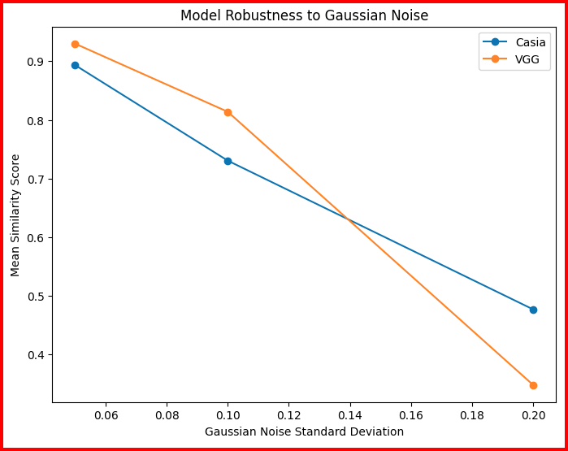
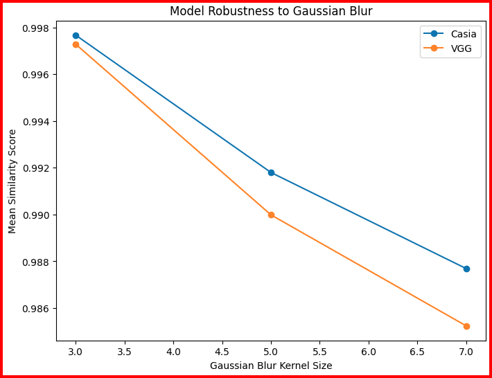
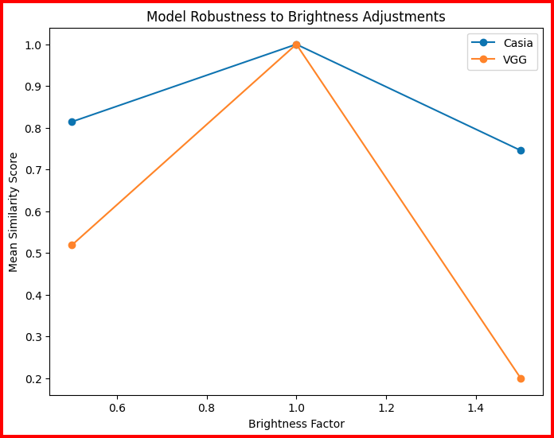

The inclusion of these visual aids enhances the clarity and logical flow of the analysis, making it accessible and easy to follow. The visualizations serve to exhibit the significance of preprocessing techniques and their impact on real-world performance for face recognition systems.

# Analysis 4 (Retrieval): System Parameter k for k-Nearest Neighbors Search

## Objective, Motivation, and Methods
The objective of this analysis was to determine the optimal value for the system parameter k in k-Nearest Neighbors (k-NN) search for the retrieval service. The choice of k directly impacts retrieval accuracy, user experience, and system latency. Specifically, a smaller value of k may lead to missing relevant matches, while a larger value can increase retrieval time and introduce irrelevant matches. Balancing retrieval quality and system latency is essential to ensure optimal performance in practical use cases.

Latency is a key component to study in this context because it directly affects the user experience and system scalability. In practical retrieval systems, the ability to provide timely results is critical, especially in applications like online recommendations or security systems where quick decision-making is essential. High latency can lead to delays that negatively impact user satisfaction, while low latency ensures smoother, faster interactions.

In the k-Nearest Neighbors (k-NN) search, the parameter k influences the number of neighbors retrieved, which in turn affects how long it takes to process the search request. By studying latency in conjunction with accuracy metrics like AP@k, we can determine the value of k that offers the best balance between delivering precise, high-quality results and maintaining acceptable response times. This analysis ensures that the system's performance remains optimal, both in terms of computational cost and user-facing responsiveness.

To achieve this, the analysis tested the system with various values of k (e.g., 1, 5, 10, 20) and evaluated the Average Precision at k (AP@k) and latency for each value. Precision-recall metrics like AP@k provide an accurate depiction of how well the system is able to return the most relevant results, while latency measurements offer insights into the system's efficiency. Plotting AP@k and latency for different values of k helps visualize the trade-off between retrieval accuracy and computational efficiency, guiding decisions about the optimal value of k for deployment.

## Justification of Design Decisions with Evidence
The graphs below illustrate the impact of different values of k on AP@k and latency.

**AP@k for Different k Values**:
- The plot of AP@k against various values of k shows that AP@k increases steadily as k moves from 1 to 20. Specifically, the AP@k improves significantly from under 0.060 at k=1 to over 0.080 at k=10, and it continues to increase, albeit at a slower rate, up to k=20. This indicates that expanding the neighborhood size allows for retrieving more relevant results, though the rate of improvement decreases beyond k=10.
- Unlike a strict plateau, the gradual increase beyond k=10 suggests that while higher values of k can still provide some benefit, the added results are not necessarily proportionally more relevant. Thus, for this particular dataset, selecting k values beyond 10 yields diminishing returns in retrieval quality.
- The increase in AP@k from k=1 to k=10 highlights the importance of considering a sufficiently large neighborhood to ensure that relevant matches are included. The results indicate that selecting too small a value for k could lead to suboptimal performance, as relevant images might be missed, reducing overall retrieval effectiveness. The slower rate of increase in AP@k beyond k=10 suggests that the model is reaching its peak retrieval capacity, and further increasing k only adds marginal improvements without significantly enhancing the relevance of retrieved items.

**Latency vs. k**:
- Latency showed an interesting trend. For k=1, the latency was around 0.0486 seconds, which decreased to under 0.0480 seconds for k=5, and then increased again for larger values (k=10 and k=20), reaching around 0.0494 seconds.
- The decrease in latency for k=5 might be due to batch optimization within the retrieval process that allowed for more efficient neighbor identification when retrieving a moderate number of neighbors. The subsequent increase in latency for higher values of k could be attributed to the additional computational load associated with identifying and processing larger sets of neighbors.
- It is also important to consider that latency trends are influenced by implementation details and hardware optimization. The observed trend suggests that there may be an optimal batch size (in this case, k=5) where the system benefits from certain optimizations, possibly due to parallelism or better memory utilization during retrieval tasks. This trend indicates that selecting k values beyond a certain point might incur higher latency costs, which should be taken into account when scaling the system to larger retrieval requests.

### Balancing Cost and Performance
- From the results, the optimal value of k appears to be around 5, where AP@k reaches a good level, and latency is relatively low. Selecting k=5 offers a balance between retrieval quality and latency, as increasing k beyond 5 yields diminishing improvement in precision, and the latency remains manageable.
- As the employee access control system scales rapidly with new employees, low latency will become increasingly important. With a larger number of employees, the system will need to handle a greater volume of retrieval requests, making the efficiency of each query critical. High latency can significantly impact user experience, especially during peak times when multiple users are accessing the system simultaneously. In such scenarios, ensuring that the system provides quick and reliable responses is essential to maintain operational efficiency and user satisfaction. Therefore, opting for a lower value of k, such as k=5, helps in keeping latency minimal, which is crucial as the system scales.
- Therefore, in environments where retrieval accuracy is the primary focus, setting k between 10 and 20 can still be considered, but careful consideration must be given to the increased latency. In contrast, for systems that prioritize faster response time, using k=5 is more appropriate. This balance helps meet specific use-case needs, whether the emphasis is on accuracy or system efficiency.
- Moreover, the choice of k=5 allows the system to capture relevant neighbors with lower computational overhead. The analysis suggests that while increasing k might theoretically lead to better recall, the practical gains in AP@k are minimal beyond k=5 to k=10, making k=5 an optimal point for most retrieval scenarios when both accuracy and latency are considered. For cases requiring real-time responses, considering the latency trends, k=5 offers a viable compromise between response speed and retrieval quality.

The evidence-based choice of k=5 is substantiated by the AP@k and latency trends, which align with the goal of achieving high retrieval performance while avoiding excessive computational costs. The careful evaluation of both precision and latency ensures that the system can adapt to various operational requirements, delivering reliable performance for different use cases.

### Overall System Design Impact

The findings from this analysis have significant implications for IronClad's employee access control system, especially as the company experiences rapid growth with more employees and facilities. Selecting the optimal value of k is crucial for ensuring that the system remains efficient, scalable, and capable of providing a seamless user experience.

As IronClad hires more employees, the database of facial embeddings will expand correspondingly. Each retrieval query will need to process an increasingly large dataset, which can impact both retrieval accuracy and latency. By choosing an optimal k value of 5, the system minimizes computational load per query, ensuring that retrieval times remain low even as the database expands. This approach helps maintain system performance without necessitating proportional increases in computational resources.

In an access control system, latency directly affects user satisfaction and operational flow. Employees expect quick and hassle-free entry into facilities. High latency can cause delays at access points, leading to queues and reduced productivity. By adopting k = 5, IronClad ensures that the system responds promptly, enhancing the overall user experience. The minimal latency at this k value prevents bottlenecks during peak times when multiple employees access the system simultaneously.

Lowering k to 5 reduces the amount of computation required for each search, which translates to lower CPU usage and energy consumption. This efficiency allows IronClad to support a higher number of simultaneous queries without investing heavily in additional hardware. As the company scales, this approach leads to significant cost savings in terms of infrastructure and operational expenses. The reduced computational demand also contributes to sustainability goals by lowering the energy footprint of the system.

While higher values of k can slightly improve retrieval accuracy, the analysis indicates that the gains beyond k = 5 are marginal. For IronClad, maintaining a balance between accuracy and efficiency is essential. By selecting k = 5, the system achieves sufficient retrieval performance for most access control scenarios without incurring unnecessary latency. In high-security areas where maximum accuracy is critical, the system can be configured to use a higher k value, accepting the trade-off of increased response time for enhanced precision.

By standardizing on k = 5, IronClad ensures that its access control system is well-prepared for future growth. The system will be capable of handling the increasing number of employees and facilities without a significant decline in performance. This foresight minimizes the need for frequent adjustments or overhauls of the system configuration as the company expands. It also simplifies maintenance and scaling processes, allowing for smoother integration of new data and technologies.

IronClad operates across various facilities with differing security needs and operational environments. The flexibility to adjust k provides the ability to tailor the system to specific contexts. In high-traffic areas, using k = 5 ensures that the system maintains low latency, preventing delays and congestion. In sensitive zones requiring stricter access control, increasing k to 10 or 15 can enhance retrieval accuracy. Although this increases latency, the trade-off is acceptable in contexts where security supersedes speed. The system can also dynamically adjust k based on real-time performance metrics, optimizing for latency during peak times and accuracy during off-peak hours.

Implementing a monitoring framework allows IronClad to track key performance indicators such as AP@k, latency, and system load. Analyzing this data enables proactive adjustments to system configurations, ensuring sustained performance levels. For instance, if latency begins to increase due to database growth, the company can explore optimization strategies such as indexing improvements, hardware upgrades, or algorithmic enhancements.

Selecting an optimal k value also impacts how the retrieval system interacts with other components of the access control infrastructure. Low latency retrieval supports real-time decision-making processes, allowing for immediate authentication and authorization. This efficiency can enhance the effectiveness of additional security measures, such as surveillance systems or anomaly detection algorithms, by providing timely data for analysis.

In terms of resource utilization, adopting k = 5 contributes to a more sustainable and cost-effective operation. The reduced computational requirements mean that existing hardware can handle more queries simultaneously, delaying the need for costly infrastructure upgrades. This efficiency aligns with IronClad's potential goals for environmental responsibility by reducing energy consumption.

From an employee experience perspective, maintaining low latency is critical. Quick and reliable access control systems minimize wait times, reducing frustration and improving overall satisfaction. This efficiency can have a positive impact on employee morale and productivity, as time spent waiting at access points is minimized.

In conclusion, the decision to adopt k = 5 for the k-Nearest Neighbors search in IronClad's employee access control system is supported by a careful analysis of trade-offs between retrieval accuracy and latency. This choice aligns with the company's need to scale efficiently while maintaining high performance and user satisfaction. By balancing cost considerations with operational requirements, IronClad can deploy a system that is both robust and adaptable, capable of meeting the demands of a rapidly growing enterprise. The strategic selection of k = 5 ensures that the access control system contributes positively to overall organizational efficiency, security, and scalability.

## Documentation and Clarity

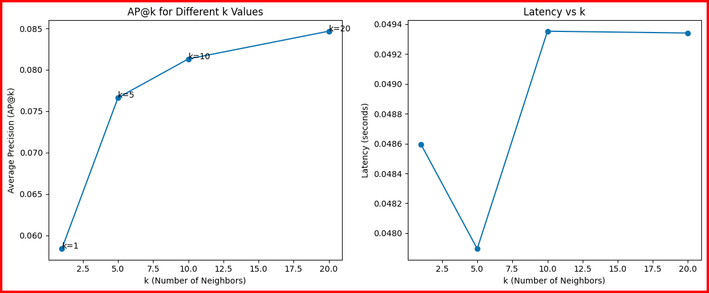

This analysis was conducted in `system_analysis.ipynb`, which includes the graphs of AP@k and latency vs. k shown above, providing insight into the relationship between accuracy and retrieval efficiency. The graphs illustrate the diminishing returns on AP@k beyond k=5 and the associated trends in latency, allowing for informed decision-making about the system parameter k. The presentation of results aims to convey the trade-offs, facilitating deployment decisions for the visual search system in practice.

# Analysis 5 (Retrieval): Indexing Type for k-Nearest Neighbors Search

## Objective, Motivation, and Methods

The primary objective of this analysis was to determine the optimal indexing type for the k-Nearest Neighbors (k-NN) search within the employee identification and access control system. Specifically, the analysis compared two different FAISS index types: Flat and HNSW, to evaluate their impact on retrieval accuracy (recall@k) and computational efficiency (latency). Choosing the appropriate indexing strategy is crucial as the system is expected to scale with an increasing number of employees, necessitating efficient and accurate image retrieval for practical use.

The motivation for this analysis stems from the need to balance both system accuracy and efficiency. In an employee identification system, high recall is crucial for ensuring that relevant images of employees are retrieved accurately, while minimizing latency is equally important for a seamless user experience. The FAISS indices (Flat and HNSW) were chosen for comparison because of their respective trade-offs between computational speed and retrieval quality. Flat is more accurate but computationally expensive, while HNSW is an approximate method intended to reduce retrieval time.

To perform this analysis, the system was benchmarked using both the Flat and HNSW indexing types across different values of k (number of neighbors retrieved: 1, 5, 10, and 20). The metrics used to evaluate performance were recall@k and latency. Recall@k provides a measure of how well the system can retrieve relevant images of an employee among the top k results, while latency captures the computational time required to conduct the search. The results were plotted to illustrate the trade-off between retrieval accuracy and efficiency across different indexing methods and k values, providing insight into which indexing strategy is better suited for various scalability requirements.

## Justification of Design Decisions with Evidence

The choice to compare the Flat and HNSW indices was driven by their contrasting characteristics, which cater to different scalability needs. Flat indexing provides exact search results, which is beneficial for maintaining high retrieval accuracy, especially in smaller datasets where latency is not a major concern. On the other hand, HNSW provides an approximate solution that balances between computational efficiency and acceptable accuracy, which is particularly useful in scenarios where response time is critical.

From the graphs, several observations can be made:

1. **Recall@k Comparison**: Both Flat and HNSW indices show an increase in recall@k as the value of k increases from 1 to 20. For both index types, the recall improved steadily, with the Flat index showing marginally better recall values across all k values compared to HNSW. This difference, however, is relatively small, suggesting that while the Flat index achieves slightly better accuracy, HNSW also performs reasonably well. Specifically, at k=20, the recall for Flat was around 0.275, whereas the recall for HNSW was approximately 0.25. The gradual increase in recall@k indicates that a larger neighborhood helps retrieve more relevant results, yet the difference in recall values between the two indexing methods suggests that HNSW can be a viable alternative where some trade-off in accuracy is acceptable.

2. **Latency Analysis**: When examining latency, the results show that HNSW generally performs better in terms of speed for smaller values of k, but latency increases significantly at larger values of k. The latency for the Flat index peaked around k=10, suggesting an increase in the computational burden as more neighbors are retrieved, followed by a decrease due to potential optimizations or parallel processing benefits. Meanwhile, HNSW maintained more stable latency initially, with a sharp increase occurring at k=20 as more of the graph needed to be traversed.

This trend highlights the trade-offs between accuracy and efficiency. While the Flat index yields higher accuracy, the increased latency may be a limiting factor in environments with strict time requirements. In contrast, HNSW offers more consistent and lower latency for smaller values of k, making it a more suitable choice when fast responses are prioritized, although latency becomes a concern at larger values of k.

### Balancing Cost and Performance

The analysis clearly indicates that the decision to use Flat or HNSW should be based on system requirements. For smaller datasets or where accuracy is paramount, the Flat index might be preferred due to its exact nature and slightly higher recall. However, as the number of employees grows and scalability becomes crucial, HNSW provides a better trade-off between maintaining reasonable recall levels and significantly reducing search time.

Ultimately, for practical deployment in an employee access system, using HNSW can ensure the system remains responsive even as it scales. If occasional accuracy sacrifices are acceptable to maintain fast response times, HNSW is the optimal choice. However, if the use case requires maximum accuracy regardless of computational cost, then Flat may still be suitable.

### Overall System Design Impact

These observations have significant implications for IronClad's employee access control system, especially in light of the company's rapid expansion and the increasing number of employees and facilities. As IronClad continues to grow, the scalability of the access control system becomes a critical factor in maintaining efficient and secure operations.

With a steadily increasing employee database, the Flat index's exhaustive search approach will result in a linear increase in computational load and retrieval time. This means that as more employees are added, the system may experience higher latency, leading to delays at access points and potentially causing bottlenecks during peak times. Such delays not only hinder operational efficiency but also negatively impact the user experience, as employees expect quick and seamless entry into facilities.

In contrast, the HNSW index is designed to handle large-scale datasets more efficiently. Its approximate nearest neighbor search scales logarithmically with the size of the dataset, which means that retrieval times remain relatively stable even as the number of employees grows. This scalability makes HNSW particularly well-suited for IronClad's needs, ensuring that the system can maintain low latency and high throughput despite the expanding dataset.

Moreover, while the Flat index offers slightly higher recall, the marginal difference in accuracy compared to HNSW may not justify the increased computational costs and latency, especially when the system scales up. The difference in recall between the two indices was relatively small, approximately 2.5% at k = 20, which suggests that HNSW provides an acceptable level of accuracy for practical purposes. IronClad can further mitigate any potential risks associated with the slight decrease in recall by implementing additional security measures, such as multi-factor authentication or periodic audits of the system's performance.

From a cost perspective, adopting the HNSW index can lead to significant savings in computational resources. The Flat index's exhaustive search would require substantial hardware upgrades to maintain acceptable performance levels as the dataset grows, leading to increased capital and operational expenditures. In contrast, HNSW's efficient search algorithm reduces the need for extensive hardware investments, lowering overall costs and simplifying system maintenance.

Additionally, the choice of indexing strategy has implications for the system's future-proofing. By selecting HNSW, IronClad ensures that its access control system can accommodate growth without the need for major overhauls or reconfigurations. The scalability and efficiency of HNSW make it a sustainable solution that can adapt to the company's evolving needs over time.

In terms of system configuration, IronClad can optimize the value of k based on specific requirements. For instance, in high-security areas where maximum accuracy is critical, the company might opt for a higher k value or even employ the Flat index despite its higher latency. In general access areas where speed is more important and slight reductions in recall are acceptable, using HNSW with a moderate k value (e.g., k = 5 or k = 10) would provide a good balance between accuracy and efficiency.

Implementing a hybrid approach allows IronClad to tailor the access control system to different facility requirements. By leveraging both indexing methods, the company can maximize security in critical zones while maintaining fast response times in areas with high employee traffic. This strategic deployment ensures that the system meets varying operational demands without compromising overall performance.

Furthermore, continuous monitoring and analysis of system performance will be essential. IronClad should regularly assess recall rates and latency to identify any issues that may arise as the employee base expands. Staying informed about advancements in indexing technologies and algorithms can also provide opportunities to further enhance the system's capabilities in the future.

In conclusion, the analysis indicates that while the Flat index offers marginally higher accuracy, the HNSW index provides significant advantages in scalability and efficiency, which are crucial for IronClad's rapidly growing employee access control system. By adopting HNSW, IronClad can ensure responsive and efficient access control across all facilities, maintaining a positive user experience and operational efficiency as the company continues to expand. Balancing the trade-offs between accuracy and performance, and potentially employing a hybrid indexing strategy, allows IronClad to meet its security requirements while optimizing resource utilization and scalability.

## Documentation and Clarity

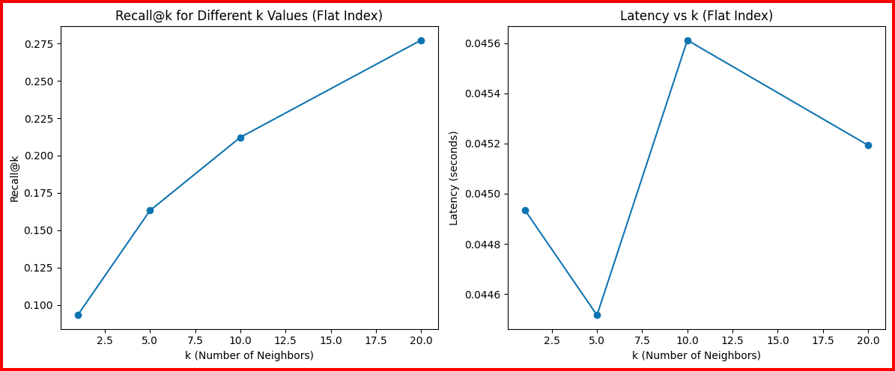
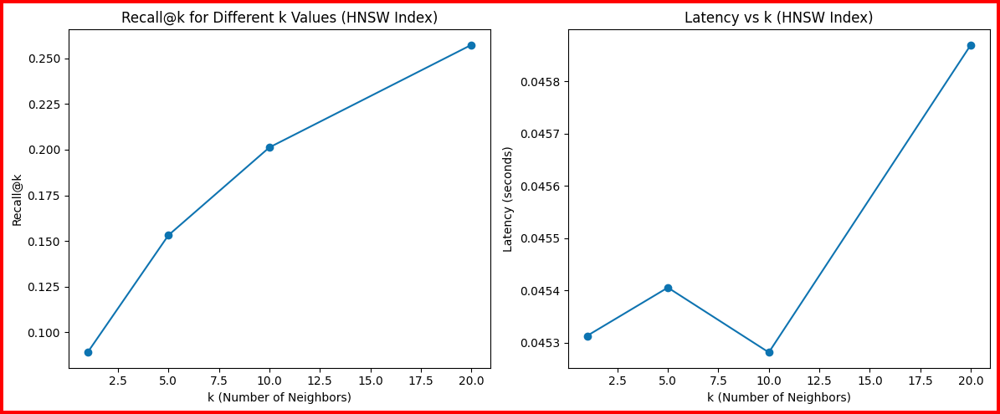

This analysis was conducted in `system_analysis.ipynb` to emphasize the balance between accuracy and performance through visual representations of recall@k and latency. The charts provided for both index types illustrate the trends in accuracy and latency across different k values, allowing for an interpretation of the trade-offs and informed decision-making based on system requirements. The side-by-side comparison of the graphs for Flat and HNSW indices helps in understanding the interactions between index type, accuracy, and efficiency, supporting decisions about the system's deployment strategy.