# "MovieMate" Recommendation System Report

# System Design
The MovieMate Recommender System is designed as a modular architecture consisting of three primary services: the Adaptive Service, the Personalization Service, and the Interface Service. Each of these services has distinct responsibilities, ensuring the system's effectiveness in recommending relevant movies, adapting to changes in user preferences, and providing a seamless user interface. Below, I will elaborate on each service's components, accompanied by corresponding diagrams illustrating the overall data flow and configurable parameters within each service.

## Adaptive Service
The Adaptive Service is responsible for learning from incoming data and ensuring that the recommendations stay relevant as new information becomes available. This service comprises multiple modules, specifically Collaborative Filtering (implemented in collaborative.py), Content-Based Filtering (content_based.py), Rule-Based Filtering (rule_based.py), and Continuous Learning (continuous_learning.py). Collaborative Filtering uses algorithms such as SVD to learn latent features in user ratings, enabling the model to make predictions based on collective user preferences. Content-Based Filtering, on the other hand, makes use of movie metadata, such as genres, actors, and directors, to suggest items similar to those a user has rated highly in the past. The Rule-Based Filtering module provides a more deterministic approach to recommendations, allowing the system to combine the advantages of both learning-based and rule-based models. The Continuous Learning module, represented in continuous_learning.py, evaluates whether the model needs retraining based on statistical drift detection using techniques like the Kolmogorov-Smirnov (KS) test. If significant drift is detected between baseline and current RMSE distributions, the model is retrained to adapt to new user behaviors or content trends. These components make the Adaptive Service flexible and capable of evolving with user data. Parameters that can be controlled include the number of latent factors for collaborative filtering, thresholds for the KS test in drift detection, and the weight given to content-based versus collaborative recommendations.

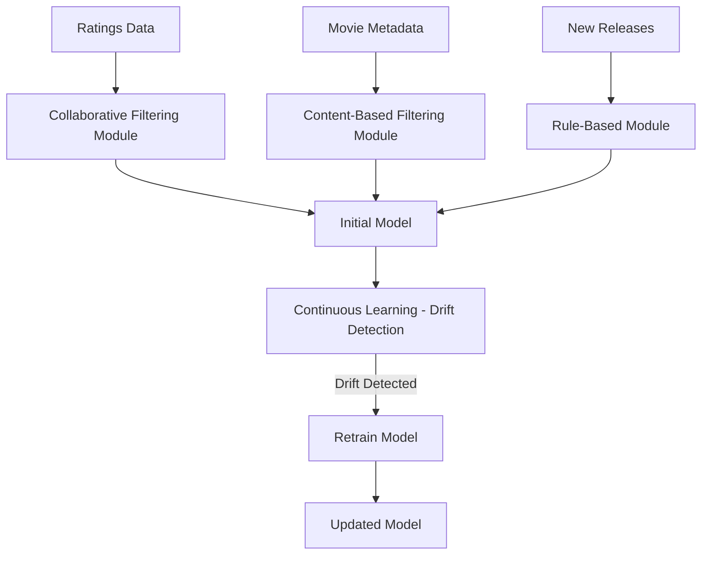

## Personalization Service
The Personalization Service is the core of the recommendation process, and it includes two essential modules: the Recommender (recommender.py) and the Diversifier (diversifier.py). The Recommender module provides personalized movie suggestions based on the models developed and updated in the Adaptive Service. It uses both collaborative and content-based methods to generate a ranked list of movie suggestions that align closely with the user’s historical preferences and ratings. This module includes parameters like top_n for the number of recommendations returned and configurable weights to balance collaborative and content-based results. After generating an initial set of recommendations, the Diversifier module enhances the diversity of these suggestions to prevent overly similar items from being presented together. The Diversifier uses techniques such as Maximal Marginal Relevance (MMR) to balance between relevance and novelty, and diversity metrics such as intra-list diversity, Shannon entropy, and pairwise dissimilarity to quantify and ensure a diverse selection. The lambda/alpha parameter used in MMR allows users to adjust the balance between relevance and diversity, providing flexibility in how varied the final recommendations are. This approach ensures that while users receive suggestions that match their interests, they are also encouraged to explore new and less familiar content.

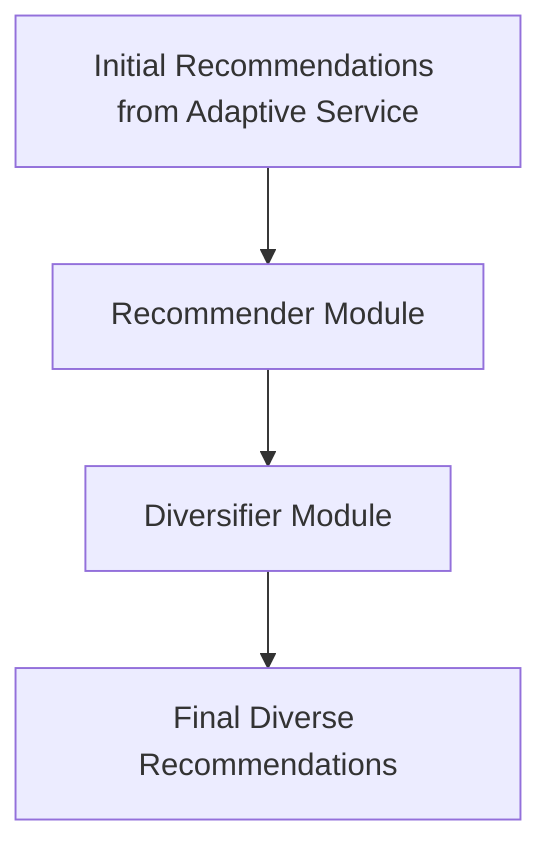

## Interface Service
The Interface Service represents the user-facing layer of the MovieMate system, built using Flask to create REST API endpoints that enable interaction with the backend services. Users can add themselves to the system via the /add_user endpoint, authenticate using /login, and access movie recommendations through the /recommend and /recommend_diverse endpoints. These API endpoints ensure that the user experience is seamless and intuitive. This service is containerized using Docker, providing scalability and ease of deployment across different environments while maintaining consistency and reliability. The Dockerfile used to containerize the Flask app is based on the python:3.9-slim image to keep the container lightweight. It defines the working directory as /app, copies application files into the container, installs necessary dependencies from requirements.txt, and exposes port 5000 for communication. Finally, the application is started using the command CMD ["python", "app.py"]. The requirements.txt file specifies the dependencies necessary to run the MovieMate system effectively. These dependencies include Flask for creating the REST API endpoints, pyarrow for efficient file system and storage handling, scikit-learn for machine learning utilities and models used in the recommendation system, pandas for data manipulation and analysis, and scikit-surprise for collaborative filtering and building personalized recommendation models. These dependencies are installed during the container setup to ensure the environment is correctly configured for all required functionalities.

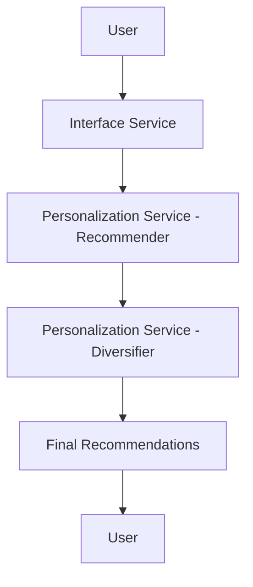

# Metrics Definition

## Offline Metrics
Offline metrics are essential for evaluating the system’s performance during the development phase to ensure it is capable of providing accurate and diverse recommendations before being deployed to users. For the MovieMate system, Root Mean Square Error (RMSE) serves as a primary offline metric for assessing the accuracy of rating predictions. RMSE is calculated by comparing the predicted ratings for movies to the actual ratings provided by users. A lower RMSE value indicates that the model is better at accurately predicting what users would rate a given movie. This metric is crucial during model training and validation, providing a benchmark for evaluating different model configurations or algorithms to select the best-performing version for deployment. Another critical offline metric is Precision@k, which measures the proportion of relevant items among the top-k recommended movies. Precision ensures that the recommendations provided by the system are accurate and likely to be appreciated by the users. Recall@k complements this by measuring how well the system captures all potentially relevant items for a user within the top-k recommendations. Additionally, diversity metrics, such as intra-list diversity and Shannon entropy, are employed to ensure that the system does not recommend overly similar items, encouraging users to explore different genres or content types. Offline evaluations using these metrics help optimize the system to deliver accurate, relevant, and varied recommendations, thereby ensuring a better user experience upon deployment.

## Online Metrics
Online metrics would be used to evaluate the performance of the system in real time, ensuring it remains effective and responsive while in use. One of the primary online metrics for the MovieMate system would be the Click-Through Rate (CTR), which would measure the percentage of recommended movies that users click on. CTR would serve as a direct indicator of how engaging and relevant the recommendations are to users. If CTR were to decline, it could signal that the recommendations are not aligning with user interests, which may indicate the need for model updates. Conversion Rate would be another significant metric, measuring how often users go from clicking on a recommendation to taking action, such as watching the movie. This metric would help determine whether the recommendations are not only interesting but also compelling enough for users to watch. Response Time would be closely monitored to ensure that the system provides quick and efficient responses to user queries, as delays could lead to frustration and a poor user experience. Dwell Time, which would measure the time users spend interacting with recommendations, would provide additional insights into how engaging the content is. Additionally, the drift detection mechanism, integrated into the Adaptive Service, would continually evaluate changes in model performance metrics, such as RMSE, using statistical tests like the Kolmogorov-Smirnov (KS) test to determine when retraining is necessary. Online metrics would be monitored using real-time analytics tools like Google Analytics. Alerts could be set up for key thresholds, ensuring that any significant drop in engagement or increase in response times is immediately flagged for investigation. This hypothetical real-time monitoring would help maintain the relevance and effectiveness of the recommendations while ensuring that users continue to have a positive experience with the system.

# Analysis 1 (Adaptive): Model Selection for Adaptive Recommendations
## Objective, Motivation, and Methods
The objective of the model selection analysis was to determine the most effective recommendation algorithm for the MovieMate system, ensuring a balance between prediction accuracy, ranking relevance, and computational efficiency. The selection of the appropriate recommendation model is a critical aspect of the system's design, as it directly impacts user satisfaction, engagement, and the overall quality of recommendations. The chosen model influences how effectively the system can predict user preferences, recommend diverse content, and adapt to the addition of new users and changing behaviors over time.

Four models were considered in this analysis: Collaborative Filtering with Singular Value Decomposition (SVD), User-User Collaborative Filtering (User-User CF), Item-Item Collaborative Filtering (Item-Item CF), and Content-Based Filtering. Each model represents a unique approach to generating recommendations. Collaborative SVD is a matrix factorization-based model that captures latent relationships between users and items by decomposing the user-item interaction matrix. User-User CF and Item-Item CF rely on similarities between users or items to provide recommendations based on collaborative information. Content-Based Filtering, on the other hand, recommends items based on their features, such as genre or description, and matches them with user preferences. These models were evaluated using two primary metrics: Root Mean Square Error (RMSE) to assess prediction accuracy and normalized Discounted Cumulative Gain (nDCG) to measure the quality of ranking.

To evaluate the effectiveness of each model, RMSE was chosen to quantify the accuracy of predicted ratings compared to actual user ratings, while nDCG assessed how effectively the model ranked items in a way that was relevant to users. Lower RMSE values indicate that the model’s predictions are closer to actual user ratings, which is crucial for providing accurate recommendations that align with user preferences. A higher nDCG value reflects the model’s ability to rank the most relevant items at the top of the recommendation list, which directly influences user satisfaction by ensuring they see the items most likely to interest them. The combination of these metrics provided a holistic view of each model's ability to accurately predict ratings and create an engaging experience for the user. To evaluate the four models, training and validation datasets were created using historical user interactions with movies, and each model was trained using these datasets. Their performance was then compared using RMSE and nDCG scores to assess both accuracy and ranking quality.

The evaluation included a comparative analysis of each model’s performance using bar charts to visualize the RMSE and nDCG values for the four models. The comparison allowed for an assessment of trade-offs between accuracy, ranking performance, and computational considerations. This helped to determine which model was best suited for MovieMate’s operational needs, taking into account both the strengths and weaknesses of each approach.

## Justification of Design Decisions with Evidence
### Trade-offs Analysis
The analysis of the four models highlighted significant trade-offs between prediction accuracy, ranking relevance, and overall system complexity. Collaborative Filtering with SVD emerged as the best performer in terms of both RMSE and nDCG scores, indicating that it offers the most effective balance between accuracy and relevance. Specifically, SVD had the lowest RMSE at 0.9363, suggesting that it made the most accurate predictions of user ratings. A lower RMSE means that the model effectively captures latent user-item interactions, leading to recommendations that closely align with user preferences. Moreover, the SVD model achieved a very high nDCG score of 0.9856, demonstrating its ability to rank relevant items prominently in recommendation lists. This combination of high accuracy and effective ranking makes SVD a strong candidate for MovieMate, as it ensures users receive accurate and contextually relevant recommendations that align with their viewing history and preferences.

The User-User CF model also performed well, but its RMSE was slightly higher at 1.0194, indicating a modest decrease in prediction accuracy compared to SVD. However, its nDCG score was nearly perfect at 0.9967, which implies that it excels at ranking items in a way that users find relevant, despite slightly higher errors in predicted ratings. This model is particularly useful in cases where similar users have similar tastes, but it requires substantial computational resources to identify and compare users as the user base grows. Item-Item CF showed similar results, with an RMSE of 1.0264 and an nDCG score of 1.0, suggesting that it also ranks items effectively, making it valuable for recommending items similar to those a user has interacted with. Both collaborative filtering approaches, User-User and Item-Item, are suitable alternatives if the system requires flexibility in focusing on either user-user or item-item similarities for recommendations.

The Content-Based Filtering model, while useful in contexts where item features are key, performed the worst among the models with an RMSE of 1.7904 and an nDCG of 0.9179. This model uses metadata like genres to recommend items, which makes it less capable of understanding user-specific nuances compared to collaborative methods that rely on actual user interactions. Its comparatively high RMSE suggests it struggles to predict ratings accurately, possibly due to its limited capacity to learn from user behaviors beyond item features. However, content-based models are still valuable in cold-start scenarios, such as recommending movies to new users who lack a viewing history, since recommendations are based solely on item features.

### Balancing Cost and Performance
The results of the analysis underscore the importance of selecting a model that balances prediction accuracy with computational feasibility. Collaborative SVD provided the best combination of low RMSE and high nDCG, which means it delivers highly accurate and relevant recommendations. However, matrix factorization-based models like SVD require more computational resources for training, as they rely on decomposing large user-item matrices to identify latent factors. This could lead to increased training times and hardware costs, particularly as the number of users and items scales. Despite the computational cost, the enhanced user experience resulting from more accurate and relevant recommendations justifies this expense, especially for a personalized recommendation system that seeks to maximize user engagement and satisfaction.

User-User CF and Item-Item CF, while slightly less accurate, offer a practical compromise in scenarios where real-time adaptability and interpretability are prioritized. User-User CF can easily explain recommendations based on similarities between users, which is valuable for transparency. Item-Item CF, on the other hand, is computationally less intensive during training compared to SVD but still requires considerable resources to maintain item similarity matrices. Given their strong ranking performance (nDCG values close to 1.0), these models are effective when high-quality ranking is more critical than minimizing rating prediction errors.

The Content-Based Filtering model, with its higher RMSE and lower nDCG, is not as well suited for the primary recommendation functionality of MovieMate but serves an important role in addressing the cold-start problem. It is computationally efficient since it relies on item features and avoids complex similarity calculations or matrix decompositions. Its role can be complementary, used as a fallback when a user’s historical data is insufficient for collaborative methods.

### Overall System Design Impact
The selection of the recommendation model has a significant impact on MovieMate’s ability to address the challenges highlighted in the case study. As a startup that initially relied on a rules-based recommendation system, suggesting "Top Trending Movies," MovieMate faced significant user abandonment due to a lack of personalized and relevant content. Users left the platform after browsing for several minutes without finding something that matched their tastes. To mitigate this issue, MovieMate needs to transition to a recommendation system that provides tailored suggestions, ultimately aiming to increase user engagement, reduce churn, and establish long-term user loyalty.

Collaborative Filtering with SVD emerged as the primary recommendation model for achieving these goals. The RMSE of 0.9363 signifies that SVD excels in predicting user ratings with high accuracy, effectively capturing the intricate patterns between users and items through matrix factorization. This accuracy is crucial for addressing the core challenge faced by MovieMate, providing relevant, personalized recommendations that meet users' preferences. The high nDCG score of 0.9856 further confirms that Collaborative SVD ranks relevant items at the top of the recommendation list, which directly improves the user experience by ensuring that users see the most appropriate content early in their browsing session. By reducing the time it takes for users to find content they enjoy, the system minimizes frustration, thereby decreasing the likelihood of abandonment. This model significantly impacts user satisfaction, leading to longer session durations, increased user engagement, and ultimately enhancing retention by providing recommendations that are personalized and accurate.

The implementation of User-User Collaborative Filtering and Item-Item Collaborative Filtering as complementary models also plays a critical role in addressing the challenge of delivering personalized recommendations. User-User CF, with an RMSE of 1.0194 and an nDCG of 0.9967, provides an alternative approach by leveraging similarities between users to recommend content based on shared preferences. Although it is not as accurate as SVD, User-User CF remains highly effective at ranking relevant items, making it an essential fallback option when interpreting user behavior based on direct user-to-user comparisons. This capability ensures that MovieMate can provide strong recommendations when it is beneficial to emphasize the collective preferences of similar users. For instance, when a user does not have extensive historical ratings, the preferences of other similar users can help inform recommendations, ensuring that the system remains engaging and informative even for users with sparse data.

Similarly, Item-Item CF, with an RMSE of 1.0264 and an nDCG of 1.0, performs well in ranking items, demonstrating its usefulness in scenarios where the goal is to recommend items similar to those that a user has already watched. Item-Item CF offers a different perspective by focusing on item similarity rather than user similarity, allowing MovieMate to enhance the recommendation experience by promoting related content that aligns with what users have previously shown interest in. This contributes to a rich content discovery experience where users are introduced to new but contextually similar movies or shows. In cases where MovieMate aims to maximize the relevance of specific genres or focus on particular viewing habits, Item-Item CF can be used to boost recommendations that directly reflect a user’s past preferences.

Content-Based Filtering, though not the strongest performer with an RMSE of 1.7904 and nDCG of 0.9179, still plays a valuable role in solving the cold-start problem, a critical requirement mentioned in the case study. In situations where new users join the platform without sufficient interaction history, Content-Based Filtering can generate initial recommendations based on item features such as genres, directors, and release years. This approach provides a functional baseline for new users, helping MovieMate avoid presenting empty or irrelevant recommendation lists, which would lead to disengagement. Content-Based Filtering bridges the gap for users who do not yet have enough activity data for collaborative models to work effectively, making it an essential component of the overall recommendation strategy. It ensures that new users have a satisfactory entry point to the platform while MovieMate gathers sufficient information to transition them to more personalized recommendations.

Together, the choice of Collaborative Filtering with SVD, supported by User-User CF, Item-Item CF, and Content-Based Filtering, has a significant impact on MovieMate's system design by addressing key user experience challenges. Collaborative SVD ensures that users receive accurate, personalized recommendations that align with their individual tastes, which is essential for reducing abandonment and enhancing engagement. User-User CF and Item-Item CF serve as flexible, complementary models that allow for different angles of personalization, either by emphasizing shared user preferences or promoting content that closely resembles what a user has previously enjoyed. The high nDCG scores for these models underscore their ability to deliver well-ranked, relevant content, keeping users interested and engaged.

The integration of Content-Based Filtering specifically targets the cold-start issue, providing a crucial on-ramp for new users to receive meaningful recommendations without requiring extensive historical data. This multi-model approach enables MovieMate to overcome the limitations of any single model, ensuring that users always receive relevant content regardless of their current status, whether they are long-time users with rich interaction data or new users just starting to explore the platform.

By incorporating a dynamic combination of these four models, MovieMate can transition from its initial rules-based recommendation system to a more sophisticated, user-centric recommendation framework that prioritizes personalization, ranking quality, and adaptability. This strategic shift ensures that MovieMate can provide content that is not only popular but also highly relevant to individual users, directly addressing the challenges that led to user abandonment in the first place. The diverse recommendation strategies embodied by Collaborative SVD, User-User CF, Item-Item CF, and Content-Based Filtering work together to build a resilient and engaging recommendation system that increases user satisfaction, enhances content discoverability, and reduces churn, ultimately fostering greater user loyalty and positioning MovieMate more competitively in the streaming market.

The overall impact of selecting these models extends beyond the immediate improvement of recommendation quality. Accurate, personalized, and diverse content keeps users engaged for longer periods, resulting in increased session duration and lower churn rates, which are vital metrics for MovieMate's growth and long-term success. This layered approach to model selection ensures that the system can cater to both new and existing users effectively, maintaining the platform's relevance and appeal across a broad and expanding user base. As a result, the transition from a static, one-size-fits-all approach to a more adaptive, personalized recommendation system directly supports MovieMate's business goals, building a loyal audience, enhancing user satisfaction, and ultimately increasing the lifetime value of each user on the platform.

## Documentation and Clarity
The findings of the model selection analysis are documented and visually represented in the accompanying charts, which compare RMSE and nDCG scores for the four recommendation models evaluated: Collaborative Filtering with SVD, User-User Collaborative Filtering, Item-Item Collaborative Filtering, and Content-Based Filtering. The RMSE Comparison graph illustrates the accuracy of predicted user ratings across the models, highlighting that Collaborative SVD has the lowest error, indicating the highest prediction accuracy. The nDCG Comparison graph shows the ranking effectiveness of each model, with User-User CF and Item-Item CF demonstrating nearly perfect ranking scores, making them highly effective for generating engaging recommendations. These visual aids effectively illustrate the trade-offs between prediction accuracy and ranking relevance among the four models, supporting the rationale behind selecting Collaborative SVD as the primary recommendation model. Additionally, the comparative analysis helps to contextualize the performance of complementary models such as User-User CF and Content-Based Filtering, highlighting their specific strengths and limitations. The code and methodology used for this analysis are documented in the `model_selection.ipynb` notebook.

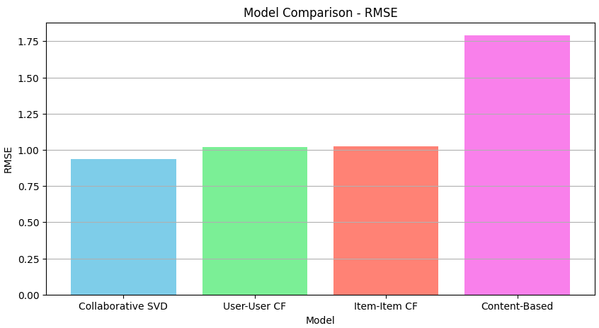
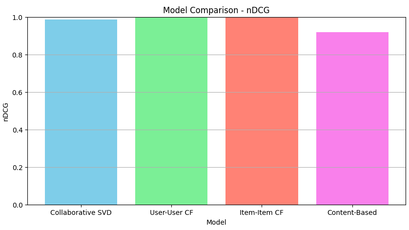

# Analysis 2 (Personalization): Cold Start Strategies
## Objective, Motivation, and Methods
The objective of this analysis was to identify and evaluate effective strategies for addressing the cold start problem in the MovieMate recommendation system. The cold start problem arises when the system encounters new users or new items with little to no historical interaction data, making it challenging to generate personalized recommendations. Addressing this issue is crucial for enhancing user satisfaction and engagement from the outset, as initial interactions significantly influence users' perceptions of the platform.

To tackle this problem, I explored four distinct strategies: Rule-Based Recommendations (Popular Items Approach), Content-Based Filtering, Hybrid Model Recommendations, and Demographic-Based Recommendations. Each of these approaches offers a different method for generating recommendations without heavily relying on prior user-specific data.

The Rule-Based Recommendations strategy involves suggesting universally popular or top-rated movies to new users based on overall ratings and popularity metrics. This method ensures that users receive high-quality content widely appreciated by the broader audience, providing a reliable starting point for engagement.

Content-Based Filtering utilizes movie metadata, such as genres, directors, and actors, to recommend movies similar to those a user has shown interest in. This approach allows for personalized recommendations based on item features, independent of other users' data, enabling tailored suggestions even with minimal user interaction.

The Hybrid Model combines the rule-based and content-based methods, aiming to balance the broad appeal of popular items with the specificity of content-based personalization. By leveraging both popularity and item feature similarities, this strategy strives to offer more relevant recommendations than single-method approaches.

Lastly, Demographic-Based Recommendations leverage user demographics, including age and occupation, to suggest movies popular among similar user groups. This strategy provides a moderate level of personalization by targeting recommendations based on shared demographic characteristics, enhancing relevance without requiring extensive user interaction data.

To evaluate these strategies, I simulated cold start scenarios involving new users with no ratings and users with very few ratings. The primary evaluation metric used was the Average Predicted Rating, which measures the mean rating predicted by the recommendation strategy for the recommended items. Additionally, I employed visualizations such as bar charts to compare the performance of each strategy.

The evaluation process involved creating user profiles with varying levels of interaction data to simulate the cold start conditions. I then applied each recommendation strategy to these profiles, generated recommendation lists, calculated the average predicted ratings of the suggested movies, and visualized the performance through comparative bar charts. This approach allowed me to gain insights into the strengths and limitations of each strategy, enabling informed decisions on which methods to integrate into MovieMate to effectively handle cold start challenges.

## Justification of Design Decisions with Evidence
### Trade-offs Analysis
The analysis of the four strategies revealed significant trade-offs between recommendation relevance, personalization, and computational complexity. The Rule-Based Recommendations approach achieved the highest average predicted rating of 4.28, demonstrating its effectiveness in providing high-quality content. Its simplicity and computational efficiency make it an attractive option for immediate deployment, ensuring that new users receive well-regarded movies likely to appeal to a broad audience. However, this method lacks personalization, resulting in uniform recommendations that may not align with individual tastes, potentially limiting long-term engagement.

Content-Based Filtering obtained a low average predicted rating of 0.78, indicating challenges in generating relevant recommendations under cold start conditions. While it offers personalized suggestions based on item features and preserves user privacy by not relying on other users' data, its effectiveness is significantly hampered by insufficient user interaction data. The dependency on comprehensive and high-quality metadata further restricts its performance, making it less suitable when user data is minimal.

The Hybrid Model achieved an average predicted rating of 2.53, reflecting a balance between popularity and personalization. By combining rule-based and content-based methods, this strategy aims to enhance recommendation relevance. However, the increased complexity and higher computational demands associated with implementing and maintaining a hybrid model pose challenges. The need for careful tuning to optimize the balance between different recommendation sources adds to the implementation burden. Despite this, the potential for improved performance justifies the complexity in the long run.

Demographic-Based Recommendations reached an average predicted rating of 3.78, positioning it as a moderately effective strategy. This approach enhances personalization compared to rule-based methods by leveraging available demographic data to offer more tailored suggestions without extensive interaction data. However, it may inadvertently stereotype users based on demographic groups, overlooking unique individual preferences. The limited depth of personalization compared to strategies that incorporate user-specific behaviors also constrains its effectiveness.

### Balancing Cost and Performance
Balancing recommendation performance with computational and implementation costs is crucial for the system's scalability and efficiency. The Rule-Based Recommendations stand out for their high efficiency and minimal computational requirements, making them ideal for initial deployment and handling large volumes of new users without significant infrastructure investment. However, the generic nature of these recommendations may not significantly enhance user engagement beyond initial interactions, as the lack of personalization can limit the system's ability to retain users over time.

Content-Based Filtering offers personalized recommendations with relatively low computational overhead once item features are processed. It is valuable for users who begin interacting with the system, as it can effectively cater to their preferences by analyzing item attributes. However, its reliance on comprehensive metadata and limited effectiveness in pure cold start scenarios restrict its applicability. The necessity for high-quality item metadata and challenges associated with generating meaningful recommendations without sufficient user interaction data highlight the need for supplementary strategies.

The Hybrid Model presents a promising avenue for improving recommendation quality by combining multiple strategies. By leveraging both popularity and personalization, it can potentially offer more relevant and diverse recommendations. However, increased complexity and computational demands pose significant challenges. The need for careful integration and tuning to optimize the balance between different recommendation sources requires substantial resources, making it a more resource-intensive option compared to single-method approaches.

Demographic-Based Recommendations offer a middle ground between rule-based and content-based methods, enhancing personalization without heavily relying on user-specific interaction data. This strategy is relatively easy to implement and can quickly leverage available demographic information to improve recommendation relevance. Nevertheless, its effectiveness is limited by the granularity and accuracy of demographic data, and it may not capture nuanced individual preferences. While it provides better personalization than purely rule-based approaches, it doesn't achieve the depth of personalization found in strategies that incorporate detailed user behaviors.

### Overall System Design Impact
The findings from this analysis have significant implications for MovieMate's recommendation system design. By implementing the identified strategies, MovieMate can effectively enhance its ability to address the cold start problem and improve the overall user experience. Introducing Rule-Based Recommendations ensures that new users receive high-quality, popular content immediately upon joining the platform, reducing the likelihood of early abandonment due to irrelevant suggestions.

Rule-Based Recommendations emerge as the most effective initial strategy for handling new users who have just joined MovieMate and have not yet provided any interaction data. With an average predicted rating of 4.28, this approach ensures that users are presented with high-quality, popular content from the moment they sign up. By introducing new users to universally acclaimed movies and shows, MovieMate can capture their interest and reduce the likelihood of immediate abandonment due to irrelevant recommendations. This strategy aligns with the immediate need to retain new users by providing them with content that has broad appeal. However, while Rule-Based Recommendations offer a quick fix for the cold start problem, they lack personalization, which is essential for long-term user engagement and satisfaction.

To add a layer of personalization without requiring extensive user interaction data, Demographic-Based Recommendations offer a valuable solution. By leveraging demographic information such as age, gender, and occupation, MovieMate can target user segments with shared characteristics, achieving an average predicted rating of 3.78. This approach allows the platform to provide more tailored suggestions that are likely to resonate with specific user groups. For example, younger users might be recommended the latest action or adventure films, while older users might receive suggestions for classic dramas or documentaries. Implementing Demographic-Based Recommendations enhances the relevance of content presented to new users, improving their initial experience on the platform. Importantly, this strategy does not demand significant computational resources, making it a practical addition to the existing system without imposing substantial overhead.

While Rule-Based and Demographic-Based Recommendations address the immediate need for better initial content suggestions, they do not fully solve the challenge of personalization based on individual user preferences. As users begin to interact with the platform by viewing movies, providing ratings, or adding items to their watchlist, MovieMate can start to gather valuable data on their tastes. At this stage, Content-Based Filtering becomes an essential component of the recommendation system. Although it achieved a lower average predicted rating of 0.78 in cold start scenarios, its strength lies in its ability to generate recommendations based on item features such as genres, directors, and actors that align with a user's preferences. Content-Based Filtering allows for transitioning users from generic recommendations to more personalized ones as more data on their interactions accumulates. This approach is particularly useful for users who have provided some feedback but not enough for collaborative filtering methods to be effective.

Looking ahead, there is potential for MovieMate to develop a Comprehensive Hybrid Approach that combines multiple recommendation strategies, including Rule-Based, Demographic-Based, Content-Based Filtering, and collaborative filtering methods. By integrating these strategies, MovieMate can create a more sophisticated system that balances popularity with personalization, catering to the unique preferences of each user while promoting content exploration across different genres, languages, and production years. Although the Hybrid Model Recommendations strategy analyzed earlier achieved an average predicted rating of 2.53, the proposed comprehensive hybrid approach aims to optimize performance by effectively integrating the strengths of all available methods. The complexity and higher computational demands of implementing such a system suggest that it may be best considered in later stages of development, once a robust infrastructure capable of handling increased processing requirements is established.

By strategically integrating Rule-Based and Demographic-Based Recommendations in the short term, immediate cold start challenges that MovieMate faces can be effectively addressed. This approach ensures that new users receive relevant and appealing content from their first interaction, enhancing their initial experience and increasing the likelihood of continued engagement. As more user data is collected over time, Content-Based Filtering can be gradually incorporated to provide more personalized recommendations based on individual preferences. This transition not only improves user satisfaction but also encourages users to explore a wider variety of content, aligning with the goal of promoting diversity in recommendations.

The ability to recommend a variety of genres, languages, or production years is crucial for encouraging exploration and preventing the user experience from becoming monotonous. By incorporating diversity-promoting algorithms within the recommendation strategies, users can be introduced to a broader range of content. This not only enhances the user's viewing experience but also helps in uncovering hidden gems within the catalog, potentially increasing the value users perceive in the service.

In the long term, adopting a Comprehensive Hybrid Approach that effectively combines all strategies could further strengthen the recommendation system. This multifaceted approach will help address all the critical requirements outlined in the challenge: the ability to suggest content based on user preferences, past viewing history, and ratings; the ability to recommend relevant content to new users; and the ability to recommend a variety of genres, languages, or production years to encourage exploration.

Implementing this layered recommendation system aligns with MovieMate's strategic objectives of improving user retention, enhancing satisfaction, and fostering long-term loyalty. By addressing the specific issues that have led to user abandonment, namely the inability to find movies or shows that match individual tastes, the platform's performance in a competitive market can be significantly improved. Furthermore, promoting content diversity not only benefits users by expanding their viewing horizons but also supports content providers by increasing exposure to a wider array of movies and shows.

## Documentation and Clarity
The results of the cold start analysis are documented and visually represented in the accompanying bar chart, which compares the average predicted ratings for the four strategies:

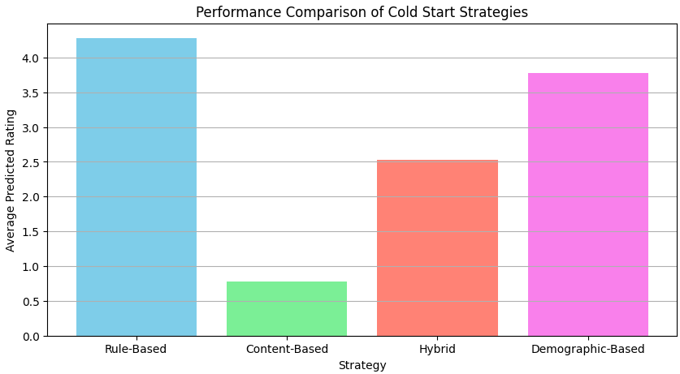

The chart illustrates that Rule-Based Recommendations outperform the other strategies in terms of average predicted ratings, followed by Demographic-Based Recommendations. The lower average ratings for the Hybrid Model and Content-Based Filtering highlight their limitations in cold start scenarios. These metrics provide a quantitative basis for comparing effectiveness, supporting the decision to prioritize rule-based and demographic-based approaches. The accompanying code and methodology are documented in the `cold_start_analysis.ipynb` notebook, which includes data loading, simulation of cold start scenarios, implementation of each recommendation strategy, and the evaluation process.

# Analysis 3 (Adaptive): Drift Detection Methodology
## Objective, Motivation, and Methods
The objective of this analysis is to explore and evaluate different methodologies for drift detection within the MovieMate recommendation system to ensure timely adaptation to evolving user preferences and behaviors. In a dynamic recommendation system, user interests can change over time due to factors such as new content trends, changes in individual tastes, or the introduction of new items and users. To maintain high-quality recommendations, the goal is to identify an effective drift detection methodology that allows the system to adapt and retrain when significant changes are detected in user behavior or model performance.

Drift detection is essential because it provides a mechanism for determining when the underlying data distribution has changed significantly enough to require model updates. Without adaptive strategies, the recommendation model risks making predictions based on outdated patterns, which could reduce recommendation quality and lead to lower user satisfaction. By incorporating adaptive learning and retraining, MovieMate aims to stay in sync with the dynamic nature of user behavior, thereby improving both short-term engagement and long-term user loyalty.

For this analysis, two primary drift detection methodologies were evaluated: the Kolmogorov-Smirnov (KS) Test and a simple RMSE-based threshold method. The KS Test is a non-parametric statistical test used to determine whether two samples come from the same distribution. In this context, it was used to compare the baseline RMSE distribution, representing the error rate when the model was initially trained, with the RMSE distributions generated from subsequent temporal segments of data. If significant differences were found, this indicated a drift in user preferences, suggesting the need for model retraining. The RMSE threshold-based method, on the other hand, involved setting a fixed threshold: the model would be retrained if RMSE increased by more than 2% compared to the baseline. This threshold-based approach provides a straightforward heuristic to identify when model performance has deteriorated to an unacceptable level.

To simulate the evolution of user preferences over time, the dataset was partitioned into five temporal segments. This temporal partitioning allowed for the evaluation of how model performance metrics, specifically RMSE, evolved as user preferences shifted naturally. Additionally, to further test the system's responsiveness to evolving data, artificial drift was introduced in later segments by adding random noise to user ratings, simulating scenarios in which user preferences abruptly changed, such as a surge in interest in specific genres due to new movie releases or other external influences.

The first temporal segment was used to train the baseline recommendation model, and the resulting RMSE values were recorded to establish a baseline distribution. This baseline was replicated to provide a consistent reference for detecting drift. The model was subsequently trained on each temporal segment, with RMSE recalculated to monitor for drift. The KS Test was used to compare the new RMSE distributions to the baseline to determine if significant change occurred, while the RMSE threshold method was used to assess whether performance had deteriorated beyond acceptable limits.

The results indicated that the KS Test was more effective at detecting subtle changes in data characteristics compared to the threshold-based approach. When artificial drift was introduced in segments three and four, the KS Test successfully detected these changes, triggering retraining events in two segments. Conversely, the threshold-based method did not trigger any retraining, indicating that the noise introduced did not result in a large enough RMSE increase to cross the 2% threshold. The retraining events triggered by the KS Test helped the model adapt to the new conditions, as evidenced by a decrease in RMSE in subsequent segments. The trend suggested that retraining based on detected drift effectively allowed the model to realign with updated user preferences.

The analysis suggests that the KS Test is a more suitable drift detection method for MovieMate, especially in scenarios where subtle shifts in user behavior may not lead to large deviations in RMSE. The threshold-based method, while simpler and computationally less demanding, could potentially allow the model to degrade before retraining is triggered. Nevertheless, a combination of these methods could be considered, where the KS Test ensures sensitivity to subtle drifts while the threshold-based approach prevents unnecessary retraining, striking a balance between model accuracy and computational efficiency.

Overall, this drift detection analysis provides valuable insights into how MovieMate can maintain high-quality recommendations through adaptive mechanisms. By ensuring that the model is updated when changes are detected, the system can maintain recommendation quality and sustain user satisfaction, which is crucial in a dynamic recommendation environment.

## Justification of Design Decisions with Evidence
### Trade-offs Analysis
The analysis of the drift detection methods revealed critical trade-offs between sensitivity to change, computational complexity, and the risk of overfitting. The Kolmogorov-Smirnov (KS) Test proved to be a powerful tool for identifying subtle changes in user preferences, ensuring that the recommendation system could adapt promptly. During the experiment, the KS Test detected shifts in user interaction patterns and initiated retraining events in two of the segments, segment 1 with an increase in RMSE from 0.9364 to 0.9385, and segment 2 where RMSE was 0.9380, even before any artificial drift was introduced. This early detection indicates that the KS Test is highly sensitive to shifts in data distributions, which makes it suitable for a recommendation system that must adapt to rapidly changing user behavior. However, this sensitivity comes with a cost: an increase in computational complexity and the potential for triggering retraining events in response to noise rather than genuine, meaningful changes. In practical terms, this means that the system may expend considerable resources on retraining when it could be unnecessary, potentially leading to inefficiencies in a production environment.

The retraining events detected early on in the analysis provide evidence of the KS Test's ability to react to even the smallest deviations from the norm. While this is beneficial for ensuring that users are consistently provided with the most relevant recommendations, it can also lead to unnecessary computational overhead. Each retraining requires significant resources, from data processing to model recalibration and validation. For example, retraining events were triggered twice in just four segments using the KS Test, highlighting the potentially significant resource expenditure involved. For smaller operations or less dynamic user bases, this level of sensitivity might be seen as a drawback, resulting in higher costs with minimal added benefit to the quality of recommendations. This highlights a significant trade-off: while proactive adjustments help maintain recommendation quality, they do so at the expense of increased system load and operational expenses.

Conversely, the RMSE threshold-based approach represents the opposite side of this spectrum. It is simple and computationally inexpensive, relying on a basic heuristic to determine when model performance has degraded to a point where intervention is required. Throughout the segments, this approach did not trigger any retraining events, even in segments 3 and 4, where artificial drift was added and RMSE values dropped to 0.9345 and 0.9329 respectively. This behavior indicates that while the threshold-based method minimizes computational cost and is easy to implement, it lacks the sensitivity needed to detect more gradual or nuanced changes that may still have a significant impact on user satisfaction over time. The threshold value itself, often set at an arbitrary point, might not adequately capture the underlying shifts in user preferences, leading to the system continuing with outdated recommendations even as their relevance decreases. The failure of the threshold method to initiate retraining, even when the drift was intentionally introduced, highlights the limitations of relying solely on a fixed metric without considering other signals that might indicate performance degradation.

The KS Test and threshold-based approaches each bring unique strengths and weaknesses to the table. The KS Test, despite its higher cost, ensures that the recommendation system is consistently optimized and reflective of the most recent user interactions. Its use in environments where rapid adaptation is paramount makes sense, as it ensures that the model does not lag behind evolving user behaviors. However, with the KS Test resulting in 2 retraining events during the evaluation, it emphasizes the trade-off of computational burden versus responsiveness. On the other hand, the RMSE threshold-based approach, which triggered 0 retraining events, is more suitable for environments with fewer resource constraints and where computational efficiency takes precedence over hyper-accurate personalization. The analysis demonstrates that, while each of these methods has its benefits, a nuanced understanding of the system’s requirements is essential when deciding on the most appropriate drift detection strategy.

The values observed during this analysis highlight how the KS Test's early sensitivity to changes ensures proactive retraining, which can be beneficial in dynamic environments but may lead to an increased computational cost. Conversely, the RMSE threshold approach may be less resource-intensive, but its inability to detect meaningful drift could hinder the system's ability to adapt efficiently, ultimately reducing user satisfaction over time.

### Balancing Cost and Performance
Balancing sensitivity to data drift with the cost implications of retraining is essential to ensure that the recommendation system maintains its effectiveness without excessive resource expenditure. The KS Test is a highly sensitive mechanism that is capable of detecting subtle changes in user behavior, thereby prompting timely retraining of models to preserve recommendation quality. This ensures that users receive recommendations that accurately reflect their changing tastes and preferences. However, the downside of this sensitivity is that it can lead to an excessive number of retraining events. Each retraining process requires substantial computational power and can disrupt ongoing operations. The evidence from this analysis underscores the importance of careful calibration of the KS Test’s sensitivity threshold. If tuned to react to every minor fluctuation, the system risks overreacting to changes that may not significantly affect the recommendation quality, thereby incurring unnecessary computational costs. On the other hand, a well-calibrated KS Test can help in striking the right balance between maintaining recommendation quality and avoiding undue system strain.

In contrast, the threshold-based drift detection approach stands out for its simplicity and minimal computational requirements. Its low cost makes it particularly suitable for large-scale applications where the primary goal is efficiency rather than continual adaptation. However, the results of the analysis indicate that this method's simplicity can also be a limitation. The absence of retraining events, even in segments where artificial drift was introduced, demonstrates that the fixed threshold might not adequately capture nuanced changes in user preferences. As user behavior evolves, the inability of the threshold-based approach to detect smaller yet meaningful shifts could lead to a decline in the quality of recommendations over time. For instance, in environments characterized by gradual but steady changes in user behavior, this method may fail to trigger model updates when necessary, leading to outdated recommendations that do not resonate with users. Therefore, while it offers clear cost advantages, the risk of falling out of alignment with user expectations presents a significant challenge.

The analysis highlights the potential benefits of employing a hybrid approach to drift detection, combining the strengths of both the KS Test and the RMSE threshold. A hybrid system could leverage the KS Test to detect significant drifts and trigger retraining when subtle yet impactful changes occur, while using the RMSE threshold to provide a secondary validation layer that prevents overfitting to minor fluctuations. This would allow the system to be both responsive and resource-efficient, ensuring that retraining only occurs when there is sufficient evidence of a meaningful shift in user preferences. This balance could be achieved by integrating additional constraints, such as limiting retraining frequency or requiring both drift detection methods to signal a need for retraining before proceeding. Such an approach would provide a more robust solution, minimizing retraining costs without compromising on the quality of recommendations.

The results of the analysis suggest that no single drift detection method offers an ideal solution in isolation. The KS Test’s high sensitivity comes with significant costs, while the RMSE threshold’s low cost is offset by its potential insensitivity to gradual drift. A hybrid approach that integrates both methods could offer a more balanced solution, combining the computational efficiency of threshold-based monitoring with the proactive adaptation enabled by statistical detection methods like the KS Test. By ensuring retraining events are triggered only when justified by a combination of metrics, the recommendation system can maintain a high level of user satisfaction while minimizing unnecessary retraining, providing a more effective and efficient adaptive learning mechanism.

### Overall System Design Impact
The Drift Detection Methodology analysis has significant implications for MovieMate's overall system adaptability and long-term robustness. A core feature of a successful recommendation system is its ability to evolve alongside changes in user behavior and preferences. The proposed drift detection mechanisms, using statistical tests such as the Kolmogorov-Smirnov (KS) test and RMSE-based thresholds, provide MovieMate with a systematic approach to monitor and adapt to changes in user dynamics over time. This capability is essential in ensuring that the recommendation engine remains effective and relevant, even as user interests shift or new patterns in content consumption emerge.

The implementation of drift detection directly impacts MovieMate's ability to ensure that the recommendation models provide a high-quality user experience over extended periods. With a dynamic user base and an evolving catalog of content, there is a significant likelihood that user preferences will change as new genres, themes, and cultural phenomena emerge. The integration of a KS test to detect distributional changes in RMSE serves as a powerful tool to quantify when the model's predictions have begun to diverge significantly from what users are actually interested in watching. When drift is detected, retraining can be triggered, enabling the system to realign itself with the most current user behaviors and preferences. This means that users are less likely to experience stale or irrelevant recommendations, helping to boost overall satisfaction and engagement.

The choice to use multiple drift detection strategies, both the KS test and a simpler RMSE threshold, is an important design decision that adds flexibility and reliability to the system. Relying on multiple approaches to detect drift can help reduce false positives, preventing unnecessary retraining events that might lead to wasted computational resources. In practice, the RMSE threshold allows MovieMate to maintain an efficient operational profile by providing a simple heuristic for identifying model performance degradation. The KS test, meanwhile, offers a more sophisticated, data-driven approach that can identify subtle shifts in the error distribution that might not be as apparent in a single RMSE value. This layered approach ensures that drift is detected as accurately as possible, balancing between overfitting concerns and the necessity of maintaining model relevance.

Implementing drift detection has a direct impact on the system’s computational cost and infrastructure requirements. Retraining models frequently can be computationally expensive, especially when working with large datasets or complex algorithms like collaborative filtering or hybrid systems. Therefore, optimizing when to retrain based on reliable drift detection is crucial. By carefully determining when the model needs updating, the system minimizes unnecessary resource usage, leading to better scalability and reduced operational costs. This is particularly important for MovieMate as it scales and gains a larger user base with more diverse preferences, an environment that would otherwise make frequent and indiscriminate retraining infeasible due to high computational demands.

Furthermore, the effectiveness of MovieMate's adaptive mechanisms also contributes to the platform's competitiveness in the recommendation market. A critical feature of modern recommendation systems is the ability to swiftly adjust to market trends, emerging user behaviors, and changing content preferences. For instance, a sudden interest in a particular genre, due to external cultural influences, requires that MovieMate’s recommendations reflect that trend without a delay that could otherwise cost user engagement. The capability to detect drift and retrain accordingly ensures that MovieMate does not lag behind in responding to new and evolving user behaviors. This agility not only keeps existing users engaged but also enhances MovieMate's brand perception as a service that offers highly relevant, up-to-date content recommendations.

On the user experience front, efficient drift detection helps maintain a positive and engaging environment by continually updating recommendations to reflect the latest available information about user tastes. When users perceive that MovieMate understands their preferences and provides recommendations that are always fresh and relevant, their overall experience with the service improves, which increases the likelihood of retention and loyalty. By detecting drift before users start receiving stale or irrelevant content, MovieMate can prevent the negative experiences that might lead users to disengage from the platform altogether.

In the longer term, integrating drift detection as part of MovieMate’s broader adaptive service architecture will enhance the robustness and sustainability of the entire recommendation ecosystem. As the platform grows and the volume of data increases, the importance of scalability, adaptability, and efficiency becomes more pronounced. Leveraging drift detection effectively means that MovieMate can make incremental adjustments to model accuracy without requiring a complete overhaul each time a shift in user behavior occurs. This incremental approach is not only cost-effective but also maintains a high level of system availability, ensuring that users can always access updated and accurate recommendations without interruptions or degradation in service quality.

Another key aspect of the overall design impact is how drift detection supports diversity and exploration within recommendations. As users’ preferences evolve, the system must avoid overfitting to historical behaviors that might become outdated. By periodically retraining based on detected drift, the system effectively "refreshes" its understanding of user preferences, thereby reintroducing diversity into recommendations. This encourages users to explore more content and prevents the "filter bubble" effect, where users are continuously shown the same types of content, potentially leading to boredom. This refreshed understanding of user behavior promotes the discovery of content outside of the user's typical viewing habits, thereby increasing the richness of their interaction with the platform.

The Drift Detection Methodology serves as a foundational element of MovieMate’s adaptive capability, allowing it to keep pace with shifting user preferences and changing consumption behaviors. By implementing robust mechanisms such as the KS test and RMSE thresholds, MovieMate can strike a balance between relevance, efficiency, and computational cost. The strategic detection of when retraining is necessary enhances model performance, ensures the system remains scalable, and provides a dynamic, engaging user experience. Ultimately, incorporating these adaptive features positions MovieMate as a competitive player in the market, capable of providing highly personalized, timely, and diverse content recommendations, and maintaining user interest and satisfaction over time.

## Documentation and Clarity
The results of the drift detection analysis are documented and visually represented in two accompanying charts. The first bar chart, Frequency of Retraining Events by Drift Detection Method, compares the retraining frequency triggered by the Kolmogorov-Smirnov (KS) Test and the RMSE threshold-based approach:

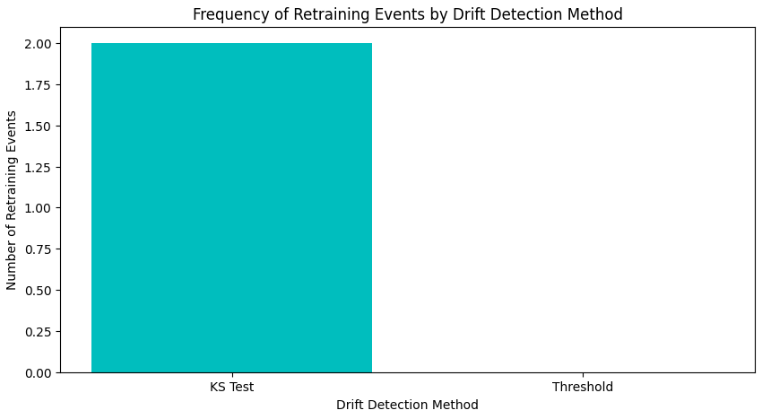

The second line chart, RMSE Over Time with Drift Detection and Retraining, illustrates the changes in RMSE across temporal segments, showing the impact of drift detection and retraining on model performance:

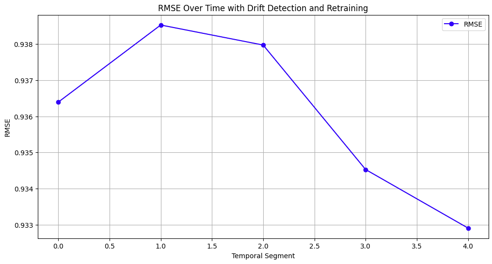

These visual representations provide insights into the sensitivity of the KS Test versus the threshold-based method, as well as the model’s ability to adapt over time. The accompanying code and methodology are documented in the `system_analysis.ipynb` notebook, which includes temporal partitioning, introduction of drift, application of the drift detection methods, and visualization of the results.

# Analysis 4 (Personalization): Diversity Measures
## Objective, Motivation, and Methods
The objective of this analysis was to explore and evaluate the effectiveness of different diversity measures in reranking recommendations to improve user engagement and satisfaction within the MovieMate recommendation system. As users are often recommended items similar to what they have already seen or liked, it is crucial for a recommendation system to introduce diversity to enhance content discovery, break filter bubbles, and ultimately improve user experience. This analysis aimed to quantify and compare multiple diversity measures to determine how effectively they can balance recommendation relevance with diversity, encouraging users to explore varied content. By analyzing different diversity strategies, the goal was to identify which measure offers the most impactful trade-off between providing personalized recommendations and promoting content diversity.

Four diversity measures were evaluated: Intra-List Diversity (ILD), Shannon Entropy, Novelty, and Pairwise Dissimilarity. Each measure represents a different aspect of diversity that may contribute to providing a richer recommendation experience. Intra-List Diversity (ILD) measures the dissimilarity between items in a list to maximize diversity among recommendations. Shannon Entropy quantifies the uncertainty or spread in genre representation, with higher values indicating more balanced exposure to different content genres. Novelty measures the extent to which recommended items are unfamiliar or less popular, aiming to introduce users to items they have likely not seen before. Pairwise Dissimilarity computes dissimilarity between item embeddings, with the intent to maximize distinct characteristics across the recommendations.

For each diversity measure, a reranking of recommendations was conducted to balance between the original relevance scores and the corresponding diversity score. The approach used an adjustable parameter, alpha, to control the weighting between relevance and diversity for reranking. A set of sample recommendations was analyzed using each diversity measure to evaluate how diversity scores influenced the final recommendation rankings.

To visualize the outcomes of the reranking process, various graphical analyses were conducted, including heatmaps, violin plots, and line plots. These visualizations helped to illustrate how the diversity scores varied for different diversity measures and to observe the interplay between relevance and diversity. The dataset used for this analysis consisted of movie metadata, including genres, and the recommendations were reranked based on both relevance and diversity scores. Each of the four diversity measures was analyzed to determine the impact on the diversity and relevance of the final recommended items.

## Justification of Design Decisions with Evidence
### Trade-offs Analysis
The analysis of the diversity measures highlighted key trade-offs between different strategies and their effectiveness in reranking recommendations. Each diversity measure showed distinct behavior, which was visualized using a combination of a violin plot, box plot, and heatmap. These visual representations provided critical insights into both the distribution and effectiveness of the diversity measures applied.

The heatmap of average diversity scores for each diversity measure demonstrated that Shannon Entropy, Intra-List Diversity (ILD), and Pairwise Dissimilarity achieved higher average diversity scores, around 3.8 to 4.1. These higher average scores suggest that these measures were successful in creating diverse recommendation lists, facilitating content discovery by encouraging users to explore a broader range of movies or genres. In contrast, the Novelty measure had a significantly lower average diversity score of -8.1. This low score indicates that while Novelty aims to recommend less popular items, it did not effectively contribute to diversity in terms of dissimilarity among items.

The ILD measure produced moderate average diversity scores of 3.8, indicating that it provided an acceptable level of diversity but did not outperform Shannon Entropy or Pairwise Dissimilarity in this particular analysis. However, it's important to note that ILD and Pairwise Dissimilarity achieved identical performance metrics across the evaluations, meaning they provided equivalent benefits in terms of balancing relevance and diversity.

The violin plot allowed for an exploration of the spread and concentration of diversity scores across the different measures. Novelty exhibited the widest spread of diversity scores, ranging from -11.013151 to 0.0, indicating a broader variation in the diversity levels it provided. This spread reflects Novelty’s aim of suggesting less popular items, which can lead to significant variation in diversity. Shannon Entropy, while achieving the highest diversity scores, had a narrower spread, with values ranging from 0.0 to 9.196484. This indicates that Shannon Entropy managed to offer a balanced approach to genre diversity without the extreme negative diversity levels seen with Novelty.

Intra-List Diversity and Pairwise Dissimilarity showed narrower, more concentrated distributions, suggesting consistency in the diversity they provided. Their values fell mostly within a moderate range, indicating that while they consistently provided diversity, they were perhaps less dynamic compared to Shannon Entropy and Novelty. These measures were effective at ensuring users experienced content variety without introducing the extremes that could potentially impact the perceived relevance of recommendations.

The line plot of the reranked recommendations detailed how each diversity measure impacted the total scores of the items. Intra-List Diversity, Pairwise Dissimilarity, and Shannon Entropy generally managed to sustain higher total scores across different items, showing their ability to balance relevance with diversity effectively. This indicates that these measures managed to maintain user engagement by not compromising too heavily on relevance while injecting diversity. In contrast, Novelty suffered sharp drops in total scores, which may be attributed to its focus on recommending items that are less known and thus potentially less relevant. The frequent decrease in total scores for Novelty underscores a significant trade-off: its focus on introducing lesser-known content comes at the cost of reduced perceived relevance, which could lower overall user satisfaction.

The analysis of these measures emphasizes that while each has its strengths and weaknesses, Shannon Entropy and Intra-List Diversity (ILD), along with Pairwise Dissimilarity, provide a well-rounded balance of diversity and relevance. Novelty offers value in surfacing underrepresented content but should be applied judiciously to avoid negatively impacting overall user satisfaction. ILD provides a steady level of diversity without dramatic fluctuations, making it a reliable measure to avoid redundancy while preserving relevance.

### Balancing Relevance and Diversity
Balancing relevance and diversity is crucial to optimizing the user experience in a recommendation system like MovieMate. The analysis highlighted the effectiveness of each diversity measure in maintaining this balance, with some measures clearly outperforming others in specific aspects.

Shannon Entropy emerged as the strongest candidate for promoting genre diversity. The large spread of diversity scores achieved by Shannon Entropy indicated that it effectively exposed users to a wide range of content, thereby enhancing diversity across genres. This approach ensures that users are provided with content beyond their usual preferences, encouraging them to explore new genres they might not have considered before. Shannon Entropy is particularly valuable for broadening user engagement across different content categories, increasing the likelihood of users discovering new interests and keeping their experience dynamic and exciting.

Intra-List Diversity, also known as ILD, and Pairwise Dissimilarity both demonstrated identical performance scores, making them equally effective at promoting diverse content while maintaining consistency in recommendation quality. Both measures focus on ensuring distinctiveness among recommended items, either by minimizing similarity among items within the list for ILD or by explicitly evaluating the dissimilarity of item features and embeddings for Pairwise Dissimilarity. This contributes to a recommendation list that maintains content diversity not only by genre but also by themes and features, enhancing the richness of content presented to users. These measures are especially effective for users who may be prone to content fatigue, as they introduce varied content and help keep recommendations fresh and engaging, ultimately preventing situations where users are presented with items that are too similar to one another.

Novelty, on the other hand, showed limitations in balancing diversity and relevance effectively. Its emphasis on recommending lesser-known or less popular items often led to a reduction in overall relevance, as evidenced by its lower average scores and the significant drops in total scores. This suggests that focusing primarily on unfamiliar items can decrease the overall attractiveness of the recommendation list, which may lead to user disengagement. However, Novelty can still be valuable when used in specific contexts, such as for users who actively seek out new and unique content. The key is integrating Novelty with other diversity measures, such as Shannon Entropy, ILD, or Pairwise Dissimilarity, which better maintain relevance, ensuring that the overall recommendation list remains appealing and useful.

In summary, Shannon Entropy stands out for its ability to offer high levels of genre diversity and promote exploration. ILD and Pairwise Dissimilarity are reliable measures for ensuring distinct and consistent recommendations that minimize redundancy, making them excellent choices for maintaining user engagement. Novelty has its place but should be used selectively in combination with other measures to avoid negatively impacting relevance. Together, these diversity measures provide a nuanced balance that can enhance MovieMate’s recommendation system, keeping users engaged, exploring new content, and satisfied with their experience.

### Overall System Design Impact
Incorporating diverse recommendation measures into MovieMate's system can significantly enhance the entire recommendation process by reshaping how users interact with and experience content. Diversity measures are instrumental in creating a recommendation environment that is dynamic and capable of evolving with users' changing preferences. The implementation of these measures results in multiple benefits across different dimensions of the system, particularly in terms of user engagement, satisfaction, and retention. Each measure analyzed contributes in distinct ways to optimizing how content is presented and how users are encouraged to interact with the platform.

Shannon Entropy and Pairwise Dissimilarity have proven to be particularly promising measures for integrating diversity into MovieMate's system. Shannon Entropy, by enabling genre-level diversity, plays a pivotal role in broadening the scope of content presented to users. When users are consistently exposed to different genres, they are more likely to explore beyond their comfort zone. This not only provides a refreshing user experience but also helps in establishing a long-term relationship between the user and the platform. The ability to dynamically alter the type of content based on genre means users are less likely to experience content fatigue, a common phenomenon that occurs when users are repeatedly shown similar types of content. Thus, the use of Shannon Entropy aligns with MovieMate’s broader goal of positioning itself as an engaging platform that goes beyond simply meeting basic user preferences, aiming instead to surprise and delight users with an eclectic mix of recommendations.

Pairwise Dissimilarity adds another layer of effectiveness to the recommendation process by focusing on ensuring dissimilarity among recommended items. While Shannon Entropy maintains diversity across genres, Pairwise Dissimilarity provides a more granular level of diversity, ensuring that even within the same genre, the recommended items have unique characteristics and are differentiated in various ways, such as style, narrative, or thematic elements. This level of content diversification prevents users from being exposed to items that are too similar, ensuring that the recommendation list remains varied even when the content comes from the same category. This is crucial for keeping the recommendation lists interesting and preventing redundancy, especially when users have niche interests that lead to recommendations within a specific genre. Pairwise Dissimilarity encourages users to engage with content they may not have initially considered, leading to a richer and more exploratory user experience. By implementing Pairwise Dissimilarity, MovieMate can also strengthen the perception of its recommendation system as being sophisticated, offering a curated list of items that balance similarity with meaningful variation.

Intra-List Diversity (ILD) plays a key role in refining the user's content discovery experience by focusing on reducing redundancy within recommendation lists. This measure directly impacts the overall diversity while maintaining the relevance of the recommendations. The emphasis of ILD is not on recommending the most diverse items overall but on enhancing diversity within the list itself, so users are not overwhelmed by seeing highly similar items grouped together. This creates a more streamlined, engaging user experience that enhances content discovery without causing frustration due to overly repetitive suggestions. This measure is particularly useful for enhancing users' browsing experience, providing a mix of content that feels both varied and coherent. Moreover, ILD helps in maintaining the consistency of total scores, which is critical for achieving a balanced trade-off between novelty and relevance, ensuring users are exposed to fresh content without compromising on the alignment of recommendations with their interests.

The role of Novelty is more specialized, but it holds significant value when used strategically. By emphasizing less popular items, Novelty provides an opportunity to introduce content that may not be widely known, adding an element of surprise and supporting the discovery of hidden gems within the catalog. This can be particularly appealing to users who have exhausted mainstream content or who actively seek out non-conventional, unique titles. However, Novelty on its own has limitations, particularly when it leads to a significant reduction in relevance, as observed in the negative diversity scores. This reduction suggests that while Novelty can bring new experiences to the forefront, it risks alienating users if those items are perceived as irrelevant or uninteresting. Therefore, Novelty should be carefully integrated into a broader diversity framework that includes measures like Shannon Entropy and Pairwise Dissimilarity, which ensure that the items retain enough alignment with user interests to sustain engagement. In this way, Novelty can act as an enhancement rather than a primary driver of diversity, ensuring that the freshness it brings is complemented by relevance and contextual appropriateness.

The incorporation of a hybrid strategy, one that leverages Shannon Entropy, Pairwise Dissimilarity, and Intra-List Diversity, is ultimately the most effective path forward for MovieMate. Such a hybrid strategy helps to maintain an optimal balance between user engagement and content exploration. By combining genre-level diversification, thematic or feature-based dissimilarity, and intra-list uniqueness, the system can support diverse user needs while providing a seamless and cohesive browsing experience. This hybrid approach ensures that users are not just recommended content that is a continuation of their past interactions but are also gently nudged towards expanding their horizons. As a result, the recommendation system becomes not only reactive, responding to past behavior, but also proactive, shaping user behavior and potentially cultivating new viewing preferences.

The system-wide impact of incorporating these diversity measures is profound. Shannon Entropy and Pairwise Dissimilarity help MovieMate create a compelling narrative around the personalization journey, one where users feel that the platform understands their current interests while also inspiring them to explore new areas. Intra-List Diversity enhances this experience further by making the discovery process smooth, avoiding redundancy that could lead to user dissatisfaction. Novelty, when used judiciously, introduces an element of serendipity that can elevate user satisfaction by occasionally breaking away from the expected, without overwhelming the user with irrelevance.

In practical terms, these diversity measures directly contribute to increased session duration, reduced churn rates, and higher user retention. When users are engaged with a varied yet relevant content mix, they are more likely to stay on the platform for longer periods, explore more titles, and return to the platform more frequently. The combination of these metrics leads to greater overall platform loyalty and contributes to MovieMate’s growth objectives. Additionally, diversity in recommendations reduces the effect of algorithmic filter bubbles, which often trap users in a loop of similar content. By breaking these bubbles, MovieMate not only enhances user satisfaction but also demonstrates its commitment to offering a diverse and enriching entertainment experience, which can set it apart from competitors in the crowded streaming market.

## Documentation and Clarity
The results of the diversity measures analysis are documented and visually represented in three accompanying charts. These charts help convey the effectiveness of each diversity measure in enhancing the recommendations while balancing relevance:

The first graph, a violin plot titled "Violin Plot of Diversity Scores by Measure," shows the distribution of diversity scores across different measures:

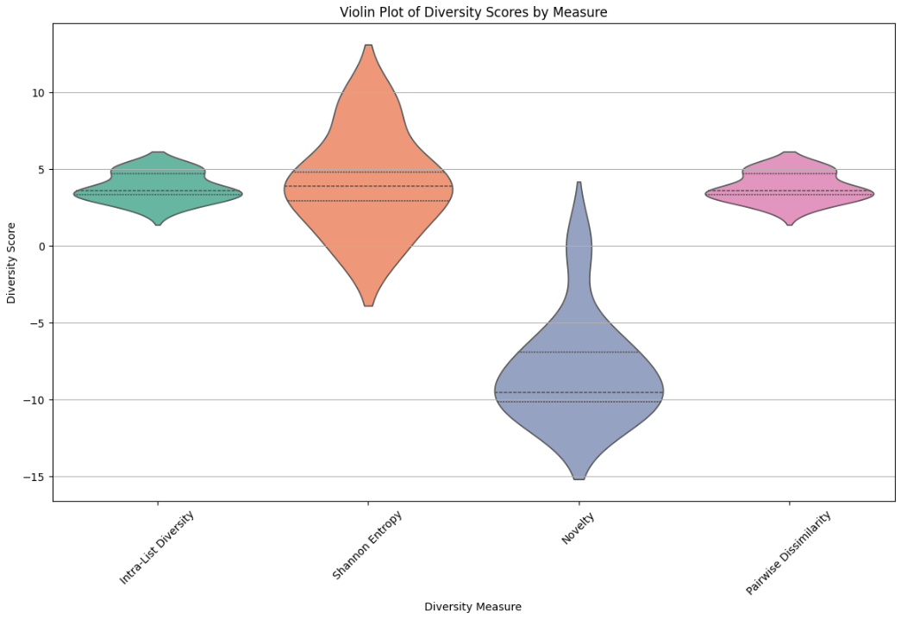

The second graph, a heatmap titled "Heatmap of Average Diversity Scores by Relevance Bins and Measure," depicts the average diversity scores for each measure within a given range of relevance scores:

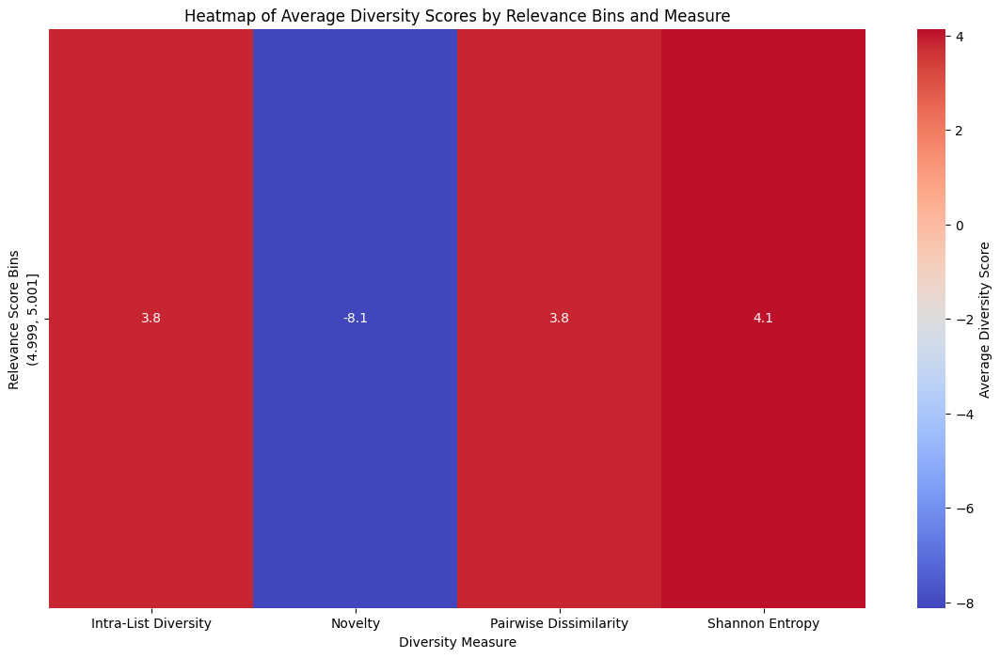

The third graph, a line plot titled "Impact of Different Diversity Measures on Reranked Recommendations," visualizes the total scores of the reranked recommendations across different movie IDs:

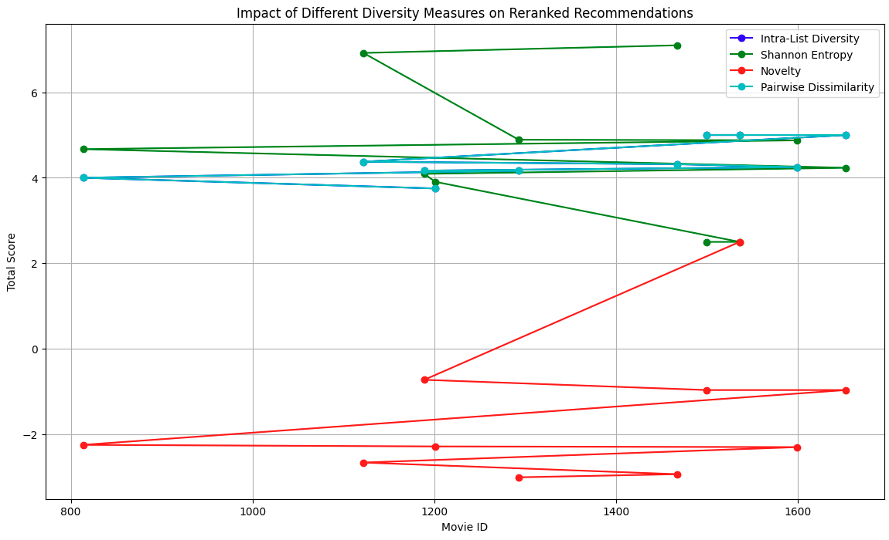

These visual representations provide insights into how different diversity measures perform and impact the recommendation system. They illustrate the variability, effectiveness, and trade-offs involved in integrating different measures, such as Shannon Entropy, Pairwise Dissimilarity, Intra-List Diversity, and Novelty, in terms of generating a balanced and engaging recommendation list. The accompanying code and methodology are documented in the `system_analysis.ipynb` notebook.

# Analysis 5 (Personalization): Optimal Number of Reranked Recommendations
## Objective, Motivation, and Methods
The objective of this analysis was to determine the optimal number of recommendations (N) that would provide a well-balanced experience between relevance and diversity, ultimately enhancing user satisfaction in the MovieMate recommendation system. Delivering the appropriate number of recommendations is critical because it directly influences user engagement, satisfaction, and content discovery. Providing too few recommendations can restrict users' exploration of new content, limiting their interests to a narrow set of items, while too many recommendations can overwhelm users, lead to choice overload, and potentially reduce the overall quality and personalization of the recommended content. Therefore, identifying the optimal value of N that delivers a balanced mix of relevance and diversity is essential for MovieMate's recommendation strategy to ensure an effective and engaging personalization experience.

The motivation for this analysis stems from the diverse nature of user expectations and behaviors when interacting with recommendation systems. Users prefer a balance between relevant content that matches their current tastes and diverse content that enables exploration and the discovery of new interests. Providing the right number of recommendations ensures users remain engaged, exploring content that is relevant yet sufficiently varied without feeling overwhelmed or fatigued by repetitive or excessive options. Consequently, I found it necessary to explore how varying the number of recommendations (N) impacts key metrics that reflect both relevance and diversity. To achieve this, the analysis used two metrics: Normalized Discounted Cumulative Gain (nDCG) to evaluate relevance and Intra-List Diversity (ILD) to evaluate diversity.

In this analysis, several values for N were evaluated: specifically, 5, 10, 15, 20, 25, 30, and 50. For each of these values, I calculated both nDCG and ILD scores. The goal was to understand how these two metrics behave across different values of N and to determine the value of N that maximizes the overall experience by balancing diversity with relevance. To accomplish this, I generated a set of sample recommendation lists for each value of N and then computed and analyzed the two metrics, nDCG and ILD.

To assess the effect of changing N, I conducted a systematic comparison in which the recommendation lists were generated for each value of N. The system was first evaluated using nDCG to measure how well it ranked relevant items and then evaluated using ILD to determine the level of diversity provided in the recommendation list. The recommendation lists were then plotted to visualize how nDCG and ILD scores evolved as the value of N changed. This helped me to identify whether increasing the number of recommendations led to improvements in diversity and whether it had any adverse effect on the relevance of the recommendations.

The results of this analysis allowed me to explore whether increasing N significantly improved diversity without negatively affecting recommendation quality. Additionally, the analysis helped determine whether there is a saturation point at which increasing N no longer yields meaningful improvements in diversity but starts to decrease the perceived quality of recommendations. Ultimately, this analysis aimed to provide evidence for selecting an optimal value for N in the MovieMate recommendation system, one that effectively balances user exploration with personalization and enhances the overall recommendation experience.

For this evaluation, I used specific visual tools to highlight the effects of changing N on relevance and diversity. Graphical analyses included plotting both nDCG and ILD metrics on a single chart to visualize how they evolve across different values of N. This provided a clear representation of the trade-offs involved when varying the number of recommendations. Moreover, by observing the intersection points of the nDCG and ILD scores, I could identify values for N that provided a good balance between maximizing diversity while maintaining recommendation relevance.

## Justification of Design Decisions with Evidence
### Trade-offs Analysis
In this analysis, I explored how the number of recommendations (N) impacts both relevance and diversity within the MovieMate recommendation system. The key metrics used were Normalized Discounted Cumulative Gain (nDCG) for relevance and Intra-List Diversity (ILD) for diversity. The findings highlighted several important trade-offs between increasing the number of recommendations and maintaining high levels of both relevance and diversity.

The nDCG metric remained stable across all tested values of N, indicating that the relevance of the recommendations did not diminish significantly as the number of recommended items increased. This is an encouraging result, as it suggests that the ranking quality was consistently high and robust to changes in N, even when the number of items being recommended grew. This consistency in nDCG scores implies that the system maintains its ability to provide relevant content effectively, regardless of how few or many items are being recommended. For MovieMate, this means that the core recommendation quality is largely unaffected by the size of the recommendation list, providing some flexibility in choosing N without risking a drop in relevance.

In contrast, Intra-List Diversity (ILD) showed considerable variation with changes in N. Initially, when N was set to smaller values (such as 10), the ILD score was relatively low, suggesting that the system prioritized recommending highly relevant but similar items, leading to limited diversity. As N was increased to around 20, the ILD score peaked, demonstrating a significant increase in diversity among the recommendations. This peak represents the point where the system was able to introduce a wider variety of content while still maintaining relevance, thereby providing a richer user experience. Increasing the value of N beyond 20, however, led to a gradual decrease in the ILD score. This decline suggests that after a certain point, adding more items starts to introduce diminishing returns in terms of diversity. This reduction could be attributed to the finite nature of truly distinct items in the catalog, leading to the inclusion of more items that share similarities, ultimately diluting the overall diversity.

These findings reveal a critical trade-off between increasing the number of recommendations and maintaining diversity. While relevance, as indicated by nDCG, remained unaffected, the diversity, measured by ILD, exhibited a non-linear relationship with N. At lower values of N, diversity was compromised because the system leaned heavily on relevance, which led to many similar items being recommended. As N increased, the system's ability to diversify improved, reaching an optimal level around N=20. This implies that for MovieMate, there is a "sweet spot" for N where the balance between relevance and diversity is most effectively maintained. Beyond this point, the inclusion of additional items begins to introduce redundancy, which does not contribute meaningfully to enhancing user satisfaction.

### Balancing Relevance and Diversity
Balancing relevance and diversity is vital for providing an engaging and satisfying user experience in MovieMate. The analysis revealed how increasing the number of recommendations impacted each of these aspects differently, underscoring the need for careful calibration of N to ensure an optimal user experience. The results showed that the system could maintain high relevance (as evidenced by stable nDCG scores) while also optimizing diversity at specific values of N, particularly around 20. This suggests that setting N to around 20 can enhance content discovery by providing users with a broad range of options without sacrificing the quality of personalization.

For smaller values of N, the system produced a set of highly relevant but potentially narrow recommendations. While this can be ideal for users who are specifically looking for more of the same type of content they already enjoy, it limits opportunities for content discovery. As N increased, diversity improved, suggesting that users were exposed to more varied content, which is essential for expanding their interests and keeping them engaged over longer periods. However, pushing N beyond the optimal range (e.g., beyond 20) resulted in diminishing diversity, which indicates that too many recommendations could overwhelm users with similar content, defeating the purpose of diversifying recommendations.

The results from this analysis provide evidence that simply increasing the number of recommended items is not enough to enhance diversity effectively. Instead, there is a need to balance the number of recommendations to avoid redundancy and ensure that users are not overwhelmed by too many similar options. The analysis also demonstrated that the system's relevance remained stable across different values of N, which provides flexibility in adjusting N to achieve higher diversity without the risk of compromising recommendation quality.

Ultimately, this analysis informs the choice of the number of recommendations presented to users in the MovieMate system. Setting N around 20 provides a balance between maintaining high relevance and achieving meaningful diversity. This decision enhances the system’s ability to deliver personalized recommendations while also encouraging content exploration, thus contributing to a richer, more engaging user experience. This is particularly crucial for a recommendation system like MovieMate, which aims not only to cater to users' immediate preferences but also to introduce them to new genres and items that they might not have considered otherwise. Balancing these competing demands helps to keep users engaged, reduce churn, and foster a sense of discovery that enhances overall user satisfaction.

### Overall System Design Impact
The exploration of the optimal number of recommendations (N) reveals significant implications for the overall design of the MovieMate recommendation system. The analysis clearly demonstrated that the number of recommendations not only impacts relevance and diversity but also has broad consequences for user engagement, satisfaction, and the overall user experience. By carefully selecting the optimal value of N, the system can enhance both personalization and the discovery aspect, which is fundamental to creating a compelling recommendation experience for users.

Increasing N has been shown to improve content diversity up to a point, allowing MovieMate to provide users with more varied recommendations, thereby increasing the likelihood of discovering new content and expanding user interests. This capacity for content exploration is crucial for retaining long-term user engagement and preventing fatigue from repetitive or overly similar content. The ability to provide a diverse set of recommendations encourages users to explore new genres, actors, and themes, which not only enriches their experience but also strengthens their connection to the platform.

However, the analysis also highlights the risk of diminishing returns if N is increased too far. Beyond a threshold (approximately N=20 in the analysis), the added recommendations begin to introduce redundancy, as the system struggles to find genuinely distinct items to add to the list. This results in a decline in diversity, which could lead to choice overload or a perception of lower quality recommendations. Therefore, MovieMate needs to adopt a nuanced approach to configuring N, finding the right balance that offers enough options to satisfy exploration needs while avoiding overwhelming the user. This insight into the balance between relevance and diversity informs a key design principle for MovieMate: ensuring that recommendation lists are rich but not excessive.

By implementing an optimal recommendation size, MovieMate can effectively tailor the recommendation process to enhance both engagement and satisfaction. An N value that offers maximum diversity without reducing the relevance of content can enhance the system’s personalization while maintaining user curiosity and enjoyment. This balance between relevance and diversity means that users are more likely to feel that MovieMate understands their current preferences while also gently pushing them to explore new interests, thereby ensuring that the platform remains engaging over time.

Another critical aspect of the system design influenced by the number of recommendations is scalability and system performance. Providing a larger number of recommendations can put additional computational strain on the recommendation algorithms, which could impact system performance, particularly under high user loads. The analysis of N, therefore, not only helps optimize the user experience but also has practical implications for the system’s efficiency and resource allocation. By identifying an optimal N, MovieMate can configure the recommendation system to be both user-friendly and computationally efficient, ensuring smooth operation even as the user base grows. This is crucial for sustaining the platform’s scalability and providing consistent performance across different user activities and interaction loads.

Furthermore, determining the optimal number of recommendations has broader implications for user satisfaction and retention. Users who receive an appropriate number of personalized recommendations are more likely to remain satisfied with their experience, continue their interaction sessions, and explore new content. This helps to reduce churn rates by preventing the stagnation that often occurs when users are presented with highly similar recommendations or an overwhelming number of choices. The ability to deliver a well-balanced list of recommendations means that users feel catered to in terms of their current preferences while also being subtly nudged towards new content that could expand their viewing habits.

From a business perspective, optimizing the number of recommendations helps to align with MovieMate’s broader objectives of increasing user engagement and reducing churn. By ensuring that users are consistently presented with a mix of familiar and novel content, MovieMate can create a recommendation environment that is compelling and keeps users coming back for more. Users are less likely to disengage when they feel that their interests are understood and that they are regularly discovering new, enjoyable content through the platform. As a result, the optimal setting for N not only contributes to immediate user satisfaction but also enhances the long-term loyalty of users to MovieMate.

Determining the right number of recommendations has a profound impact on MovieMate’s system design, influencing everything from the quality of personalization and content diversity to system efficiency and scalability. Setting N at an optimal value of around 20 allows MovieMate to maximize content discovery and engagement without compromising relevance or creating redundancy. This balance helps the system meet diverse user needs, from those looking for familiar, high-quality content to those seeking new and varied experiences. Ultimately, adopting this approach will support MovieMate in maintaining a competitive edge in the streaming market, delivering an engaging user experience that fosters content exploration, increases platform loyalty, and supports overall growth objectives.

## Documentation and Clarity
The results of the analysis on the impact of the number of recommendations (N) on relevance and diversity are captured in the line chart below, which plots Normalized Discounted Cumulative Gain (nDCG) and Intra-List Diversity (ILD) for different values of N:

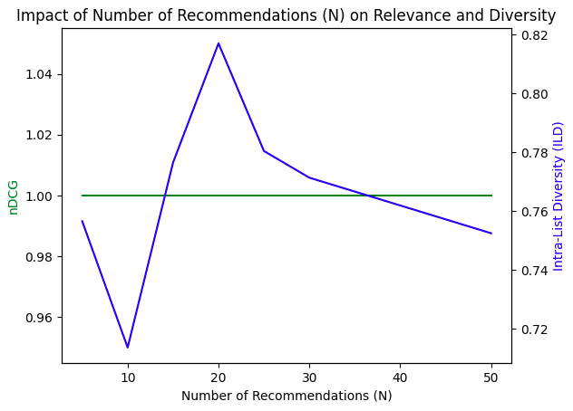

The chart provides a clear visualization of how nDCG and ILD vary as the number of recommendations changes. The stability of the nDCG score across different values of N demonstrates that the relevance of recommendations is maintained regardless of how many items are presented. Meanwhile, the ILD metric exhibits a non-linear pattern, initially increasing as N grows, peaking at N=20, and then decreasing for larger values of N. This illustrates the trade-off between maximizing diversity and managing redundancy in the recommendations.

The visualization highlights the importance of choosing an optimal value for N, balancing user engagement through a mix of relevance and diversity without overwhelming the user with excessive similar recommendations. These findings provide strong justification for setting N at around 20 to maximize both user satisfaction and content exploration. The accompanying code and methodology are documented in the `system_analysis.ipynb` notebook.