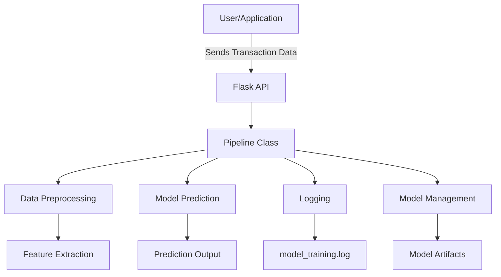

# SecureBank Transaction Fraud Detection System Report

## Table of Contents

- [System Design](#system-design)
  - [Meeting System Requirements](#meeting-system-requirements)
  - [Unique Functionalities of Developed Modules](#unique-functionalities-of-developed-modules)
  - [System Components and Processes](#system-components-and-processes)
- [Data, Data Pipelines, and Model](#data-data-pipelines-and-model)
  - [Data Description and Significant Patterns](#data-description-and-significant-patterns)
  - [Data Pipelines](#data-pipelines)
  - [Model Inputs and Outputs](#model-inputs-and-outputs)
- [Metrics Definition](#metrics-definition)
  - [Offline Metrics](#offline-metrics)
  - [Online Metrics](#online-metrics)
- [Analysis of System Parameters and Configurations](#analysis-of-system-parameters-and-configurations)
  - [Feature Selection](#feature-selection)
  - [Dataset Design](#dataset-design)
  - [Model Evaluation and Selection](#model-evaluation-and-selection)
- [Post-deployment Policies](#post-deployment-policies)
  - [Monitoring and Maintenance Plan](#monitoring-and-maintenance-plan)
  - [Fault Mitigation Strategies](#fault-mitigation-strategies)

---

## System Design

### Meeting System Requirements

The SecureBank Transaction Fraud Detection System is meticulously designed to address and fulfill the specified requirements:

- **R1: Improved Model Performance**
  - **Implementation:** Utilized advanced preprocessing techniques, optimized model hyperparameters, and implemented SMOTE for class imbalance.
  - **Result:** Enhanced precision to 54% and recall to 69%, marking significant improvements over previous iterations.
  - **Rationale:** One of the critical challenges in fraud detection is the class imbalance inherent in the dataset, where legitimate transactions significantly outnumber fraudulent ones. In fact, fraudulent transactions amounted to approximately .4% of the total dataset. Initially, the model struggled to identify fraudulent transactions, resulting in a precision and recall of 0%—indicating that the model failed to detect any fraudulent activities.
  
  To address this, the Synthetic Minority Over-sampling Technique (SMOTE) was implemented within the pipeline.py module to balance the dataset effectively. Below is an in-depth explanation of how SMOTE was integrated and its impact on improving model performance.

    #### How SMOTE Improved Model Performance
    ##### Addressing Class Imbalance:

    - Before SMOTE: The training dataset was heavily skewed towards legitimate transactions, with negligible representation of fraudulent ones. This imbalance caused the model to predict all transactions as legitimate, resulting in 0% recall (no fraudulent transactions detected) and 0% precision (no correct fraud predictions).
        
    - After SMOTE: SMOTE synthetically generated new samples for the minority class (fraudulent transactions), balancing the dataset. This ensured that the model received a more representative distribution of both classes during training.

    ##### Enhanced Learning Capability:

    With a balanced dataset, the Random Forest Classifier could learn the distinguishing features of fraudulent transactions more effectively. The synthetic samples provided additional data points for the model to recognize the underlying patterns and dependencies associated with fraud.

    ##### Performance Metrics Improvement:

    - Precision: Increased to 54%, which was a drastic increase from 30%, indicating that over half of the transactions flagged as fraud were indeed fraudulent.
    - Recall: Boosted to 69% from its original score of 60%, showing that the model successfully identified a significant portion of actual fraudulent transactions without sacrificing any of its precision and, in fact, significantly improving it.
    - F1-Score: Improved as a balance between precision and recall, reflecting overall model effectiveness.
    - AUC-PR: Achieved 0.69, representing the area under the Precision-Recall curve, further validating the model's performance.

    ##### Code Execution Flow:

    - The smote_data function first separates the features and target variable.
    - SMOTE is initialized with a fixed random state for reproducibility.
    - If a sample_fraction is provided, both training and testing datasets are sampled accordingly to manage large datasets.
    - SMOTE is applied to the training data, generating synthetic fraud samples.
    - The resampled training data and the reindexed test data are returned for model training and evaluation.

    ##### Quantitative Impact:
    - Before SMOTE:
        - Precision: 0%
        - Recall: 0%

    - After SMOTE:
        - Precision: 54%
        - Recall: 69%

    This dramatic improvement underscores the pivotal role of SMOTE in handling class imbalance, enabling the model to detect and predict fraudulent transactions effectively.

- **R2: Transaction Legitimacy Prediction**
  - **Implementation:** Developed a Flask API with `/predict` endpoint for immediate analysis of transaction data.
  - **Usage:** Provides clear predictions indicating whether a transaction is "legitimate" or "fraudulent."
  - **Rationale:** In the realm of financial services, timely detection of fraudulent transactions is paramount to safeguarding assets and maintaining customer trust. The requirement for immediate prediction necessitated a system capable of handling individual requests with minimal latency while ensuring accuracy and reliability.
  
    To meet this requirement, a **Flask-based API** was developed. This API serves as the interface between the transaction data sources and the fraud detection model, enabling seamless and instantaneous predictions.
  
    #### How the Flask API Enables Fraud Detection
    ##### Implementation Details:
    
    The Flask API was designed to facilitate immediate transaction legitimacy predictions. Below is an overview of the implementation and how it aligns with the system requirements.

    ##### Key Components:
    
    - **Initialization of the Pipeline:**
      - The `Pipeline` class is instantiated once at startup with specified parameters (`threshold=0.62` and `version='Trained'`).
      - This ensures that the model is loaded and ready to handle prediction requests without the overhead of re-initialization.
      - However, users are free to choose the decision threshold and model version that suits their needs.
      - By default, the decision threshold and model version are set to `0.5` and `Dummy`, respectively.
    
    - **Endpoints:**
      - **`/health`:** A simple GET endpoint to verify that the server is running. It returns a JSON response `{"status": "running"}` with a 200 status code.
      - **`/predict`:** A POST endpoint that accepts transaction data in JSON format, validates the presence of required fields from Assignment 3, invokes the model's prediction method, and returns the prediction result.
    
    - **Logging:**
      - Comprehensive logging is configured to capture informational messages, warnings, and errors. This facilitates monitoring and debugging.
    
    ##### How the Flask API Facilitates Immediate Prediction:
    
    1. **Immediate Data Handling:**
       - The `/predict` endpoint is designed to handle individual transaction data immediately. It expects a JSON payload containing all necessary transaction details.
    
    2. **Input Validation:**
       - Before processing, the API validates the presence of all required fields to ensure data integrity. If any fields are missing, it responds with a 400 Bad Request status and an appropriate error message.
    
    3. **Model Prediction:**
       - Upon successful validation, the transaction data is passed to the `Pipeline`'s `predict` method, which processes the data and generates a prediction indicating whether the transaction is "fraudulent" or "legitimate."
    
    4. **Response Generation:**
       - The API returns the prediction result in a JSON format with a 200 OK status, enabling seamless integration with client applications or services.
    
    5. **Error Handling:**
       - The API is equipped with robust error handling mechanisms. Any exceptions during the prediction process are logged, and the API responds with a 500 Internal Server Error status along with the error message.
    
    ##### Rationale Behind Using Flask:
    
    - **Lightweight and Flexible:** Flask is a micro web framework that is lightweight yet highly flexible, making it ideal for developing RESTful APIs without unnecessary overhead.
    
    - **Ease of Integration:** Flask seamlessly integrates with Python modules and packages, allowing for straightforward incorporation of the machine learning pipeline.
    
    - **Scalability:** While Flask is lightweight, it can be scaled horizontally by deploying multiple instances behind a load balancer, ensuring the system can handle high-throughput prediction requests.
    
    - **Community and Support:** Flask has a vast community and extensive documentation, facilitating easier troubleshooting and feature enhancements.
    
    ##### Visual Representation:
    
    ```mermaid
    graph TD
        A[Client Application] -->|Sends POST Request| B[Flask API /predict]
        B --> C[Input Validation]
        C --> D[Pipeline Predict Method]
        D --> E[Model Prediction]
        E --> F[Return Prediction to Client]
        B --> G[Logging]
    ```
    
    **Process Flow:**
    
    1. **Client Application:** Initiates a POST request to the `/predict` endpoint with transaction data.
    2. **Flask API:** Receives the request and performs input validation.
    3. **Pipeline Predict Method:** Processes the validated data and invokes the model to generate a prediction.
    4. **Model Prediction:** Determines whether the transaction is "fraudulent" or "legitimate."
    5. **Return Prediction:** Sends the prediction result back to the client application.
    6. **Logging:** Throughout the process, relevant information and any errors are logged for monitoring and auditing purposes.
    
  

- **R3: Generate New Training Dataset**
  - **Implementation:** Incorporated the `create_data` function within `pipeline.py` to aggregate and preprocess data from multiple sources.
  - **Usage:** Allows administrators to refresh training data with the latest transaction patterns.
  - **Rationale:** In the dynamic landscape of financial transactions, fraud patterns evolve rapidly. To maintain the effectiveness of the fraud detection model, it is imperative to continuously update the training dataset with the most recent data. This ensures that the model adapts to new fraudulent behaviors and maintains high prediction accuracy.
  
    The create_data function serves as a centralized mechanism to aggregate, preprocess, and prepare the dataset for model training. By automating this process, administrators can efficiently update the training data without manual intervention, reducing the risk of errors and ensuring data consistency.
    
    #### How `create_data` Facilitates Dataset Generation

    ##### Implementation Details:
    The `create_data` function within the Pipeline class is responsible for aggregating data from multiple sources, performing necessary preprocessing steps, and preparing the dataset for model training. Below is a detailed breakdown of its functionality.

    ##### Functional Workflow:
    1. Data Ingestion:

        - Sources:
            - `customer_release.csv`: Contains customer demographics and account details.
            - `transactions_release.parquet`: Logs of all transactions.
            - `fraud_release.json`: Labels indicating fraudulent transactions.
        - Tools: Pandas for reading CSV, Parquet, and JSON files.

    2. Data Merging:

        - Merges transaction data with customer information.
        - Further merges with fraud labels to associate each transaction with its fraud status.
    
    3. Data Cleaning:

        - Removes any records with missing values to ensure data integrity.

    4. Feature Engineering:

        - `transaction_hour`: Extracts the hour from the transaction timestamp to capture temporal patterns.
        - `time_since_last_trans`: Calculates the time difference between consecutive transactions for the same credit card number (cc_num), providing insights into customer behavior.
    
    5. Categorical Encoding:

        - Converts categorical variables, such as `merchant`, into numerical formats using frequency encoding, making them suitable for model training.
        - Frequency encoding was used instead of one-hot encoding to minimize the feature space and label encoding was not used due to its reputation for producing false ordinal relationships.

    6. Dataset Saving:

        - Saves the fully processed and engineered dataset to `generated_training_data.csv` for subsequent model training.
        
    ##### Usage Scenario:
    Administrators can invoke the `create_data` function to generate a fresh training dataset at any point, ensuring that the model is trained on the latest transaction data. This is particularly useful when new data sources become available or when significant shifts in transaction patterns are observed.

    ##### Quantitative Impact:
    - Efficiency: Automates the data aggregation and preprocessing pipeline, reducing manual effort and potential for human error.
    - Data Recency: Ensures the model is always trained on the most recent data, enhancing its ability to detect new fraud patterns.
    - Scalability: Capable of handling increasing volumes of data as the number of transactions grows, maintaining performance without degradation.
    
    ##### Visual Representation:

    ```mermaid
    graph LR
        A[Data Sources] --> B[Data Ingestion]
        B --> C[Data Merging]
        C --> D[Data Cleaning]
        D --> E[Feature Engineering]
        E --> F[Categorical Encoding]
        F --> G[Processed Dataset]
    ```

    ##### Process Flow:

    - Data Sources: Multiple data files including customer details, transaction logs, and fraud labels.
    - Data Ingestion: Loading data into Pandas DataFrames.
    - Data Merging: Combining data based on common identifiers.
    - Data Cleaning: Removing incomplete or inconsistent records.
    - Feature Engineering: Creating new features to enhance model performance.
    - Categorical Encoding: Transforming categorical variables into numerical formats.
    - Processed Dataset: Final dataset ready for model training.

    This structured approach ensures that the training dataset is comprehensive, clean, and representative of current transaction behaviors, thereby enhancing the model's predictive capabilities.

- **R4: Select from Pre-trained Models**
  - **Implementation:** Maintained a catalog of pre-trained models and enabled selection via the `version` parameter in the `Pipeline` class.
  - **Usage:** Facilitates seamless switching between different model versions without altering the codebase.
  - **Rationale:** As fraud patterns evolve and models are iteratively improved, it's essential to have the flexibility to deploy the most effective model versions. Maintaining a catalog of pre-trained models allows administrators to switch between models based on performance metrics, deployment requirements, or new feature integrations without necessitating code changes or redeployments.
  
  The system's design incorporates a versioning mechanism within the Pipeline class, enabling the loading of specific model versions dynamically. This modularity ensures that the system remains adaptable and scalable, accommodating future model advancements.
  
  #### How Model Versioning Allows Administrators to Enhance System Flexibility
  ##### Implementation Details:
  The `Pipeline` class in `pipeline.py` is engineered to support multiple pre-trained models. Below is an overview of how model versioning is implemented and utilized.

    ##### Functional Workflow:
    1. Model Initialization:

    - The `Pipeline` class is initialized with a default `version` (e.g., `'Dummy'`) and a `threshold` value.
    - The `model_path` is constructed based on the specified version, pointing to the corresponding `.joblib` file in the `storage/models/artifacts/` directory.

    2. Model Loading:

    - The `load_model` method checks for the existence of the specified model file.
    - If the model file exists, it is loaded using `joblib.load`; otherwise, a FileNotFoundError is raised.
    
    3. Model Switching:

    - The `version` parameter in the class constructor allows administrators to switch to a different model version by specifying the model name.
    - The parameter updates the `model_path`, then reloads the new model.

    ##### Usage Scenario:
    Administrators can switch between different pre-trained models by changing the `version` parameter with the desired version name. This can be achieved through a Docker command that executes a Python script within the running container.

    ##### Example Workflow:
    1. Listing Available Models:

    Administrators can list all available pre-trained models stored in the storage/models/artifacts/ directory.

    `docker exec -it securebank-container ls storage/models/artifacts/`

    Example Output:

    ```
    Dummy.joblib
    Extra_Trees.joblib
    Logistic_Regression.joblib
    Random_Forest.joblib
    Trained.joblib
    Advanced.joblib
    ```

    2. Selecting a Specific Model Version:

    To switch to the desired model version, administrators can execute the following command after ensuring that their desired model is saved in `storage/models/artifacts/`:

    `docker exec -it securebank-container python -c "from pipeline import Pipeline; p = Pipeline(version='{Model Name}'); p.load_model()"`
    Description: This command initializes the Pipeline class with the default threshold and then calls the specified `version` argument to switch to the desired model. Replace `'{Model Name}'` with your desired model's name (e.g., `'Extra Trees'`).

    3. Restarting the Container:

    After switching the model version, it's advisable to restart the Docker container to ensure that the changes take effect seamlessly.

    `docker restart securebank-container`

    ##### Benefits of Model Versioning:
    - Flexibility: Easily deploy different models based on specific needs without modifying the underlying codebase.
    - Performance Optimization: Compare and select models that offer the best performance metrics for current fraud patterns.
    - Versatile Risk Mitigation: In case a newer or older model underperforms (due to concept drift or other reasons), administrators can swiftly revert to a new model or a previous stable version.
    - Scalability: As more models are developed and validated, the system can accommodate them without architectural changes.

    ##### Visual Representation:
    ```mermaid
    graph LR
        A[Administrator] -->|Selects Model Version| B[Load Model Version Method]
        B --> C[Update Model Path]
        C --> D[Load Selected Model]
        D --> E[Pipeline Ready for Predictions]
    ```
    
    ##### Process Flow:
    1. Administrator: Initiates the selection of a new model version.
    2. Load Model Version Method: Updates the internal state to reflect the chosen version.
    3. Update Model Path: Points to the new model's file location.
    4. Load Selected Model: Loads the new model into the pipeline.
    5. Pipeline Ready for Predictions: The system is now equipped with the new model for handling prediction requests.

    This structured approach ensures that model versioning is handled systematically, maintaining system integrity and performance while providing the necessary flexibility to adapt to evolving fraud detection requirements.

- **R5: Audit System Performance**
  - **Implementation:** Integrated comprehensive logging mechanisms and generated detailed output files for performance evaluation.
  - **Usage:** Enables administrators to monitor system performance, review logs, and analyze model outputs.
  - **Rationale:** Effective auditing is essential for maintaining the reliability, security, and compliance of the fraud detection system. By implementing comprehensive logging and generating detailed performance reports, administrators can track the system's behavior, identify and troubleshoot issues, ensure compliance with regulatory standards, and make informed decisions for system improvements.
  
  The auditing mechanisms provide visibility into various aspects of the system, including model predictions, training processes, and operational metrics. This transparency is crucial for ensuring that the system operates as intended and adapts to new challenges effectively.
  
    #### How Auditing Enables Administrators to Enhance System Reliability
    ##### Implementation Details:
    The system incorporates multiple layers of auditing through logging and output file generation. Below is an overview of the implemented auditing features and their functionalities.
    
    1. Comprehensive Logging:
    - Log File: `model_training.log` captures detailed information about the model training process, including performance metrics, hyperparameter settings, and any errors encountered.
    - Prediction Logs: Each prediction request is logged with details such as input data, prediction outcome, and timestamp.
    - Error Logs: Any exceptions or errors during data processing, model loading, or prediction are recorded with error messages and stack traces.
    
    2. Detailed Output Files:
    - Classification Reports: {version}_classification_report.txt provides precision, recall, F1-score, and support for each class.
    - Confusion Matrices: {version}_confusion_matrix.txt displays the confusion matrix, showing true vs. predicted labels.
    - Precision-Recall Curves: {version}_precision_recall_curve.png visualizes the trade-off between precision and recall at various threshold settings.
    - Threshold Optimization Plots: {version}_precision_recall_curve_with_optimal_threshold.png highlights the optimal threshold on the Precision-Recall curve when maximizing the F1-score.

    3. Training History:
    - Training Records: Each training session's details, including timestamp, model version, performance metrics, and file paths to output files, are stored in a history log for future reference and analysis.

    ##### Usage Scenario:
    Administrators can utilize the auditing features to monitor the system's performance, analyze model behavior, and ensure compliance with regulatory standards. The detailed logs and output files provide valuable insights into the system's operations, facilitating proactive maintenance and continuous improvement.

    ##### Quantitative Impact:
    - Enhanced Transparency: Provides clear visibility into model performance and system operations, enabling informed decision-making.
    - Issue Identification: Facilitates the swift identification and resolution of anomalies or errors within the system.
    - Compliance Assurance: Ensures that the system adheres to regulatory requirements by maintaining detailed records of its operations and performance metrics.

    ##### Visual Representation:
    ```mermaid
    graph LR
        A[Model Training] --> B[Generate Classification Report]
        A --> C[Generate Confusion Matrix]
        A --> D[Plot Precision-Recall Curve]
        D --> E[Plot Optimal Threshold]
        B --> F[Save to Text File]
        C --> G[Save to Text File]
        D --> H[Save as PNG]
        E --> I[Save as PNG]
        F --> J[Logging]
        G --> J
        H --> J
        I --> J
    ```

    ##### Process Flow:
    1. Model Training: Executes the training process on the resampled dataset.
    2. Generate Reports: Creates classification reports and confusion matrices to evaluate model performance.
    3. Plot Curves: Visualizes the Precision-Recall curve and highlights the optimal threshold.
    4. Save Outputs: Stores the generated reports and plots in designated files.
    5. Logging: Records all relevant information and outputs for auditing and monitoring purposes.
    
    This comprehensive auditing approach ensures that the system's performance is consistently tracked and evaluated, providing a robust foundation for maintaining high standards of reliability and effectiveness.

### Unique Functionalities of Developed Modules

- **`pipeline.py`:** Centralizes the machine learning pipeline, handling data preprocessing, model training, evaluation, and prediction. Key functions include:
  - `create_data()`: Aggregates data from various sources and generates a new, resampled training dataset.
  - `train_eval_model()`: Trains the model, evaluates performance, and generates performance metrics and visualizations.
  - `get_history()`: Maintains and outputs a history of training sessions and predictions for analysis.

- **`feature_extractor.py`:** Dedicated to extracting and engineering features from raw transaction data, ensuring that the model receives relevant and high-quality inputs.

- **`raw_data_handler.py`:** Manages the ingestion and initial processing of raw data files, facilitating smooth data flow into the pipeline.

- **`dataset_design.py`:** Defines the structure and schema of the datasets, and partitions them for training and evaluation, ensuring consistency and reliability.

### System Components and Processes

The system comprises several interconnected components working in harmony to deliver robust fraud detection capabilities. Below is an overview of the system architecture:



##### Component Descriptions:

- User/Application: Initiates transaction data requests to the system.
- Flask API: Handles incoming HTTP requests (/health and /predict) and routes them to the appropriate pipeline functions.
- Pipeline Class: Orchestrates data preprocessing, model prediction, logging, and model management.
- Data Preprocessing: Involves cleaning, transforming, and preparing data for model consumption.
- Model Prediction: Utilizes the Random Forest Classifier, or other models preferred by users, to predict transaction legitimacy.
- Feature Extraction: Extracts relevant features from raw data to enhance model performance.
- Logging: Records system activities, errors, and performance metrics for auditing and monitoring.
- Model Management: Handles loading, saving, and switching between different model versions.
- Model Artifacts: Stores trained models and related files for deployment and evaluation.

## Data, Data Pipelines, and Model
### Data Description and Significant Patterns
The system leverages the following datasets to train and evaluate the fraud detection model:

- `customer_release.csv`: Contains customer information, including demographics and account details.
- `transactions_release.parquet`: Logs of all transactions, capturing transaction amounts, timestamps, and merchant information.
- `fraud_release.json`: Labels indicating whether transactions are fraudulent or legitimate.

##### Significant Patterns:

- Class Imbalance: A higher number of legitimate transactions compared to fraudulent ones, necessitating techniques like SMOTE to balance the dataset.
- Temporal Patterns: Fraudulent activities often exhibit specific time-based behaviors, such as occurring in rapid succession, or during certain hours and periods.
- Merchant Behavior: Certain merchants may have higher incidences of fraud, influencing feature importance.

### Data Pipelines
The data pipeline is designed to ensure efficient and reliable processing of raw data into formats suitable for model training and prediction:

1. Data Ingestion:

- Sources: `customer_release.csv`, `transactions_release.parquet`, `fraud_release.json`.
- Tools: Pandas for CSV and Parquet processing, JSON parsing for fraud labels.

2. Data Cleaning:

- Tasks: Handling missing values, correcting data types, and removing duplicates.
- Tools: Pandas operations and custom cleaning functions.

3. Feature Engineering:

- Tasks: Extracting relevant features such as transaction hour, amount scaling, and encoding categorical variables.
- Tools: `feature_extractor.py` module.

4. Data Splitting and Resampling:

- Tasks: Splitting data into training and testing sets, applying SMOTE to address class imbalance.
- Tools: Scikit-learn's `train_test_split`, SMOTE from `imblearn`.

5. Model Training and Evaluation:

- Tasks: Training the Random Forest Classifier, evaluating performance metrics, and generating visualizations.
- Tools: Scikit-learn and Matplotlib.

6. Deployment:

- Tasks: Saving trained models, updating model versions, and enabling predictions via Flask API.
- Tools: Joblib for model serialization, Flask for API.

### Model Inputs and Outputs
- Inputs:

    - Features:
        - trans_date_trans_time: Date and time of the transaction.
        - cc_num: Credit card number.
        - unix_time: Unix timestamp of the transaction.
        - merchant: Merchant name.
        - category: Transaction category.
        - amt: Transaction amount.
        - merch_lat: Merchant latitude.
        - merch_long: Merchant longitude.
        - time_since_last_trans: Time in seconds since the last transaction.

- Outputs:

    - Prediction: Binary classification indicating whether the transaction is "fraud" or "legitimate."

## Metrics Definition

### Offline Metrics
Offline metrics are crucial during the model training and evaluation phases to assess performance and guide optimization. Each metric provides unique insights into the model's capabilities and areas for improvement.

- **Accuracy:**  
  **Definition:** Accuracy measures the proportion of correct predictions made by the model out of all predictions.
  
  **Justification:**  
  While accuracy provides a quick overview of the model's performance, it can be misleading in cases of class imbalance, such as fraud detection where fraudulent transactions are rare. However, it remains a fundamental metric for understanding the overall correctness of the model's predictions and serves as a baseline for comparison with more nuanced metrics.

- **Precision:**  
  **Definition:** Precision indicates the proportion of true positive predictions among all positive predictions made by the model.
  **Justification:**  
  Precision is crucial in scenarios where the cost of false positives is high. In fraud detection, a high precision means that when the model flags a transaction as fraudulent, it is likely to be correct, thereby reducing unnecessary investigations or customer inconvenience. This ensures operational efficiency and maintains customer trust by minimizing false alarms.

- **Recall (Sensitivity):**  
  **Definition:** Recall measures the proportion of actual positive cases (fraudulent transactions) that the model correctly identifies.
  
  **Justification:**  
  Recall is vital in fraud detection as it reflects the model's ability to identify all fraudulent transactions. A high recall ensures that most fraudulent activities are detected, minimizing potential losses and enhancing security. It is especially important in financial services where undetected fraud can lead to significant financial and reputational damage.

- **F1-Score:**  
  **Definition:** The F1-Score is the harmonic mean of precision and recall, providing a single metric that balances both concerns.
  
  **Justification:**  
  The F1-Score is particularly useful when there is an uneven class distribution, as it accounts for both false positives and false negatives. It provides a more balanced measure of the model's performance compared to accuracy alone, ensuring that the model maintains effectiveness in both identifying fraud and minimizing false alarms.

- **Confusion Matrix:**  
  **Definition:** A confusion matrix is a table that summarizes the performance of a classification model by displaying the true positives, true negatives, false positives, and false negatives.
  
  **Justification:**  
  The confusion matrix provides a detailed, visual breakdown of the model's predictions, allowing for a deeper understanding of where the model excels and where it falters. It is instrumental in identifying specific areas for improvement, such as whether the model is more prone to false positives or false negatives, and guides targeted enhancements in data preprocessing, feature engineering, or model tuning.

- **Precision-Recall Curve:**  
  **Definition:** The Precision-Recall Curve plots precision against recall for different threshold settings of the model, illustrating the trade-off between the two metrics.
  
  **Justification:**  
  This curve is particularly informative in imbalanced datasets, providing insights into how changing the decision threshold affects the model's ability to balance precision and recall. It helps in selecting an optimal threshold that aligns with business objectives, ensuring that the model maintains a desirable balance between detecting fraud and minimizing false positives.

- **AUC-PR (Area Under the Precision-Recall Curve):**  
  **Definition:** AUC-PR quantifies the overall performance of the Precision-Recall Curve by measuring the area under the curve. It ranges from 0 to 1, with higher values indicating better model performance.
  
  **Justification:**  
  AUC-PR provides a single value to summarize the model's ability to achieve high precision and recall across all threshold levels. It is a robust metric for evaluating models on imbalanced datasets, offering an objective measure (taking into account all decision thresholds) to compare different models or iterations, especially when the focus is on the performance related to the minority class (fraudulent transactions).

### Transitioning Offline Metrics to Online Metrics
Currently, the system does not implement specific online metrics. However, the existing offline metrics can be adapted to function as online metrics to enable real-time monitoring and continuous performance assessment. By transforming these offline evaluations into online metrics, the system can achieve enhanced visibility into model performance during deployment, facilitating timely interventions and optimizations.

#### How Offline Metrics Can Be Adapted to Online Metrics:
- Real-Time Accuracy Tracking:
    - Continuously monitor the accuracy of predictions as new data flows in, allowing for immediate detection of performance drifts or anomalies.

- Live Precision and Recall Monitoring:
    - Track precision and recall in real-time to ensure the model maintains its effectiveness in identifying fraudulent transactions while minimizing false positives.

- Dynamic F1-Score Calculation:
    - Compute the F1-Score continuously to balance precision and recall in real-time, enabling adaptive threshold adjustments based on live data.

- Real-Time Confusion Matrix Updates:
    - Maintain an up-to-date confusion matrix by aggregating predictions and actual outcomes in real-time, providing instant insights into the model’s performance.

- Continuous Precision-Recall Curve Analysis:
    - Update the Precision-Recall Curve dynamically as new data is processed, allowing for ongoing assessment of the trade-offs between precision and recall.

- Streaming AUC-PR Evaluation:
    - Calculate the AUC-PR in a streaming manner to evaluate the model’s performance comprehensively over time, even as data distributions shift.

##### Purpose:

- **Model Selection:** Compare different models in real-time and select the one with optimal performance based on live metrics.
- **Threshold Optimization:** Continuously determine and adjust the best decision threshold to balance precision and recall as new data arrives.
- **Performance Tracking:** Monitor improvements or degradations in model performance over different iterations and deployments.
- **Service Reliability:** Ensure the API remains responsive and available to users by tracking system-level metrics alongside model performance.
- **Scalability:** Assess if the system can handle increasing loads without degradation by monitoring resource utilization and throughput in real-time.

## Analysis of System Parameters and Configurations

### Feature Selection

##### Approach:
- Correlation Analysis: Identified features with strong correlations to the target variable (fraudulent transactions) using the Pearson correlation matrix.
- Data Analytics Insights: Incorporated insights from financial fraud patterns, such as transactions in rapid succession, to select relevant features.
- Automated Selection: Utilized feature importance scores from the Random Forest model to retain significant features.

##### Selected Features:

- trans_date_trans_time: Date and time of the transaction.
- cc_num: Credit card number.
- unix_time: Unix timestamp of the transaction.
- merchant: Merchant name.
- category: Transaction category.
- amt: Transaction amount.
- merch_lat: Merchant latitude.
- merch_long: Merchant longitude.
- time_since_last_trans: Time in seconds since the last transaction.

### Dataset Design

##### Structure:

- Training Set: 80% of the data, balanced using SMOTE to address class imbalance.
- Testing Set: 20% of the data, retained for unbiased evaluation.
- Features: Engineered features as outlined in the Feature Selection section.
- Labels: Binary labels indicating fraudulence (1 for fraud, 0 for legitimate).

##### Considerations:

- Data Recency: Ensured that the dataset includes the latest transaction patterns.
- Consistency: Maintained uniform preprocessing steps across training and testing sets.
- Scalability: Designed the pipeline to accommodate increasing data volumes without significant performance degradation.

### Model Evaluation and Selection
Model Chosen: Random Forest Classifier

##### Rationale:

- Performance: Demonstrated strong performance metrics, especially in handling imbalanced datasets.
- Interpretability: Offers insights into feature importance, aiding in understanding model decisions.
- Scalability: Efficiently handles large datasets and complex feature interactions.

##### Evaluation Process:

1. Training: Trained the model on the balanced training set.
2. Validation: Evaluated performance on the testing set using offline metrics.
3. Hyperparameter Tuning: Optimized parameters such as the number of trees, maximum depth, minimum samples split, and more.
4. Threshold Optimization: Adjusted the decision threshold based on the precision-recall trade-off to maximize F1-score.

##### Performance Metrics Achieved:

- Precision: 0.54
- Recall: 0.69
- F1-Score: 0.61
- AUC-PR: 0.69

##### Parameter Selection Rationale:
To optimize the performance of the RandomForestClassifier, several hyperparameters were meticulously tuned. The selected values are tailored to balance model accuracy, computational efficiency, and the ability to handle class imbalances effectively.

- n_estimators = 200

    - Justification: The n_estimators parameter specifies the number of trees in the forest. A higher number of trees generally improves model performance by reducing variance and enhancing robustness. Setting this value to 200 strikes a balance between achieving high predictive accuracy and maintaining reasonable training times. It ensures that the ensemble has sufficient diversity without incurring excessive computational costs.

- criterion = 'entropy'

    - Justification: The criterion determines the function used to measure the quality of a split. Using 'entropy' (information gain) instead of the default 'gini' can lead to better performance in scenarios with complex data distributions and class imbalances. 'Entropy' provides a more nuanced evaluation of splits, which can enhance the model's ability to capture intricate patterns in the data, especially important in fraud detection where fraudulent transactions are rare.

- min_samples_split = 10

    - Justification: The min_samples_split parameter defines the minimum number of samples required to split an internal node. Setting this value to 10 helps prevent the model from creating overly specific rules that may capture noise in the training data, thereby reducing the risk of overfitting. It ensures that each split is based on a substantial number of samples, promoting generalization to unseen data.

- bootstrap = True

    - Justification: Enabling bootstrap allows each tree in the forest to be trained on a random subset of the training data sampled with replacement. This technique introduces diversity among the trees, which is crucial for improving the ensemble's overall performance and reducing variance. It also aids in handling class imbalances by ensuring that each tree has a different perspective on the data.

- min_samples_leaf = 4

    - Justification: The min_samples_leaf parameter specifies the minimum number of samples required to be at a leaf node. Setting this to 4 ensures that the model does not create leaves that are too specific to particular samples, which can lead to overfitting. This constraint promotes smoother decision boundaries and enhances the model's ability to generalize from the training data to unseen instances.

- class_weight = 'balanced_subsample'

    - Justification: The class_weight parameter adjusts the weights inversely proportional to class frequencies within each bootstrap sample. Using 'balanced_subsample' is particularly effective in handling imbalanced datasets, such as fraud detection, by ensuring that minority classes receive adequate attention during training. This adjustment helps the model to better identify and predict rare events, improving overall detection performance.

- random_state = 42

    - Justification: Setting a fixed random_state ensures reproducibility of the model training process by controlling the randomness involved in data splitting and tree construction. This consistency is essential for verifying results, facilitating debugging, and enabling fair comparisons between different model iterations or configurations.

- n_jobs = -1

    - Justification: The n_jobs parameter determines the number of CPU cores to use for training the model. Setting this to -1 instructs the algorithm to utilize all available cores, significantly speeding up the training process, especially when dealing with a large number of trees (n_estimators) or large datasets. This parallelization enhances computational efficiency without compromising model performance.

## Post-deployment Policies

### Monitoring and Maintenance Plan
##### Monitoring Tools:

- Training Logs (`model_training.log`):
    - Comprehensive logs capture detailed information about the model training process, including class distributions after resampling, training progress, performance metrics, and any errors encountered during training.

- API Logs:
    - The Flask application is configured with logging to monitor incoming prediction requests, validation errors, prediction outcomes, and any exceptions that occur during request handling. These logs provide insights into the operational status and performance of the API endpoints.

- Prediction and Training Histories (`prediction_history.csv`, `training_history.csv`):

    - Prediction History: Records each prediction request along with relevant details, enabling analysis of prediction patterns and potential anomalies over time.

    - Training History: Maintains a history of all training sessions, including timestamps, model versions, performance metrics, and paths to saved artifacts. This facilitates tracking of model evolution and performance trends.

##### Maintenance Activities:

- Regular Updates: Periodically retrain and update the model using new and updated datasets to capture evolving fraud patterns and maintain model relevance and accuracy.
- Log Review: Continuously monitor both training and API logs to identify and troubleshoot issues promptly. Regular log analysis helps in detecting unusual patterns, errors, or performance degradations.
- Performance Benchmarking: Regularly assess system performance against predefined benchmarks using metrics such as accuracy, precision, recall, F1-Score, and AUC-PR. This ensures that the model maintains optimal performance over time.
- Backup Procedures: Implement automated backups of model artifacts (`securebank/storage/models/artifacts`), as well as the prediction and training history CSV files. Regular backups prevent data loss and facilitate quick recovery in case of system failures.
- History Management: Maintain and periodically archive `prediction_history.csv` and `training_history.csv` to support long-term analysis, auditing, and compliance requirements.

### Fault Mitigation Strategies
- Deploy multiple instances of the Flask application within Docker containers to ensure high availability. Replicated containers prevent single points of failure and enhance the system's resilience.
- Utilize load balancers to distribute incoming prediction requests evenly across multiple container instances. This prevents any single container from becoming a bottleneck, ensuring consistent performance under varying loads.
- Design the system to handle partial failures without complete shutdowns. For instance, if one container instance fails, others continue to serve prediction requests, minimizing service disruption.
- Utilize the `/health` endpoint to monitor the health status of each container instance. Health checks enable automated detection of unhealthy containers, triggering recovery actions such as restarts or replacements as needed.
- Implement strict validation of incoming data within the `/predict` endpoint to ensure that all required fields are present and correctly formatted. This prevents corrupt or malformed data from affecting model predictions.
- Clean and sanitize all input data to mitigate security risks, such as injection attacks. Ensuring data integrity protects the system from malicious inputs that could compromise security or performance.

### Integration with Current Implementation

##### Logging Configuration:
Both the `train_eval_model` function and the Flask application are configured with comprehensive logging using Python’s `logging` module. This captures detailed information about model training, predictions, and any errors, aligning with the Monitoring Tools and Log Review activities.

##### Health Endpoint (/health):
The `/health` endpoint in the Flask application allows for real-time monitoring of the API’s operational status. Health checks are essential for automated recovery procedures and ensuring system reliability.

##### Prediction and Training Histories:
The `get_history` method saves prediction and training histories to CSV files (`prediction_history.csv`, `training_history.csv`). These records support Performance Benchmarking and History Management by providing detailed logs of model performance and usage over time.

##### Model Backup and Artifact Storage:
Trained models are saved to `securebank/storage/models/artifacts`, and the code ensures that the directory exists before saving. Regular backups of this directory are crucial for Backup Procedures, safeguarding model artifacts against data loss.

##### Error Handling in API:
The `/predict` endpoint includes robust error handling, capturing and logging validation errors and unexpected exceptions.

##### Resource Optimization:
The `n_jobs=-1` parameter in the `RandomForestClassifier` utilizes all available CPU cores during training, optimizing resource usage and reducing training time.