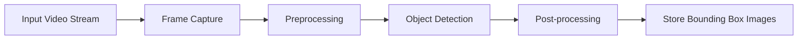
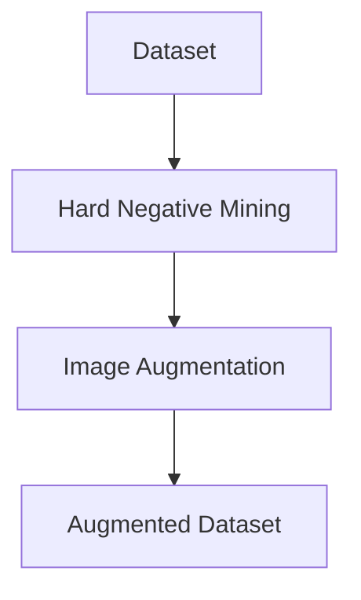
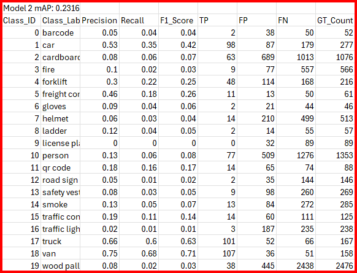
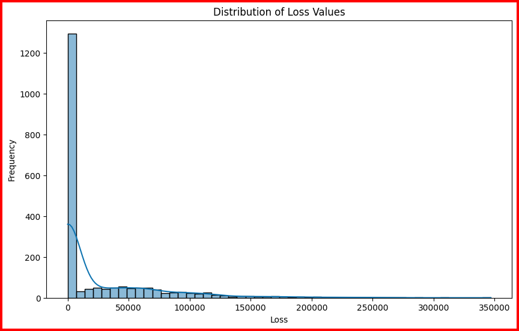
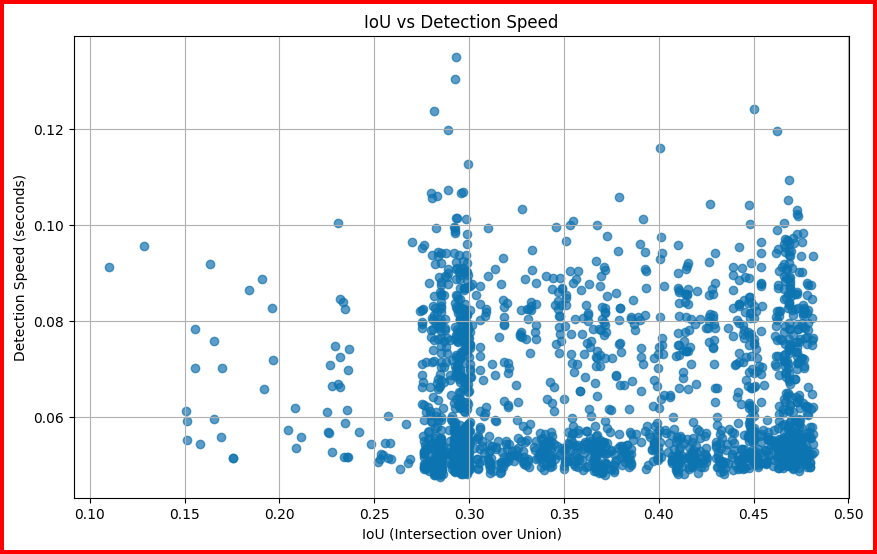
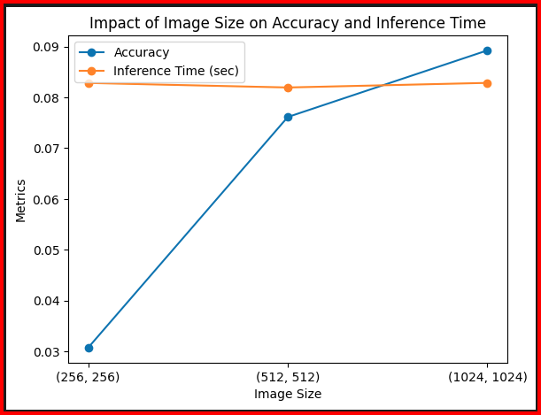
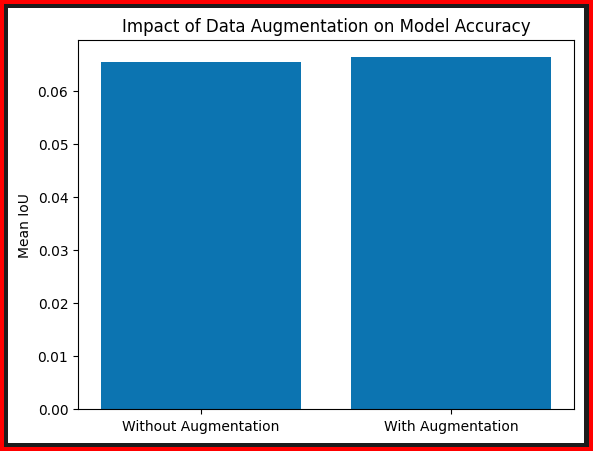
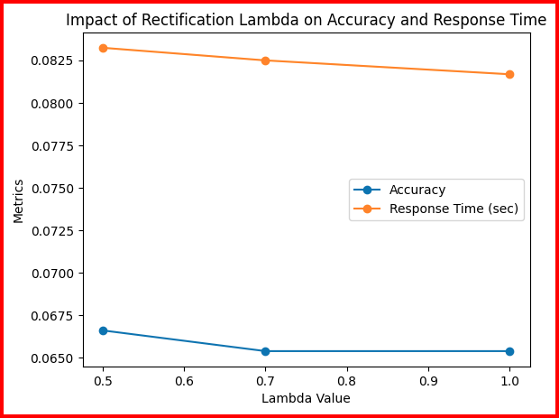

# "TechTrack" Object Detection System Report

## Table of Contents
- [System Design](#system-design)
  - [Inference Service](#inference-service)
  - [Rectification Service](#rectification-service)
  - [Interface Service](#interface-service)
- [Metrics Definition](#metrics-definition)
  - [Offline Metrics](#offline-metrics)
  - [Online Metrics](#online-metrics)
- [Analysis of System Parameters and Configurations](#analysis-of-system-parameters-and-configurations)
  - [1. Inference: System Performance on Specific Classes](#1-inference-system-performance-on-specific-classes)
  - [2. Inference: Analysis of Loss Distribution and Detection Speed](#2-inference-analysis-of-loss-distribution-and-detection-speed)
  - [3. Inference: Impact of Image Sizes](#3-inference-impact-of-image-sizes)
  - [4. Rectification: Data Augmentation Analysis](#4-rectification-data-augmentation-analysis)
  - [5. Rectification: Lambda Analysis](#5-rectification-lambda-analysis)

## System Design

### Inference Service

The Inference Service processes and detects objects within video streams. This service takes in video frames, performs preprocessing, applies object detection using YOLO, and then post-processes detections (e.g., non-max suppression). The system is designed to store the images, with overlaid bounding boxes and predictions, in a suitable format. The model processes videos such as the TechTrack Test Videos, supporting both accuracy and efficiency by selectively sampling frames to reduce the computational load. The Inference Service begins by capturing video frames using a frame capture module. The `capture_video` function is used to read the video file and yield frames based on a specified drop rate, which allows efficient sampling of frames without processing every single one. The captured frames are then passed to the preprocessing step, where each frame is resized and converted into a blob using OpenCV's `blobFromImage` function. This blob serves as the input to the YOLO model. The YOLO model is loaded using configuration and weight files. During inference, the model performs a forward pass to generate predictions, including bounding boxes, class IDs, and confidence scores for each detected object. The bounding boxes are scaled back to match the original frame dimensions, and detections are filtered based on confidence scores. After filtering, the `post_process` method applies a confidence score threshold to retain high-confidence detections, while the non-max suppression (NMS) is separately performed using the `filter` function. This NMS step removes overlapping detections, ensuring that only the most confident detections remain. The output of the Inference Service is a set of images with bounding boxes overlaid on detected objects, along with prediction metadata. These outputs, including the stored overlaid images in JPG format and predictions in TXT format, are saved for further analysis or visualization.

### Rectification Service

The Rectification Service focuses on improving the model's performance through hard negative mining and augmentations. Hard negative mining is used to identify the most challenging cases for the model, which are the samples where the model struggles the most. The `compute_yolo_loss` function calculates the loss for each prediction by considering multiple components: bounding box loss, classification loss, and objectness loss. This loss is used to identify the hardest negatives within the dataset, which are then selected for further processing. The Rectification Service starts by selecting the top-N hard negatives from the TechTrack Dataset based on the computed loss. The `sample_hard_negatives` function identifies these challenging samples, which are then used to improve the model's robustness. The selected hard negatives undergo a series of augmentations using various techniques, such as horizontal flipping, Gaussian blur, resizing, rotation, and color jittering. These augmentations are implemented in the `augmentation.py` module and are used to create a diverse set of training samples that can help the model generalize better to different conditions. The purpose of augmentations is to introduce variability in the training data, making the model more resilient to different environmental conditions. By augmenting the hardest negative samples, the Rectification Service ensures that the model is exposed to challenging scenarios, ultimately improving its detection capabilities. The output of this service is an augmented dataset containing hard negative samples, which can be used for further training or analysis.

### Interface Service

The Interface Service is responsible for processing video streams via the UDP protocol. This service manages data transfer to ensure that the Inference Service can receive frames in real time. The Interface Service begins by setting up a UDP stream using OpenCV's `VideoCapture` to connect to the specified UDP URL. This stream continuously captures frames from the video source and forwards them to the Inference Service for processing. To ensure efficient and reliable communication, the Interface Service handles any potential issues with the UDP stream, such as ensuring that the stream is successfully opened. The frames captured from the UDP stream are then preprocessed, and object detection is performed using the Inference Service. The resulting detections, including bounding boxes, class labels, and confidence scores, are then overlaid on the original frames for visualization. The Interface Service also saves the processed frames, with bounding boxes overlaid, to an output directory inside the Docker container. Additionally, the detection results are saved in YOLO format for further analysis. The service provides periodic updates on the number of processed frames, ensuring that the real-time nature of the system is maintained. The Inference Service runs inside a Docker container, providing a portable, isolated environment suitable for deploying the detection model in various scenarios, while the Rectification Service is not containerized to ensure flexibility during model analysis and adaptation. The input to this service is a video stream via UDP, which undergoes packet handling and real-time data streaming. The output is transferred frames for inference, along with saved processed frames and predictions.

## Metrics Definition

### Offline Metrics

Offline metrics are used to evaluate the performance of the object detection model based on pre-collected data without involving real-time operation. These metrics include mean Average Precision (mAP), computed using the `calculate_ap` function in `helper.py`. mAP provides an overall measure of the accuracy of object detection by averaging over all classes. The Precision and Recall metrics are computed using the `calculate_pr` function in `helper.py`, which compares predicted bounding boxes with ground truth boxes for each class. IoU measures the overlap between predicted bounding boxes and ground truth boxes, serving as an indicator of localization accuracy. The `calculate_iou` function computes this overlap, which is essential for understanding how well the predicted bounding boxes align with the ground truth. Throughput can be monitored by measuring the time taken during inference, as implemented in the `test_object_detection` function in `test.py`. These metrics are crucial for determining how well the model performs in terms of accuracy, efficiency, and localization capability.

### Online Metrics

Online metrics assess the performance of the system during real-time deployment. These metrics include Detection Speed (measured in frames per second or milliseconds per frame), which is monitored in the `predict` function of the `Model` class in `object_detection.py` by timing the inference process, and CPU Utilization to understand the computational load during operation. The system leverages tools like `psutil` to track CPU usage during operation, as demonstrated in `hard_mining_analysis.ipynb` where memory usage is monitored after processing each image. Adaptability metrics are used to evaluate how well the system performs in different conditions, such as tracking performance in dynamic environments and under different lighting setups. Operational metrics include the Task Success Rate, which can be calculated by tracking the completion of specific tasks against attempts, though specific code to do this is not yet implemented, and Navigation Safety, which could be monitored through additional logging for collisions or near-misses, although it is not directly addressed in the current implementation. These online metrics help ensure that the system is not only accurate but also efficient and safe when deployed in real-time environments. To monitor these metrics, logging tools can be used to track detection speed and resource utilization, while custom metrics can be implemented to measure adaptability and operational performance.

## Analysis of System Parameters and Configurations

To address the analysis of significant design decisions for a system that involves both Inference and Rectification Services, five critical design choices have been identified. These decisions are fundamental in shaping the performance, reliability, and scalability of the system, and include system performance on specific classes, loss distribution and detection speed, image size analysis, data augmentation, and lambda settings.

### 1. Inference: System Performance on Specific Classes

Measuring system performance based solely on mAP is insufficient as certain classes may perform worse than others. Analyzing the performance of the system on specific classes helps identify where improvements are needed. To improve the overall reliability of the system, targeted improvements are necessary for classes with low accuracy. This class-specific analysis helps to identify weaknesses and refine the model accordingly, either through additional training data or adjustments to model architecture.

#### General Observations

- **mAP Score**: The overall mAP (mean Average Precision) of 0.2316 indicates that the model struggles to perform well across all classes. This low value suggests that the model has difficulties achieving high precision and recall, particularly for a variety of object classes with different characteristics.

- **High Variability Among Classes**: The metrics demonstrate significant variability in performance across different classes. Classes such as "van" and "truck" achieve the highest performance with F1-scores of 0.71 and 0.63, respectively, while classes like "license plate" and "wood pallet" have very low F1-scores, close to zero, indicating poor performance.

#### Class-Specific Analysis

#### Low-Performing Classes:

- **Wood Pallet**: The model has a recall of 0.02 and a precision of 0.08, indicating that it struggles to detect wood pallets correctly. The model detects only 38 true positives while producing 445 false positives and missing 2438 ground truth instances. This may indicate that wood pallets are underrepresented in the training set or that they are challenging to identify due to their similarity to other objects in the environment. Addressing these challenges may require collecting additional training data that includes diverse instances of wood pallets in various conditions, as well as applying more sophisticated feature extraction techniques to better distinguish them from other visually similar items.

- **License Plate**: With zero true positives, 32 false positives, and a recall of 0.00, the model fails to detect license plates reliably. The poor performance may be due to the small size of license plates in images or lack of diversity in the training examples. License plates are often small and can vary significantly in appearance, making them challenging to detect. Enhancing the training dataset with more examples of license plates in different lighting conditions and orientations, along with targeted augmentation techniques, could improve the model's ability to detect them effectively.

#### Moderately Performing Classes:

- **Freight Container and Forklift**: These classes show moderate performance, with F1-scores of 0.26 and 0.25, respectively. The recall of 0.18 for freight containers suggests a lower detection rate. Freight containers and forklifts are often partially occluded or appear in cluttered environments, which can make detection challenging. Improving the model's performance on these classes may involve collecting more training data that includes such challenging scenarios, as well as using advanced data augmentation techniques to simulate occlusions and cluttered backgrounds.

- **Smoke and Fire**: The low recall values (0.05 for smoke and 0.02 for fire), paired with relatively high false positives, indicate challenges in detecting these dynamic objects. Smoke and fire are inherently difficult to detect due to their transient and diffuse nature. The model's performance in identifying these objects is poor, suggesting a need for more advanced temporal features or augmentation techniques that can capture their changing characteristics over time. Incorporating temporal modeling, such as using recurrent neural networks or 3D convolutional networks, could help the model better recognize these dynamic elements by analyzing their temporal evolution.

#### High-Performing Classes:

- **Van**: The model performs well on the "van" class, with a precision of 0.75 and recall of 0.68, leading to an F1-score of 0.71. This performance suggests that the model is well-trained on the distinguishing features of vans, and it can detect them with high accuracy. The availability of diverse and representative training examples likely contributes to the model's strong performance for this class.

- **Truck**: Similar to the "van" class, "truck" achieves a high F1-score of 0.63 with precision of 0.66 and recall of 0.60, indicating the model has learned to reliably detect trucks with good accuracy and relatively low false positives. The model's ability to distinguish trucks from other vehicles may be attributed to effective feature extraction and sufficient representation of trucks in the training dataset.

#### Design Improvement Insights

1. **Data Imbalance**: The significant disparity between classes indicates that the dataset may be imbalanced, with classes like "van" and "truck" being well-represented compared to "license plate" and "wood pallet". Collecting additional data for poorly performing classes would be beneficial to improve their detection accuracy. Ensuring that the dataset includes a diverse range of examples for each class, including variations in lighting, occlusion, and pose, can help the model generalize better.

2. **False Positives**: Many classes (e.g., "helmet" and "wood pallet") have a high number of false positives, suggesting that the model struggles to differentiate between visually similar objects. This could potentially be addressed through more advanced feature extraction and augmentation techniques that better capture subtle visual differences. Techniques such as contrastive learning, which focuses on learning to differentiate between similar and dissimilar objects, could help reduce false positives by improving the model's ability to distinguish between visually similar items.

3. **Augmentation and Training Strategies**:

- **Augmentation**: Applying more targeted augmentation (e.g., simulating low-light conditions for detecting license plates) during training can help the model become more invariant to the challenges faced in real-world scenarios. Additionally, augmentations that introduce occlusions, changes in perspective, or varying levels of blur can help improve the model's robustness to challenging conditions commonly encountered in real-world environments.

- **Hard Negative Mining**: Incorporating hard negative mining in the training pipeline could also help by focusing on difficult-to-classify images, thus improving the overall performance across underrepresented or challenging classes. Hard negative mining involves identifying and emphasizing training on examples that the model often misclassifies, which helps the model learn to handle difficult cases more effectively. This approach can be particularly useful for reducing false positives by forcing the model to learn more discriminative features for challenging examples.

#### Summary
The analysis of class-specific performance metrics for Model 2 reveals significant challenges in detecting certain object classes, especially smaller or more dynamic ones like "license plate", "smoke", and "fire". On the other hand, the model shows good performance for larger, more distinct objects like "van" and "truck". Addressing these issues requires:

- Collecting additional data to balance the representation of different classes.
- Enhancing the augmentation pipeline to introduce more variation in challenging classes, such as occlusions, varying lighting conditions, and different perspectives.
- Revising the model architecture and training strategies to incorporate hard negative mining, which can help the model focus on difficult cases and reduce false positives.

With these improvements, the model could achieve a more consistent and robust performance across all classes, thereby increasing its reliability in warehouse robotics and related real-world applications.

**Impact on System Design**: Improving the system performance on specific classes enhances overall reliability, especially in a warehouse environment where certain classes (e.g., license plates, wood pallets) are critical for efficient operations. By targeting weaker classes for improvement, the system becomes more consistent, leading to better decision-making and fewer errors in object detection.

### 2. Inference: Analysis of Loss Distribution and Detection Speed

#### Distribution of Loss Values

The graph titled "Distribution of Loss Values" shows the frequency distribution of loss values across the dataset. The loss value is a crucial measure that indicates how well the model's predictions align with the ground truth during inference. A lower loss indicates a better match between predictions and actual outcomes.

- **Observation**: The histogram shows a skewed distribution where the majority of the loss values are clustered at the lower end (near zero), with a few high outliers. Most of the loss values fall below 50,000, indicating that, for the majority of instances, the model performs reasonably well.

- **Insight**: The presence of numerous low-loss instances suggests that the model is effectively learning from the majority of the dataset. However, the long tail of high-loss values indicates that there are challenging samples on which the model struggles, leading to high prediction errors. These difficult instances could be caused by poor-quality images, high variability in the objects being detected, or challenging environmental conditions, such as occlusion or cluttered backgrounds.

The distribution of loss values provides valuable insight into the performance characteristics of the model. The high concentration of low-loss values indicates that the model has effectively learned to generalize across most of the training data, which is a positive indicator of its performance. However, the high-loss outliers highlight potential weaknesses in the model's ability to handle more complex or uncommon scenarios. These outliers could be indicative of specific classes or types of images that are underrepresented in the training set, leading to difficulties in generalizing to those instances.

The class-specific analysis from the previous section provides additional insight into the types of instances that contribute to the high-loss values. For example, classes like "wood pallet," "license plate," and "smoke" consistently exhibit low detection performance and high error rates, which suggests that the high-loss outliers may often belong to these challenging classes. The difficulty in detecting these classes may stem from their inherent characteristics—such as small size, occlusion, or variability in appearance—which makes it challenging for the model to learn effective features for accurate detection.

To improve the performance on high-loss samples, it may be beneficial to analyze the characteristics of these instances and enhance the training dataset to cover more challenging scenarios. This could involve collecting additional data with similar characteristics, incorporating more complex data augmentation, or using techniques such as hard negative mining. Hard negative mining, in particular, focuses on identifying and prioritizing difficult instances during training, which can help the model learn more effectively from challenging examples and ultimately reduce the number of high-loss outliers.

Additionally, examining the types of errors made on high-loss samples can help in identifying potential improvements to the model architecture. For example, if the high-loss instances are due to occlusion or overlapping objects, incorporating a more advanced feature extraction mechanism or multi-scale detection approach could help the model better handle these challenging scenarios. Another potential approach is to use ensemble learning, where multiple models are trained and their predictions are combined, which can improve the robustness of the system, particularly for difficult instances.

#### IoU vs Detection Speed

The scatter plot titled "IoU vs Detection Speed" illustrates the relationship between Intersection over Union (IoU) values and detection speed (in seconds) for various inference instances.

- **Observation**: The scatter plot shows that most IoU values are in the approximate range of 0.25 to 0.45, with detection speeds roughly between 0.06 and 0.12 seconds. There is no clear linear relationship between IoU and detection speed, indicating that the time required for detection does not directly impact the quality of the detection, as measured by IoU.

- **Insight**: The scatter plot reveals that the system is capable of achieving relatively high detection speeds, with the majority of detections taking less than 0.1 seconds. However, there is considerable variation in IoU values, suggesting that the detection speed alone is not a good predictor of detection quality. Factors such as object size, occlusion, and image quality likely contribute more significantly to the IoU variation.

The lack of a clear relationship between detection speed and IoU suggests that optimizing for speed does not necessarily lead to improved accuracy or vice versa. This insight is crucial for designing a balanced system where both speed and accuracy are important. For instance, in a warehouse robotics context, achieving fast detection speeds is essential for maintaining high throughput, but accuracy is equally important to ensure reliable identification and handling of items.

To improve overall system performance, it may be valuable to focus on optimizing the model's feature extraction capabilities to improve IoU without negatively impacting speed. Techniques such as model pruning, knowledge distillation, or using efficient network architectures could help in achieving this balance. Model pruning involves removing redundant or less important parameters from the model, which can help reduce computational complexity and speed up inference without significantly affecting accuracy. Knowledge distillation, on the other hand, transfers knowledge from a larger, more accurate model to a smaller, faster one, thereby improving the efficiency of the model while retaining as much accuracy as possible.

Another approach to improving the IoU without compromising detection speed is to leverage hardware acceleration, such as using GPUs or specialized hardware like TPUs. By optimizing the inference pipeline to take advantage of such hardware, it is possible to achieve faster detection times while maintaining or even improving accuracy. This is particularly relevant in a warehouse setting where multiple robots may need to operate simultaneously, and efficiency is key to avoiding bottlenecks.

#### Summary

- **Loss Distribution**: The skewed distribution of loss values highlights the importance of addressing outlier instances with high loss. Improving the dataset to include more challenging examples similar to those that lead to high losses can enhance model robustness. Techniques like hard negative mining and analyzing high-loss instances can provide targeted improvements to the model's performance, ultimately reducing the occurrence of high-loss predictions.

- **IoU vs Detection Speed**: Since detection speed does not appear to be a limiting factor for achieving higher IoU, the design focus should be on improving model accuracy through better feature extraction rather than further optimizing detection speed. This will ensure that the system remains efficient while improving detection quality, which is crucial in a warehouse robotics context where precision in detecting and classifying packages and obstacles is key. Techniques such as model pruning, knowledge distillation, and hardware acceleration can help achieve a balanced system that meets the requirements for both speed and accuracy.

**Impact on System Design**: Understanding the loss distribution and detection speed relationship helps in designing a more balanced and efficient system. By focusing on reducing high-loss instances and optimizing for accuracy without compromising speed, the system can achieve both high reliability and high throughput, which is essential for smooth warehouse operations.

### 3. Inference: Impact of Image Sizes

The system's performance can vary significantly based on the size of input images, which directly influences both accuracy and inference time. Smaller images may lose critical details, leading to reduced detection accuracy, especially for fine-grained classes, while larger images require more computational resources.

The analysis, as depicted in the graph below, reveals the trade-offs between different image sizes and their impact on accuracy and inference time:

The accuracies reported in this analysis are relatively low because all noisy predictions were included, which brought the average down significantly. The analysis aims to illustrate the impact of image size on system performance despite the noise in the predictions.

The three image sizes considered were 256x256, 512x512, and 1024x1024 pixels, and the results are summarized as follows:

- **256x256 pixels**: The accuracy is relatively low at approximately 3%, indicating that crucial details are lost due to the reduced resolution. However, the inference time is fast, which suggests that while this configuration may be suitable for tasks where speed is prioritized over accuracy, it fails to provide adequate detection quality for most use cases. In the context of a warehouse robotics system, this size might be appropriate for preliminary object filtering tasks, such as quickly identifying the presence of an obstacle without needing precise classification. The fast inference time is beneficial for real-time operations where the robot needs to make quick decisions to avoid collisions.

- **512x512 pixels**: At this resolution, there is a significant increase in accuracy to approximately 8%. This suggests that increasing the image size allows the model to capture more details, thereby improving detection accuracy. Importantly, the inference time remains approximately the same as with smaller image sizes, which provides a favorable trade-off between computational cost and accuracy. For warehouse robots, this resolution is ideal for tasks like identifying and classifying packages or navigating around obstacles with moderate precision requirements. The balance between accuracy and speed ensures that the robots can perform essential tasks effectively without causing delays in the overall operation.

- **1024x1024 pixels**: This configuration achieves the highest accuracy of approximately 9%, demonstrating that a larger image size provides the best detection capabilities by preserving finer details. However, the inference time shows only a slight increase, indicating a relatively higher but not significantly detrimental computational demand. In a warehouse setting, this configuration may be suitable for specialized tasks where precision is paramount, such as handling fragile or high-value items that require careful identification and manipulation. The increased accuracy helps in reducing errors, but the additional latency means that this configuration should be used selectively, primarily for tasks that can tolerate slower processing times.

#### Summary

The trade-offs between image size, accuracy, and inference time are crucial considerations in the design of warehouse robotics systems. Larger images enable the model to learn finer features, which is essential for distinguishing between similar-looking packages or objects. However, while the computational resources required for processing larger images do increase, the inference time, based on the given graph, does not appear to increase substantially.

Overall, the 512x512 pixel configuration offers the best balance between accuracy and efficiency. It provides substantial improvements in accuracy over the smaller size while maintaining a similar inference time, making it the recommended option for most general-purpose warehouse scenarios where both performance and speed are important. This size strikes a balance between preserving key image details and minimizing computational overhead, thereby supporting both scalability and reliability in diverse operational environments. The choice of image size should ultimately be guided by the specific requirements of the target application, such as whether accuracy, speed, or resource efficiency is prioritized.

**Impact on System Design**: Choosing the appropriate image size is essential for optimizing system performance. The 512x512 pixel configuration offers a balance between accuracy and speed, making it suitable for most tasks in a warehouse setting. By optimizing the image size, the system can maintain efficiency while ensuring accurate object detection, which is critical for reliable warehouse operations.

### 4. Rectification: Data Augmentation Analysis

Data augmentation is a crucial technique for enhancing model robustness, particularly under challenging conditions like varying lighting, occlusions, and differing viewpoints, which are common in warehouse environments. Augmentation strategies can significantly affect the model's ability to generalize across different scenarios, ensuring that the system remains reliable under a wide variety of operational conditions.

The impact of data augmentation on model accuracy is presented in the graph below:

The augmentation techniques tested in this study included random horizontal flipping, brightness adjustment, Gaussian blur, and color jittering. Each of these augmentation methods serves a specific purpose in helping the model become more adaptable to real-world variations.

The following augmentation techniques were applied:

- **Random Horizontal Flip**: This technique helps the model learn to recognize objects irrespective of their orientation. By randomly flipping images, the model becomes less sensitive to the left or right position of an object, thereby improving its robustness to such variations in real-world scenarios. The decision to use horizontal flipping was based on the typical layout of warehouse items, which can be positioned in various orientations. Ensuring the model is invariant to these flips helps improve its adaptability in dynamic environments.

- **Brightness Adjustment**: The brightness of the image was randomly adjusted within a range of 0.8 to 1.2. This augmentation helps the model adapt to different lighting conditions, such as bright daylight or dim indoor environments. Brightness adjustments ensure that the model can effectively handle variations in exposure, making it more robust to changes in illumination. The specific values were chosen to simulate a realistic range of lighting conditions found in warehouses, from poorly lit corners to areas under bright artificial lights.

- **Gaussian Blur**: Random Gaussian blur was applied with a small kernel size of either 3 or 5. The purpose of this augmentation is to simulate scenarios where images might be slightly out of focus or blurred due to camera motion. This forces the model to rely on more prominent features rather than fine details, which can be beneficial for generalization. The kernel sizes of 3 and 5 were selected to introduce subtle blurring without overly degrading the image, reflecting common conditions where cameras may capture slightly blurry frames.

- **Color Jittering (Contrast and Saturation Adjustments)**: The contrast and saturation of the image were randomly adjusted, with values ranging between 0.8 and 1.2. Adjusting contrast and saturation helps the model become invariant to different color conditions, such as changes in ambient lighting or camera settings. This augmentation improves the model's robustness to variations in color and intensity, which is particularly important when working with images captured in diverse environments. The chosen range ensures moderate variations that reflect different lighting and camera conditions typical in warehouse environments, helping the model generalize better.

The analysis of these augmentations revealed the following insights:

- **Without Augmentation**: The model achieves a mean Intersection over Union (IoU) of approximately 6%. This performance suggests that the model is not adequately generalizing, possibly due to the limited diversity of the training dataset.

- **With Augmentation**: The performance remains nearly identical, with a mean IoU of 6% as well. This indicates that the current augmentation strategy, which may include brightness adjustment and minor transformations, does not significantly impact model performance.

The lack of significant impact suggests several possible reasons:

- The model might already be inherently robust to the types of transformations used during augmentation. If the transformations, such as slight brightness adjustments, blurring, or horizontal flips, were not substantial enough to impact the model's predictions, the performance might not change significantly. Essentially, the model's learned features might be general enough that minor variations introduced by the augmentations do not alter its ability to make predictions.

- The augmentation techniques applied, such as small changes in brightness, Gaussian blur, and flips, may have been too simple or not sufficiently varied to create significant changes in the input data. These basic augmentations might not introduce enough meaningful variations to challenge the model or to simulate real-world diversity effectively.

- The model's architecture might have learned robust and generalized features, which means that even when presented with unseen augmented data, it is still capable of correctly interpreting the data. If the training data already covered a broad range of lighting conditions, orientations, and other factors, then adding augmentations that mimic those same variations may not add much additional value.

- Since the augmentations were applied only during inference, and not during training, the model did not have the opportunity to adapt to these augmented views and internalize those variations during the learning process. If the augmentations applied were not drastically different from the distribution of the training data, the model might perform similarly on both augmented and non-augmented images during inference.

- The types of augmentation applied might not have targeted the specific weaknesses of the model. For instance, since the model struggles with identifying small or diffusive objects, but the augmentations only introduced changes in color or brightness, the performance wouldn't improve much.

#### Summary

The current analysis suggests that merely applying augmentations during inference, rather than during training, does not substantially affect model performance. For effective design improvement, these augmentations should be incorporated during the training phase, allowing the model to learn from and adapt to these transformations. Training with augmented images would allow the model to better handle variations it may encounter in deployment, ultimately improving its robustness and generalization capability.

**Impact on System Design**: Incorporating effective data augmentation techniques during training is essential for improving the model's robustness and generalization. By enhancing the training process with more varied data, the system can better handle real-world conditions, leading to more reliable and consistent performance in a warehouse setting.

### 5. Rectification: Lambda Analysis

The rectification process is a critical step in correcting errors made during the initial inference phase, thereby improving the overall quality of output decisions. Configuring lambda as a parameter for rectification provides flexibility in balancing the contribution of rectified results versus original inference outputs. The analysis of different lambda values provides insights into how to achieve an optimal trade-off between accuracy and response time.

The impact of varying rectification lambda values on accuracy and response time is depicted in the following graph:

The accuracies reported in this analysis are relatively low because all noisy predictions were included, which brought the average down significantly. This analysis is intended to illustrate the impact of rectification lambda on system performance despite the noise in the predictions.

The lambda parameter determines how much weight the rectification process has in influencing the final decision. The different lambda values tested were 0.5, 0.7, and 1.0, with the results summarized as follows:

- **Lambda Value 0.5**: At this setting, the model achieves an accuracy of almost 6.75%. This is the highest accuracy observed in the analysis, suggesting that assigning a moderate weight to the rectification output helps in effectively correcting the initial predictions made by the inference model. However, the corresponding response time is about 0.083 seconds, which is relatively higher. This result implies that while accuracy is prioritized, it incurs a cost in terms of higher latency. This setting is particularly suited for applications where making accurate predictions is more important than achieving very low response times, such as during non-time-sensitive quality checks of goods in a warehouse.

- **Lambda Value 0.7**: With this configuration, accuracy drops slightly to around 6.5%, while the response time also decreases to 0.0825 seconds. This trade-off indicates a balanced influence of rectification, leading to marginally faster inference while maintaining a high level of accuracy. For warehouse automation, this configuration is suitable for tasks that require a balance between accuracy and computational efficiency. For instance, identifying packages and ensuring correct placement may benefit from this balance, where both accuracy and speed play crucial roles in maintaining operational flow without bottlenecks.

- **Lambda Value 1.0**: At a lambda value of 1.0, the accuracy remains the same, and the response time decreases to about 0.0815 seconds. This suggests that fully relying on rectification yields only a slight improvement in response time without much impact on accuracy, possibly due to over-correction or an over-reliance on rectified predictions. This setting is more appropriate for tasks where speed is the key concern, and some compromise on accuracy is acceptable—such as initial object sorting or filtering tasks where quick classification is needed without the highest precision requirements.

#### Observations and Recommendations
The trade-offs between lambda values are crucial for achieving the optimal balance between accuracy and response time. The graph shows that as the lambda value increases, both accuracy and response time tend to decrease slightly, indicating that heavier reliance on the rectification process alone may not always yield better performance.

- **Accuracy vs. Latency**: The accuracy of the model tends to decrease slightly as lambda increases from 0.5 to 1.0, while response time also reduces marginally. This trend implies that over-relying on rectification may introduce biases or errors, which can reduce detection precision. At the same time, the reduction in response time is not significant enough to justify the loss in accuracy for most use cases. This highlights the importance of carefully balancing the rectification process with the original inference for optimal system performance.

- **Lambda Value Selection**: Based on the analysis, a lambda value of 0.5 appears to provide the highest accuracy, while the differences in response time across the three settings are minimal. This suggests that for warehouse robotics applications where detection accuracy is vital (e.g., package verification), a lower lambda value such as 0.5 may be preferred. For scenarios where both accuracy and response time are important but not critical, a lambda value of 0.7 may be a good compromise.

#### Summary
The rectification lambda value significantly impacts the accuracy and response time of the system. Smaller lambda values provide higher accuracy with a slight increase in response time, while larger values tend to favor lower latency but at the expense of reduced accuracy.

- For tasks in warehouse environments requiring a balance of accuracy and efficiency, a lambda value of 0.7 is recommended.
- For high-precision tasks where even small inaccuracies are unacceptable, a lambda value of 0.5 may be preferred, with the understanding that this will slightly increase latency.
- For real-time tasks that prioritize speed with acceptable trade-offs in precision, a lambda value of 1.0 may be utilized to achieve faster processing times.

This analysis underscores the importance of adjusting lambda based on the specific needs of each task to ensure both operational efficiency and accuracy are appropriately balanced.

**Impact on System Design**: The selection of the lambda value depends on the operational requirements of the task at hand. For applications where high precision is necessary, such as final quality checks or detecting fragile items, a lower lambda value that maximizes accuracy is advisable. On the other hand, for tasks where speed is more crucial—such as early-stage sorting—a higher lambda value might be acceptable to minimize latency, even if it comes at the cost of some accuracy.