# System Design
The TextWave Retrieval-Augmented Generation (RAG) system is structured into four modular services: Extraction, Retrieval, Generation, and Interface. Each service performs a distinct role, contributing to the overall functionality and scalability of the system. Below is a detailed description of each service along with accompanying diagrams that outline the flow of data and configurable parameters.

## Extraction Service
The Extraction Service preprocesses documents and queries, converting them into semantic embeddings to facilitate effective retrieval. This service comprises two modules: the Preprocessing Module and the Embedding Module. The Preprocessing Module tokenizes and normalizes input data, ensuring semantic coherence. Documents are split into fixed-length or sentence-based chunks, allowing granular control over chunk size and overlap. These chunks are then passed to the Embedding Module, where a pre-trained transformer model (Sentence Transformers) generates high-dimensional embeddings. Users can configure parameters such as the chunk size, overlap size, and embedding model to optimize the service for various corpora and downstream requirements.

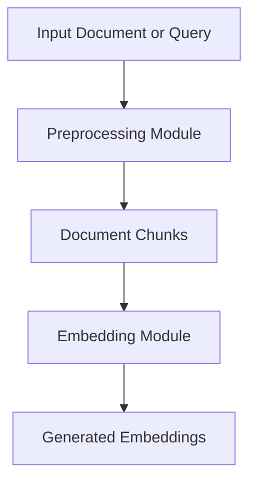
```mermaid
graph TD
    A[Input Document or Query] --> B[Preprocessing Module]
    B --> C[Document Chunks]
    C --> D[Embedding Module]
    D --> E[Generated Embeddings]
```

## Retrieval Service
The Retrieval Service indexes the embeddings and performs similarity searches to find the most relevant contexts for a given query. It includes the Indexing Module, which uses FAISS to build scalable vector indexes capable of handling billions of embeddings. Users can select from multiple indexing configurations, such as Flat, IVF, or HNSW, to balance precision and efficiency. The Search Module identifies the top-k nearest neighbors for a query embedding using a specified distance metric (e.g., cosine or Euclidean). A Reranker Module further refines the results using cross-encoders or hybrid models, ensuring the retrieved contexts are highly relevant. Configurable parameters include the number of neighbors (k), index type, and reranking strategy.

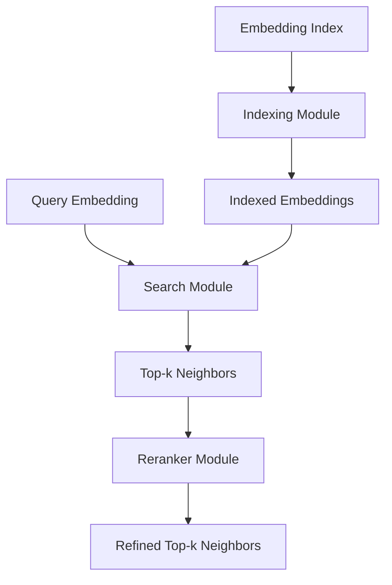
```mermaid
graph TD
    A[Embedding Index] --> B[Indexing Module]
    B --> C[Indexed Embeddings]
    D[Query Embedding] --> E[Search Module]
    C --> E
    E --> F[Top-k Neighbors]
    F --> G[Reranker Module]
    G --> H[Refined Top-k Neighbors]
```

## Generation Service
The Generation Service synthesizes human-readable answers from the retrieved contexts and the query. The Context Fusion Module concatenates the top-k contexts into a single input for the Answer Generation Module, which employs a transformer-based model (e.g., Mistral) to generate responses. This service incorporates mechanisms to mitigate hallucinations by ensuring answers align strictly with retrieved contexts. Configurable parameters include the generation model, response temperature, and strategies for hallucination mitigation. This modular design allows the service to adapt to use cases ranging from direct factual lookups to complex narrative generation.

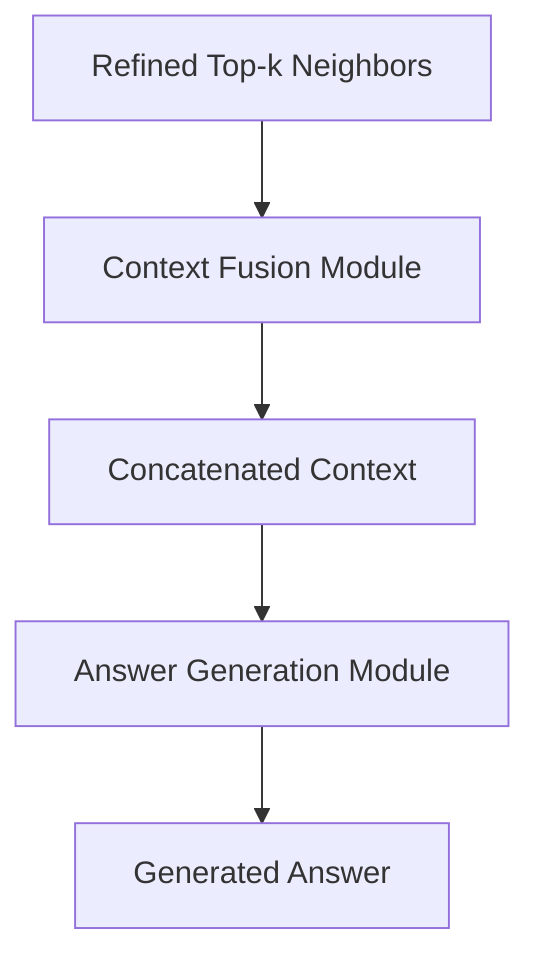
```mermaid
graph TD
    A[Refined Top-k Neighbors] --> B[Context Fusion Module]
    B --> C[Concatenated Context]
    C --> D[Answer Generation Module]
    D --> E[Generated Answer]
```

## Interface Service
The Interface Service connects users and administrators to the TextWave RAG system via a REST API implemented in Flask, providing endpoints for querying, corpus management, and index operations. Core endpoints include /query for submitting questions and receiving generated answers, /set_corpus_directory for defining the directory containing documents, /add_document for uploading files to the corpus, and /process_and_save_corpus for preprocessing documents and saving them into a FAISS index. Additionally, /load_index allows loading pre-saved indexes for retrieval tasks. These endpoints ensure seamless interaction with the underlying services, including preprocessing, embedding, retrieval, and generation, while robust error handling provides user feedback for invalid inputs or missing configurations. For deployment, the system uses a Dockerfile to standardize its runtime environment with Python 3.9, all dependencies listed in requirements.txt, and necessary NLTK resources pre-downloaded. Flask runs on port 5000, enabling containerized access to the service, which supports rapid scalability and consistency across infrastructures. This design ensures that the system is both user-friendly and portable, making it suitable for cloud-based or on-premise deployments.

```mermaid
graph TD
    A[User Query or Corpus Action] --> B[Query Endpoint (/query)]
    B --> C[Extraction Service]
    C --> D[Retrieval Service]
    D --> E[Generation Service]
    E --> F[Answer Returned to User]
    G[Set Corpus Directory (/set_corpus_directory)] --> H[Corpus Directory Updated]
    I[Add Document (/add_document)] --> J[Document Uploaded to Corpus]
    J --> K[Extraction and Index Update]
    L[Process and Save Corpus (/process_and_save_corpus)] --> K
    M[Load Index (/load_index)] --> N[FAISS Index Loaded]
```

# Metrics Definition

## Offline Metrics
Offline metrics are used to evaluate the performance of the RAG system during development and validation, ensuring its readiness for deployment. One primary metric is Transformer Match (TM), which measures the percentage of generated answers that semantically align with ground truth answers. TM accounts for semantic equivalence regardless of lexical variations, such as treating “Paris is the capital of France” as equivalent to “The capital of France is Paris.” This metric is critical for assessing the Answer Generator’s effectiveness and fine-tuning components like the Reranker. Additionally, similarity metrics like cosine similarity, Euclidean distance, and dot product evaluate the quality of retrieval by comparing query embeddings with retrieved neighbors. These metrics ensure that relevant chunks are ranked highly, enabling the system to optimize configurations like k and rerank_top_k for robust retrieval and generation performance.

## Online Metrics
Online metrics are essential for monitoring the real-time performance and reliability of the system while ensuring a positive user experience. A core metric is Response Time, which measures the latency between query submission and answer delivery. This metric helps identify pipeline bottlenecks and ensures that the system remains responsive during varying loads. Answer Acceptance Rate (AAR), though not currently implemented, could be introduced to evaluate user feedback on the relevance and accuracy of generated answers, providing insights into retrieval and generation effectiveness. A high AAR would indicate robust system performance, while a decline could signal issues such as insufficient corpus coverage or misconfigured parameters. Additionally, System Uptime and Error Rate track the system’s reliability by capturing instances of downtime or errors, such as failures during embedding generation or query execution. Thresholds for acceptable error rates can be established to trigger alerts when anomalies are detected. Although these metrics are not yet active, they could be implemented using real-time dashboards and alerting systems to enable immediate intervention when performance issues arise. This proactive approach would ensure the system maintains high availability, accuracy, and responsiveness while adapting to evolving user demands.

# Analysis 1 (Extraction): Embedding Model Selection

## Objective, Motivation, and Methods
The choice of embedding model is a fundamental aspect of system design in a retrieval-augmented generation (RAG) pipeline. This decision directly affects the quality of embeddings, retrieval accuracy, the coherence of generated answers, and overall system scalability. The objective of this analysis was to evaluate two widely used embedding models, MiniLM and MPNet, to determine their suitability for this pipeline. The goal was to understand the trade-offs between computational efficiency, retrieval performance, and answer quality to inform the model selection process for optimal system performance.

MiniLM was selected for its reputation as a fast and lightweight embedding model that achieves competitive accuracy while minimizing computational overhead. Its efficiency makes it a strong candidate for real-time systems and large-scale datasets. In contrast, MPNet is known for generating richer and more nuanced embeddings, which can improve retrieval relevance and semantic understanding. However, its computational cost is significantly higher, making it a better fit for scenarios where precision outweighs speed. By comparing these two models, this analysis aimed to assess how their distinct characteristics translate into practical performance metrics.

To evaluate the models, a pre-existing corpus of documents was used, and six test queries were selected to provide a range of scenarios:

1. "What is the capital of France?" was included as a query without any context in the corpus. This tested how the system handled irrelevant or unsupported questions and whether it could return appropriate fallback responses such as "No context."

2. "Who was Abraham Lincoln?" was selected because there is direct context in the corpus. This query assessed how well the models retrieved relevant information and generated a coherent response based on the available data.

3. "Who was Abraham Adams?" combined elements of two historical figures, Abraham Lincoln and John Adams, both of whom are represented in the corpus. This ambiguous query tested the models' ability to handle overlap and differentiate between relevant contexts.

4. "How did Fillmore ascend to the presidency?" had clear context in the corpus. It evaluated how well the models retrieved specific historical details and incorporated them into the generated answers.

5. "What trail did Lincoln use a Farmers' Almanac in?" intentionally used the word "trail" instead of the correct term "trial," for which there is context in the corpus. This tested the robustness of the retrieval mechanism and how it responded to slight inaccuracies in the query.

6. "What trial did Lincoln use a Farmers' Almanac in?" corrected the term "trail" to "trial," for which there is direct context. This allowed for a comparison of retrieval accuracy and answer quality between the correct and incorrect versions of the query.

The metrics used to assess performance included Encoding Time, Transformer Match Metric, and a qualitative comparison of generated answers and retrieved contexts. Encoding time was measured to evaluate the computational efficiency and scalability of each model, which are crucial for real-world deployments. The Transformer Match Metric, which calculates the cosine similarity between generated answers and their retrieved contexts, quantified semantic alignment in the absence of ground truth answers. Additionally, qualitative analysis was conducted to manually assess the relevance of retrieved contexts and the coherence of generated answers. This combination of metrics provided a comprehensive evaluation of each model's strengths and weaknesses.

## Justification of Design Decisions with Evidence

### Trade-offs Analysis
The results of the analysis revealed important trade-offs between MiniLM and MPNet, particularly in encoding speed, semantic alignment of retrieved contexts with user queries, and the quality of generated answers. These findings provide practical insights into how the choice of an embedding model impacts the system's overall efficiency and usability.

The encoding time analysis demonstrates that MiniLM significantly outperformed MPNet in terms of speed. MiniLM encoded the corpus in 16.57 seconds, compared to MPNet's 93.80 seconds. This nearly sixfold difference highlights MiniLM's efficiency, making it ideal for real-time processing and handling large corpora where rapid updates are critical. MPNet's much longer encoding time reflects its higher computational complexity, which, while potentially advantageous for certain high-precision tasks, makes it less scalable for applications that prioritize speed.

The Transformer Match Metric measures the semantic similarity between generated answers and retrieved contexts, providing insight into how well the embeddings align with the task's information retrieval requirements. MiniLM achieved an average score of 0.45 with a standard deviation of 0.33, while MPNet scored 0.29 with a standard deviation of 0.35. These results show that MiniLM not only had higher semantic alignment on average but also exhibited less variability across different queries. MPNet's slightly higher standard deviation suggests inconsistency, which could lead to less reliable performance for diverse or ambiguous queries. Despite MPNet’s slightly lower scores, it sometimes retrieved more contextually relevant chunks, particularly for complex or ambiguous queries. However, this did not consistently translate into better generated answers, as MPNet occasionally returned “No context” responses, indicating difficulty in adapting to imperfect retrieval results.

Below is an example that highlights a scenario where MiniLM outperformed MPNet in handling slight inaccuracies in the query and in providing a coherent answer when context aligned correctly with the query.

For Query 5 ("What trail did Lincoln use a Farmers' Almanac in?"), both MiniLM and MPNet failed to retrieve directly relevant context due to the incorrect term "trail" instead of "trial." Both models generated "No context" as the answer. However, MiniLM’s retrieved context provided a closer alignment to the historical context of Lincoln's life and cases, which could potentially aid in correcting the query or identifying the misalignment. MPNet, on the other hand, retrieved more scattered and less relevant context, such as references to unrelated events like Lincoln practicing with a broad sword and Roosevelt commissioning a penny design based on Lincoln.

For Query 6 ("What trial did Lincoln use a Farmers' Almanac in?"), MiniLM accurately retrieved and utilized the relevant context to generate the correct answer: "Lincoln used a Farmers' Almanac in the trial of William 'Duff' Armstrong in 1858." This response demonstrates MiniLM's ability to align the query with precise retrieved information and generate an accurate and informative answer. MPNet, however, generated "No context" as its answer despite retrieving some relevant information about Lincoln's legal career and the Armstrong trial. The lack of a coherent response from MPNet underscores its reliance on retrieving highly precise contexts to generate meaningful answers, which makes it less adaptable to such scenarios.

This comparison underscores MiniLM's resilience and adaptability in handling imperfect queries and generating coherent answers. It suggests that MiniLM can effectively process noisy or partially misaligned queries, making it better suited for real-world applications where user inputs may not always be perfectly phrased. MPNet, while capable of retrieving rich embeddings, demonstrated limitations in leveraging partially relevant contexts to produce meaningful outputs, highlighting its dependency on precision in both retrieval and query alignment. This adaptability difference is particularly critical for scenarios like TextWave's system, where user queries may often vary in phrasing or accuracy.

Qualitative analysis further underscores these trade-offs. For straightforward queries, such as "Who was Abraham Lincoln?", both models performed well, retrieving relevant contexts and generating accurate answers. However, for ambiguous or irrelevant queries like "What is the capital of France?", both models struggled, although MiniLM demonstrated greater adaptability in utilizing retrieved contexts to construct plausible responses. This ability to generate meaningful answers even when the retrieval results are not perfect gives MiniLM a distinct advantage for real-world applications where data quality can vary.

MPNet’s tendency to produce “No context” answers highlights its reliance on highly relevant retrieval outputs. This makes it less robust in handling noisy or incomplete data. In contrast, MiniLM’s balance of speed and adaptability ensures more consistent performance, albeit with occasional limitations in the relevance of retrieved contexts for highly complex queries.

### Balancing Cost and Performance
The choice of embedding model directly influences the RAG system’s scalability, operational efficiency, and ability to generate high-quality answers. Based on the analysis, MiniLM emerges as the recommended model for general-purpose use cases where speed, adaptability, and scalability are critical. Its encoding time of 16.57 seconds compared to MPNet’s 93.80 seconds highlights its efficiency, making it particularly suitable for real-time systems and large-scale datasets. MiniLM’s higher Transformer Match Metric score (0.45 versus MPNet’s 0.29) and lower variability further demonstrate its reliability in handling diverse and imperfect queries, ensuring robust performance even when retrieved contexts are noisy or partially aligned.

MiniLM strikes a balance between cost and performance, offering speed, scalability, and consistent adaptability to imperfect queries. Its ability to process data quickly reduces operational costs, enabling faster updates and enhanced scalability without compromising answer quality. These characteristics make it the optimal model for TextWave’s general-purpose needs, particularly given the company’s mission to manage billions of documents and process a wide variety of user queries in real time.

In contrast, MPNet, while generating richer and more nuanced embeddings in theory, demonstrated inconsistent performance in this analysis. Its computationally expensive encoding time, coupled with a lower average Transformer Match Metric score and higher variability, limits its applicability for general use. MPNet’s reliance on highly relevant retrieval results makes it less robust in scenarios involving noisy or ambiguous queries, further diminishing its value in broader applications. These limitations suggest that MPNet’s higher computational cost is not justified for general-purpose deployments.

However, MPNet remains a viable option for specialized tasks that demand extremely high retrieval precision and nuanced embeddings, such as targeted analyses or niche datasets where precision outweighs the need for speed. For TextWave, MPNet could be selectively integrated into the system for these specific use cases, where its richer embeddings may provide a tangible benefit. Even in such cases, additional preprocessing or more sophisticated retrieval mechanisms may be required to fully leverage MPNet’s potential.

The findings suggest that MiniLM should serve as the backbone of the system, balancing efficiency, adaptability, and scalability for the majority of operations. MPNet’s role should be limited to narrowly scoped, high-precision tasks that can justify its higher computational cost. This hybrid approach ensures that TextWave’s system remains flexible, cost-effective, and capable of meeting diverse operational requirements without sacrificing overall efficiency or scalability.

### Overall System Design Impact
The findings of this analysis have significant implications for the design and deployment of the retrieval-augmented generation (RAG) system requested by TextWave, which aims to develop an automated solution capable of seamlessly processing user questions, searching through an expansive repository of domain-specific and institution-specific documents, and delivering accurate, contextually relevant answers. Given the company's mission to handle billions of documents and adapt to a dynamic, growing corpus of information, the choice of embedding model is pivotal in achieving their operational objectives.

MiniLM, with its encoding time of 16.57 seconds and its superior adaptability to imperfect retrieval results, emerges as the optimal choice for TextWave’s large-scale requirements. The company’s clients rely on the timely processing of queries to retrieve critical information, making scalability and efficiency non-negotiable. MiniLM’s ability to process vast amounts of data in significantly less time compared to MPNet, which has an encoding time of 93.80 seconds, ensures that the system remains responsive, even under high query loads or during real-time processing. This efficiency directly aligns with TextWave’s need to manage institutional data that is growing rapidly and becoming untenable for manual search methods.

By leveraging MiniLM, TextWave can confidently scale their system to handle billions of documents without compromising on performance. The speed at which MiniLM generates embeddings allows for efficient updates to the document index, a key requirement for adapting to the evolving nature of their datasets. Furthermore, MiniLM’s resilience in generating answers from partially relevant or noisy contexts provides a practical solution for real-world applications where retrieved data may not always perfectly align with the query. MiniLM’s ability to deliver a Transformer Match Metric average score of 0.45 (with a standard deviation of 0.33) further highlights its robustness in aligning retrieved contexts with generated answers. This ensures that the system delivers useful and accurate responses, enhancing client satisfaction and trust in TextWave’s services.

In contrast, MPNet’s slower encoding time and reliance on precise retrieval results limit its utility for TextWave’s general-purpose applications. While MPNet’s nuanced embeddings offer slightly better retrieval precision in certain scenarios, its computational overhead and lower Transformer Match Metric score of 0.29 (with a standard deviation of 0.35) present significant drawbacks. The higher costs associated with MPNet’s processing requirements, both in terms of hardware and time, make it less suitable for the company’s core objective of providing a fast, scalable, and adaptive solution to its clients.

For specialized tasks, such as providing in-depth analyses or handling niche datasets requiring extremely precise answers, MPNet may still have value. Its ability to generate rich embeddings can be advantageous for use cases where precision outweighs speed. However, these scenarios are likely to represent a smaller fraction of TextWave’s overall operations, making MPNet better suited as a secondary model reserved for high-priority or specific queries.

By selecting MiniLM as the primary embedding model, TextWave can deploy a system that balances scalability, cost efficiency, and competitive performance. The reduced encoding time and lower computational demand of MiniLM translate directly into cost savings for TextWave, allowing the company to allocate resources more effectively. This efficiency extends to the client experience, ensuring that users receive fast and accurate responses without delays caused by system bottlenecks. For a company like TextWave, where the ability to provide timely and reliable information is critical to its reputation and success, this advantage cannot be overstated.

The hybrid approach of incorporating MPNet for niche, high-precision use cases adds flexibility without compromising the overall scalability and performance of the system. By deploying MiniLM as the backbone and reserving MPNet for specialized tasks, TextWave can cater to a wide range of use cases while maintaining cost-effective operations. This strategy ensures the system is equipped to adapt to diverse and evolving client needs, balancing the trade-offs between speed, scalability, and precision.

In conclusion, the findings underscore the importance of aligning model selection with TextWave’s mission to provide automated, scalable, and accurate information retrieval. MiniLM’s speed and reliability make it the clear choice for the majority of TextWave’s operations, ensuring that the system can handle the ever-growing volume of institutional data while delivering timely, relevant answers to user queries. The inclusion of MPNet for specific high-precision tasks further enhances the system’s capabilities, providing a comprehensive solution that meets both current and future demands.

## Documentation and Clarity
The results of this analysis are illustrated in the accompanying graphs, which compare the encoding time and Transformer Match Metric for MiniLM and MPNet. The encoding time graph highlights MiniLM’s significant speed advantage, while the Transformer Match Metric graph shows marginally higher alignment scores for MiniLM, albeit with high variance for both models. These visual aids summarize the trade-offs between the two models and support the recommendations made in this analysis. Examples of generated answers and retrieved contexts are included in the report to show differences in model behavior. The code and methodology for this analysis are documented in `system_analysis.ipynb` for reproducibility and transparency.

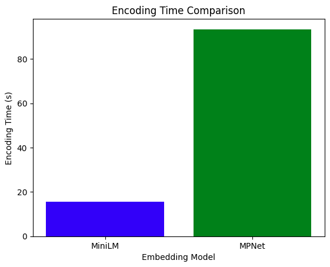
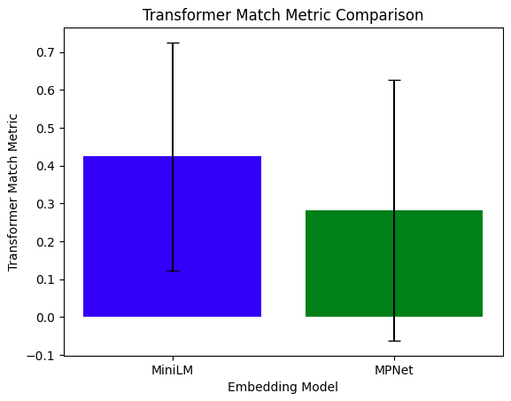

# Analysis 2 (Extraction): Document Chunking Strategy

## Objective, Motivation, and Methods
The choice of chunking strategy is a critical aspect of document preprocessing in a retrieval-augmented generation (RAG) pipeline. This decision directly influences the efficiency of preprocessing, the granularity of retrieved context, the size of the document index, and the quality of answers generated. The objective of this analysis was to compare sentence-based chunking and fixed-length chunking with overlap to determine the most suitable strategy for balancing processing time, context preservation, scalability, and relevance in the system. By understanding these trade-offs, this evaluation aims to identify the strategy that maximizes the overall effectiveness of the pipeline.

Sentence-based chunking was chosen for its ability to preserve the natural linguistic structure of documents, allowing the system to work with self-contained units of information. However, this method often results in fewer, larger chunks, which can impact retrieval granularity and index size. Fixed-length chunking with overlap, in contrast, segments documents into chunks of a specific word count, ensuring uniformity while allowing overlap to maintain contextual continuity across chunks. This approach was tested with varying fixed lengths (50, 100, 150, 200 words) and overlap sizes (0, 5, 10, 15 words) to assess how these parameters affect performance and quality. The analysis aimed to understand how the size and overlap of chunks impact preprocessing speed, the number of indexed chunks, and the relevancy of retrieved information.

The selection of fixed lengths (50, 100, 150, 200 words) and overlap sizes (0, 5, 10, 15 words) was guided by the need to balance contextual coherence and computational efficiency. Fixed lengths of 50 and 100 words were chosen to represent shorter segments that might capture more granular details but could lead to increased processing time and larger index sizes. These values are particularly suitable for queries requiring highly specific information or where details are dispersed throughout the text. On the other hand, lengths of 150 and 200 words were included to test how larger chunks might preserve broader context, potentially improving retrieval accuracy while reducing the number of chunks and the associated index size.

Overlap sizes were selected to explore how different levels of redundancy in contextual continuity impact the retrieval and answer generation process. A zero-overlap condition served as a baseline, providing insight into how non-overlapping chunks affect the system’s ability to piece together meaningful context. Overlap sizes of 5, 10, and 15 words were chosen to simulate increasing degrees of redundancy, allowing for smoother transitions between chunks and reducing the risk of losing critical information that might span chunk boundaries. These overlap sizes are practical increments that balance the trade-off between preserving context and minimizing unnecessary repetition in the index.

By systematically varying these parameters, the analysis aimed to simulate realistic scenarios in which preprocessing strategies might be optimized for specific use cases, such as querying dense, technical documents or broader narratives. This approach ensured that the evaluation was comprehensive and that the selected values were rooted in the practical requirements of a retrieval-augmented generation system.

To evaluate the impact of these strategies, the preprocessing time, the total number of chunks generated, and a relevancy score (measuring the semantic similarity between retrieved context and queries) were used as metrics. Preprocessing time was measured to assess the computational cost of each strategy, while the number of chunks reflected the scalability of the index and the granularity of retrieval. The relevancy score provided a measure of how well the chunking strategy supported meaningful retrieval and answer generation. These metrics, combined with visualizations and quantitative analysis, allowed for a detailed evaluation of the trade-offs inherent to each strategy. By considering both efficiency and contextual fidelity, this analysis provided actionable insights into the optimal preprocessing design for the RAG system.

## Justification of Design Decisions with Evidence

### Trade-offs Analysis
The analysis of chunking strategies revealed critical trade-offs between the number of generated chunks, processing time, and relevance scores, all of which significantly impact the efficiency and performance of the RAG system. Sentence-based chunking produced a notably smaller number of chunks (1,531) compared to all fixed-length strategies but incurred one of the longest processing times at 17.40 seconds. This result reflects the computational overhead required to ensure linguistic coherence in sentence-based segmentation. By prioritizing semantic and contextual accuracy, sentence-based chunking excels in preserving text structure but can become a bottleneck in scenarios requiring scalability or rapid updates.

Fixed-length chunking strategies, in contrast, offered greater control over the balance between chunk count and processing efficiency. The analysis evaluated fixed lengths of 50, 100, 150, and 200 words with overlaps of 0, 5, 10, and 15 words. Shorter fixed lengths, such as 50 words, produced the highest chunk counts (ranging from 3,042 with no overlap to 8,761 with a 15-word overlap) but demonstrated relatively lower processing times, which spanned from 13.57 to 18.57 seconds. These results indicate that shorter chunks are computationally lightweight to process but contribute to increased storage and indexing demands due to their sheer quantity. Conversely, longer fixed lengths, such as 200 words, reduced the number of generated chunks (14,570 to 15,777) and offered storage efficiency, albeit with slightly longer processing times of up to 17.99 seconds when paired with a 15-word overlap.

The overlap parameter introduced another layer of complexity, directly influencing chunk quantity and processing time. Larger overlaps increased redundancy by duplicating parts of the text across adjacent chunks, which proved beneficial for contextual preservation but added to computational costs. For instance, a 50-word fixed-length strategy without overlap generated 3,042 chunks, whereas adding a 15-word overlap nearly tripled the number of chunks to 8,761. This redundancy necessitated longer processing times, as the system had to handle and index additional segments. However, the contextual continuity afforded by overlap sizes proved valuable in mitigating information loss at chunk boundaries. This was particularly evident in retrieval scenarios where seamless transitions between chunks were essential for maintaining coherence in responses.

Relevance scores, while generally consistent across chunking strategies, highlighted the subtle advantages of overlap for context-sensitive queries. Fixed-length strategies with overlap sizes of 10 and 15 words demonstrated marginally higher average relevance scores than those without overlap, indicating that redundancy helps capture context that might otherwise be excluded. Although the improvements in relevance scores were slight, they underscore the importance of overlap in preserving critical information and generating accurate, contextually coherent answers, especially in use cases requiring a higher degree of precision, such as technical or legal document retrieval.

This analysis highlights the nuanced trade-offs inherent in choosing a chunking strategy. Sentence-based chunking, while preserving linguistic structure, struggles with processing efficiency and scalability. Shorter fixed lengths with minimal overlap optimize processing speed and storage but risk truncating context at boundaries. Longer fixed lengths with overlap strike a balance, reducing chunk counts while maintaining contextual fidelity, albeit at the cost of increased processing overhead. Each strategy offers distinct advantages depending on the system's operational priorities.

In practice, the selection of a chunking strategy should align with the system's specific goals. Real-time applications requiring rapid response times and storage efficiency may favor shorter fixed-length strategies with minimal overlap. Conversely, applications demanding high retrieval accuracy and robust context preservation, such as research or compliance tasks, may benefit from longer fixed lengths with larger overlaps. The ability to adjust chunking parameters dynamically ensures that the RAG system remains adaptable to varying operational requirements, optimizing both performance and resource utilization.

### Balancing Cost and Performance
The balance between cost and performance is critical when optimizing the chunking strategy for a RAG system. Chunking directly influences processing time, storage, and retrieval relevance, and this analysis demonstrates the trade-offs inherent in different configurations of chunk size and overlap.

Sentence-based chunking produced the fewest chunks (1,531) but incurred a relatively high processing time of 17.40 seconds. While this approach preserves linguistic coherence and minimizes context loss, its inefficiency in processing and scalability makes it less viable for large-scale systems. These characteristics suggest that sentence-based chunking should be reserved for highly specialized tasks requiring linguistic precision rather than general-purpose use.

Fixed-length chunking offered greater flexibility but revealed significant trade-offs depending on chunk size and overlap. Shorter fixed lengths, such as 50 words, were computationally efficient only when overlaps were minimal. For instance, the 50-word strategy with no overlap generated 3,042 chunks with a processing time of just 13.57 seconds. However, introducing a 15-word overlap nearly tripled the chunk count to 8,761 and increased processing time to 18.57 seconds, surpassing even the sentence-based strategy. This highlights that while shorter chunks can be efficient, the addition of overlap introduces redundancy that inflates both computational overhead and storage requirements.

Longer fixed-length chunks, such as 200 words, reduced the total number of chunks (14,570 to 15,777) but consistently exhibited higher processing times (16.77 to 17.99 seconds), particularly with larger overlaps. Although this approach minimizes storage demands and improves index efficiency, its processing costs were on par with sentence-based chunking in some cases. This indicates that while longer chunks offer benefits for storage scalability, they require careful tuning of overlap size to avoid unnecessary computational costs.

Overlap sizes played a crucial role in determining the trade-offs between context preservation and computational efficiency. Larger overlaps enhanced retrieval relevance by mitigating the loss of context at chunk boundaries, but they significantly increased processing times and chunk counts. For example, a 100-word fixed-length strategy with no overlap produced 9,520 chunks in just 12.57 seconds, whereas adding a 15-word overlap increased the chunk count to 12,049 and the processing time to 14.85 seconds. This suggests that overlap should be kept minimal when efficiency is prioritized, while moderate overlap sizes (e.g., 10–15 words) are better suited for scenarios requiring higher retrieval accuracy.

From a cost-performance perspective, the 100-word fixed-length strategy with a 10-word overlap emerged as a balanced configuration. It produced 11,158 chunks with a processing time of 13.55 seconds, offering an effective compromise between storage, processing time, and contextual continuity. This makes it particularly suitable for systems like TextWave’s, where scalability and efficiency are critical while ensuring relevance and accuracy for diverse queries.

In conclusion, shorter fixed-length chunks with minimal overlap are optimal for scenarios requiring rapid query handling and efficient indexing. Longer fixed-length chunks with moderate overlap are better suited for applications prioritizing retrieval accuracy and context preservation, albeit with slightly higher processing costs. Sentence-based chunking, while precise, is best reserved for specialized tasks where linguistic coherence is paramount. By tailoring chunking strategies to specific use cases, TextWave can achieve an efficient balance between cost, performance, and relevance in its RAG system.

### Overall System Design Impact
The findings of this analysis provide critical guidance for designing and deploying TextWave's Retrieval-Augmented Generation (RAG) system, which aims to automate information retrieval and deliver precise, contextually relevant answers across a growing repository of billions of documents. TextWave operates in a context of exponential data expansion, demanding a system that not only scales efficiently but also maintains high performance under diverse and complex query loads. In this environment, the selection of a document chunking strategy is pivotal, directly influencing the system's efficiency, scalability, and ability to provide relevant and coherent responses.

Among the strategies analyzed, fixed-length chunking with moderate overlaps emerged as the most suitable solution for TextWave's operational and strategic objectives. This approach balances the trade-offs between processing time, chunk quantity, storage demands, and retrieval relevance. By contrast, sentence-based chunking, though effective in preserving linguistic coherence, demonstrated significant inefficiencies in terms of both processing time and scalability. With a processing time of 17.40 seconds to generate just 1,531 chunks, sentence-based chunking struggles to keep pace with the dynamic needs of TextWave’s system, particularly when managing billions of documents and high query loads. While this approach may offer value in specialized applications requiring maximal linguistic coherence, its inefficiencies render it impractical for TextWave’s large-scale use cases.

Fixed-length chunking proved to be a more versatile and scalable alternative, offering a range of configurations to balance chunk quantity and processing time while preserving contextual continuity. For example, a 100-word fixed length with a 10-word overlap produced 11,158 chunks in just 13.56 seconds. This configuration effectively mitigates the risk of losing important context at chunk boundaries, a common challenge in document segmentation. The inclusion of moderate overlaps ensures that contextually significant information is carried over between adjacent chunks, which is particularly crucial for handling fragmented or complex queries. This strategy aligns well with TextWave’s mission of delivering accurate and contextually relevant answers while maintaining computational efficiency.

Shorter fixed lengths, such as 50 words, were found to be computationally efficient only when overlaps were minimal. For instance, a 50-word fixed length with no overlap generated 3,042 chunks in just 13.57 seconds, making it ideal for scenarios prioritizing processing speed and indexing efficiency. However, as overlaps increased, the number of chunks and processing time rose substantially. A 50-word length with a 15-word overlap generated 8,761 chunks in 18.57 seconds, demonstrating the diminishing returns associated with higher overlaps for shorter chunks. While larger overlaps enhance context preservation, they also introduce significant computational and storage overhead, which may undermine scalability in large-scale deployments.

Longer fixed lengths, such as 200 words, offer further reductions in chunk counts and associated storage demands, making them suitable for indexing large datasets. For example, a 200-word fixed length with no overlap produced 14,570 chunks in 16.83 seconds. However, this configuration may risk slight compromises in retrieval relevance due to reduced continuity between chunks. When paired with moderate overlaps, such as 10 or 15 words, longer fixed lengths effectively balance efficiency with context preservation, ensuring that the system can manage large data volumes without sacrificing retrieval accuracy. This makes longer fixed lengths particularly well-suited for exploratory searches or use cases where query precision is less critical.

The analysis also underscores the importance of overlap sizes in achieving optimal system performance. Overlaps of 10 or 15 words were found to significantly enhance the system’s ability to handle noisy or imperfectly phrased queries by preserving subtle contextual cues across chunk boundaries. However, overlaps larger than 15 words introduce excessive redundancy, increasing both the chunk count and processing time without proportionate gains in retrieval relevance. This highlights the need for careful calibration of overlap sizes to ensure that the benefits of context preservation are not outweighed by the associated costs.

The implications of these findings for TextWave’s system design are profound. Fixed-length chunking with moderate overlaps should serve as the default strategy for document preprocessing, offering a scalable and efficient solution that preserves retrieval relevance. Sentence-based chunking, while less efficient, may still hold value for niche applications requiring detailed linguistic coherence, such as legal or academic analyses. Similarly, configurations with minimal overlaps may be leveraged for exploratory data tasks where speed and storage efficiency are prioritized over contextual continuity.

By adopting a tiered approach to chunking, TextWave can flexibly adapt its system to diverse operational requirements. This strategy ensures that the RAG system remains robust, scalable, and capable of delivering high-quality answers across a wide range of use cases, enabling TextWave to meet the evolving needs of its clients while maintaining operational efficiency and cost-effectiveness.

## Documentation and Clarity
The results of this analysis are summarized and visualized through the accompanying graphs, which provide detailed insights into the performance and impact of the various document chunking strategies evaluated. The "Number of Chunks by Strategy" graph highlights the differences in the number of chunks generated by each chunking method, including sentence-based chunking and fixed-length chunking with varying overlap sizes. This visualization reveals a clear trend: increasing overlap sizes for fixed-length strategies lead to a proportional increase in the number of chunks. Such insights are crucial for understanding the trade-offs between chunk granularity and overall index size, a consideration that directly impacts retrieval efficiency and storage requirements.

The "Processing Time by Strategy" graph offers a comparative view of the computational efficiency of each chunking strategy. The data illustrates that sentence-based chunking requires the longest processing time, whereas fixed-length chunking strategies, even with overlaps, achieve faster processing times overall. However, as the overlap size increases, the processing time also grows, highlighting the trade-off between computational efficiency and the contextual continuity provided by overlapping chunks. These observations help substantiate the recommendation of selecting a chunking strategy that balances processing time with the desired level of contextual granularity.

Lastly, the "Average Relevancy Score by Strategy" graph provides a critical evaluation of retrieval effectiveness, showing that relevancy scores remain stable across all strategies. This stability indicates that even as chunk size and overlap vary, retrieval accuracy is not compromised. Overlaps improve contextual continuity, especially for queries that span chunk boundaries, but the overall impact on relevancy scores is minimal. This consistency confirms the robustness of the system's retrieval mechanism, which can adapt to different chunking configurations without degrading performance.

In addition to the graphs, qualitative examples of retrieved chunks and their relevancy scores are included to illustrate how different strategies perform in practice. These examples demonstrate the qualitative benefits of overlaps in mitigating information loss at chunk boundaries. The methodology and code used for this analysis are fully documented in the accompanying `system_analysis.ipynb` file.

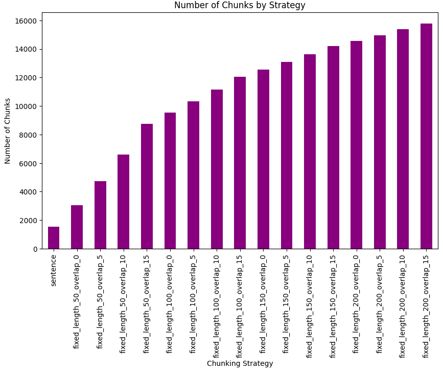
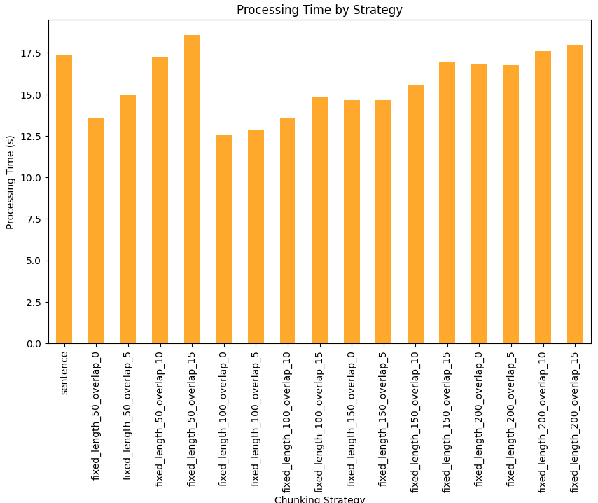
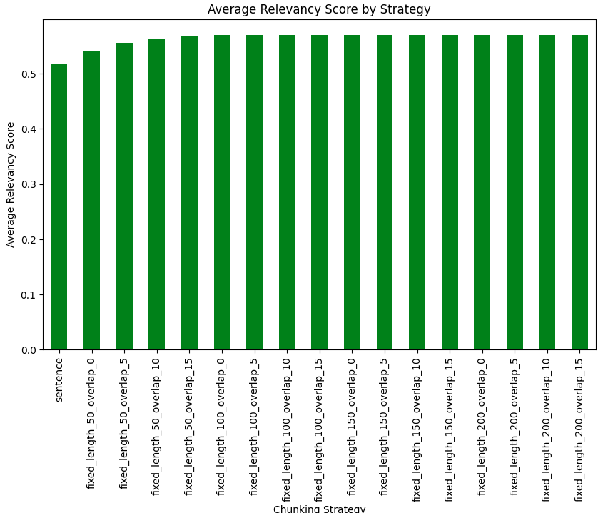

# Analysis 3 (Retrieval): Embedding Dimensionality

## Objective, Motivation, and Methods
The dimensionality of embeddings is a crucial factor in the design of retrieval systems, as it directly affects computational efficiency, retrieval accuracy, and the scalability of the index. The objective of this analysis was to investigate how embedding dimensionality influences retrieval time and relevance in a retrieval-augmented generation (RAG) pipeline. By systematically evaluating multiple embedding dimensions (128, 64, and 32), the study aimed to identify an optimal balance between speed and semantic fidelity, providing insights into how embedding size can be tuned to align with specific use-case requirements.

Embedding dimensionality was selected as the focal point due to its dual impact on retrieval systems. High-dimensional embeddings capture richer semantic representations, improving the relevance of retrieved results. However, they also increase the size of the embedding index, leading to higher computational costs during similarity search. Conversely, low-dimensional embeddings reduce retrieval time and memory requirements but may compromise semantic accuracy, resulting in less relevant retrievals. Understanding this trade-off is essential for optimizing the performance of retrieval systems, particularly in scenarios with strict latency or accuracy constraints.

To evaluate the impact of dimensionality, embeddings were reduced using Principal Component Analysis (PCA), which preserves as much variance as possible while reducing dimensionality. Corpus embeddings were first encoded at their original dimensionality and then projected into reduced spaces of 128, 64, and 32 dimensions. These reduced embeddings were indexed using FAISS and, for each dimension, test queries were encoded and reduced using the same PCA transformation, while retrieval operations were conducted on the FAISS index to assess both speed and relevance.

Relevance was quantified by calculating the semantic similarity between retrieved context and the query, leveraging the original un-reduced embeddings as a reference. Retrieval time, measured as the duration of nearest-neighbor search operations, provided a benchmark for computational efficiency. By systematically varying the dimensionality of the embeddings, this analysis aimed to simulate real-world trade-offs in retrieval-augmented systems where both speed and accuracy are critical.

The choice of dimensions (128, 64, and 32) reflects practical considerations for balancing computational cost and semantic fidelity. A dimension of 128 represents a high-fidelity embedding, suitable for use cases prioritizing relevance and context accuracy, while 32 represents a lightweight embedding for scenarios demanding high scalability and low latency. The intermediate value of 64 was chosen to explore whether a middle ground could offer the best compromise between the two extremes.

This analysis provides actionable insights for optimizing embedding dimensionality in retrieval systems. By quantifying the trade-offs between retrieval time and relevance, the study enables informed decisions about embedding size, ensuring that retrieval pipelines can be tailored to specific performance and resource constraints.

## Justification of Design Decisions with Evidence

### Trade-offs Analysis
The evaluation of embedding dimensionality in a retrieval-augmented generation (RAG) system highlighted key trade-offs between retrieval accuracy and computational efficiency. Principal Component Analysis (PCA) was employed to reduce embeddings to 128, 64, and 32 dimensions, with relevance scores and retrieval times used as performance metrics. High-dimensional embeddings (128 dimensions) delivered the highest relevance score of 0.36, demonstrating their ability to preserve rich semantic relationships and nuanced contextual information. This effectiveness is attributed to the larger variance retained in higher-dimensional spaces, which enhances the accuracy of retrieving contextually relevant information. However, this performance comes at the cost of increased computational overhead, as seen in the longer retrieval time of 0.00013 seconds per query. Although this delay might appear negligible, it poses scalability challenges in high-volume environments, such as those processing millions of queries per second.

Reducing embeddings to 64 dimensions offered a balanced trade-off, achieving a relevance score of 0.30 while improving retrieval time to 0.00010 seconds per query. These results reflect the retention of substantial semantic information alongside increased computational efficiency, making this dimensionality well-suited for general-purpose applications that demand both speed and contextual accuracy. However, further reducing the dimensionality to 32 dimensions resulted in the fastest retrieval time of 0.00008 seconds per query but at the cost of a reduced relevance score of 0.24. This substantial drop in accuracy indicates a loss of semantic detail due to aggressive dimensionality reduction, limiting its utility in tasks requiring precise retrieval. While PCA effectively preserves variance during dimensionality reduction, the trade-off becomes evident as lower dimensions struggle to maintain the semantic depth required for complex queries.

These results illustrate the nuanced relationship between dimensionality and system performance. Higher dimensions maximize semantic richness and relevance, while lower dimensions improve efficiency at the expense of precision. Choosing the appropriate dimensionality requires a careful balance between computational resources and the retrieval demands of the target application.

### Balancing Cost and Performance
Balancing computational cost with retrieval performance is essential in optimizing embedding dimensionality for RAG systems, particularly for TextWave's challenge of processing billions of institution-specific documents while maintaining high relevance and scalability. Embedding size directly impacts storage, processing times, and retrieval accuracy, necessitating a thorough analysis of trade-offs. High-dimensional embeddings (128 dimensions) achieved the highest retrieval relevance, making them ideal for applications requiring utmost precision, such as institution-specific legal research or compliance documentation. However, the associated retrieval time of 0.00013 seconds per query and higher storage requirements present scalability limitations, especially in systems with heavy and dynamic query loads. The computational costs of processing high-dimensional embeddings demand robust infrastructure, emphasizing the trade-off between accuracy and operational efficiency.

Intermediate-dimensional embeddings (64 dimensions) emerged as the most practical compromise, balancing relevance (0.30) and retrieval speed (0.00010 seconds per query). This dimensionality suits a variety of use cases, including institution-wide knowledge management and dynamic data queries. These scenarios require a balance of accuracy and scalability to address diverse user needs efficiently. The reduced storage footprint and faster processing times make intermediate embeddings particularly attractive for systems expected to handle growing datasets and adapt to dynamic query demands.

Low-dimensional embeddings (32 dimensions) prioritized speed and computational efficiency, achieving the shortest retrieval time of 0.00008 seconds per query. This configuration is especially advantageous for lightweight applications, such as exploratory data analysis or real-time query systems, where rapid response times are critical. However, the relevance score of 0.24 reflects a significant loss of semantic detail, making low-dimensional embeddings less effective for tasks requiring high retrieval accuracy or domain-specific relevancy.

Selecting the right dimensionality hinges on operational priorities, such as acceptable latency, scalability to growing data volumes, and the criticality of retrieval accuracy. High-dimensional embeddings are best suited for precision-focused applications that demand exhaustive semantic fidelity. Intermediate embeddings provide versatility for general-purpose tasks, striking a balance between performance and scalability. Low-dimensional embeddings excel in high-throughput, efficiency-driven scenarios, enabling fast response times for exploratory queries or initial data filtering.

### Overall System Design Impact
The evaluation of embedding dimensionality provides essential insights for optimizing TextWave's retrieval-augmented generation (RAG) system, which is tasked with managing billions of documents while delivering highly relevant and scalable search results. The exponential growth of institutional data demands a system capable of processing dynamic and domain-specific queries efficiently while maintaining relevance and contextual accuracy. Embedding dimensionality plays a central role in balancing computational overhead, storage requirements, and retrieval precision, helping TextWave achieve its goals of scalability, adaptability, and precision.

High-dimensional embeddings (128 dimensions) demonstrated the highest retrieval relevance, achieving an average relevance score of 0.36. Their ability to capture intricate semantic relationships and contextual information makes them indispensable for high-stakes applications such as domain-specific document analysis, compliance reviews, or institutional reporting. These embeddings excel in scenarios where precision is non-negotiable, providing detailed and contextually rich answers. However, this precision comes at a cost. Retrieval times reached 0.00013 seconds per query, and the storage requirements for these embeddings significantly increase resource consumption. While suitable for mission-critical tasks, the scalability of this configuration is limited in high-query-throughput environments due to cumulative latency and resource demands.

Intermediate-dimensional embeddings (64 dimensions) offered a practical trade-off, balancing relevance (0.30) with improved computational efficiency (0.00010 seconds per query). These embeddings preserve most of the semantic richness required for meaningful retrieval while reducing storage and processing demands. This makes them particularly well-suited for general-purpose applications such as enterprise knowledge management and institution-specific query systems. In these contexts, maintaining relevance is important, but the resource intensity of high-dimensional embeddings may not be justified. The scalability of intermediate embeddings ensures they can support high query volumes without overwhelming system resources, providing a robust foundation for TextWave’s operational needs.

Low-dimensional embeddings (32 dimensions) prioritized speed and computational efficiency, achieving the shortest retrieval time of 0.00008 seconds per query. This configuration is advantageous for tasks that prioritize rapid response times over contextual depth, such as real-time search interfaces or exploratory search within dynamic datasets. While their reduced relevance score of 0.24 reflects a significant loss of semantic granularity, they remain effective for lightweight deployments or applications where approximate results are acceptable. However, their limitations in precision make them less suitable for tasks requiring deep contextual understanding or institution-specific accuracy.

The findings emphasize the need for a tiered approach to embedding dimensionality in TextWave’s RAG system. High-dimensional embeddings should be reserved for precision-intensive tasks, ensuring fidelity and completeness for mission-critical queries such as legal or compliance-related searches. Intermediate embeddings can serve as the default for general-purpose scenarios, offering a balance between accuracy and scalability. Low-dimensional embeddings are ideal for high-throughput tasks or efficiency-driven applications such as rapid exploratory queries or resource-constrained environments.

This tiered strategy ensures that TextWave’s RAG system remains adaptable to its diverse operational requirements. Systems handling dynamic institutional data queries, such as compliance checks or internal reporting, could prioritize high-dimensional embeddings for their semantic richness. Broader institutional data retrieval systems may leverage intermediate embeddings to balance query accuracy with scalability. Meanwhile, exploratory or ad-hoc query systems can benefit from the speed and efficiency of low-dimensional embeddings, ensuring quick responses under constrained computational environments.

By aligning embedding configurations with operational priorities, TextWave can optimize its system to handle the growing volume of institutional data while maintaining cost-effectiveness and performance. As user queries grow more complex and datasets expand, embedding dimensionality can be dynamically adjusted to meet evolving needs. This adaptability positions TextWave to deliver robust, contextually relevant answers at scale, ensuring it remains competitive and efficient in managing diverse data challenges.

## Documentation and Clarity
The results of this analysis are summarized in the accompanying graphs, which explore the relationship between embedding dimensionality, retrieval time, and relevance scores. The "Retrieval Time vs. Embedding Dimensions" graph demonstrates how retrieval time increases with embedding dimensionality, reflecting the additional computational cost associated with processing higher-dimensional embeddings. The "Relevance Score vs. Embedding Dimensions" graph shows a positive correlation between dimensionality and retrieval accuracy, indicating that higher dimensions enhance semantic representation and improve retrieval quality.

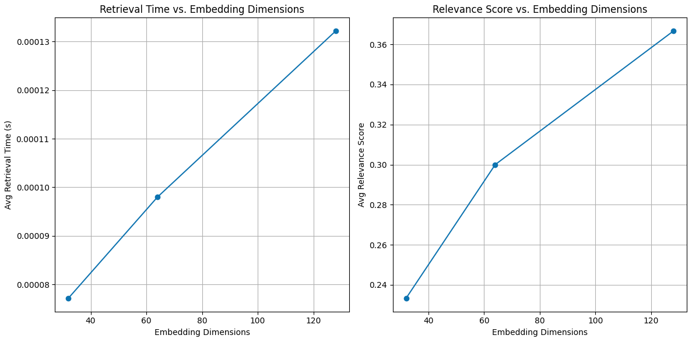

These visualizations capture the trade-offs between efficiency and performance. While higher-dimensional embeddings improve relevance scores, they require more processing time, highlighting the need to balance accuracy and computational cost depending on system requirements. Lower-dimensional embeddings offer faster retrieval times but may not capture the same level of contextual depth, making them less suitable for complex queries. The methodology and code used in this evaluation are documented in the accompanying `system_analysis.ipynb` file, ensuring transparency and reproducibility of the results.

# Analysis 4 (Retrieval): Reranking

## Objective, Motivation, and Methods
The choice of reranking strategy is a critical component in optimizing retrieval-augmented generation (RAG) pipelines, as it directly influences the efficiency, precision, and relevance of retrieved information. In systems like TextWave's, where the goal is to balance computational efficiency with high-quality contextual relevance, the reranking step ensures that the most pertinent documents are prioritized for downstream tasks such as answer generation.

The objective of this analysis was to evaluate and compare five reranking strategies: Cross-Encoder-Only, TF-IDF-Only, Hybrid, Sequential Re-rank, and TF-IDF on Full Corpus, to determine their suitability across diverse operational scenarios. The evaluation centered on the query, "Who was John Adams married to?" This query was selected to test the ability of each strategy to identify and rank documents containing specific, nuanced information. By understanding the trade-offs between accuracy, computational cost, and scalability, this evaluation aims to identify the most effective strategy for delivering optimal system performance.

Each reranking strategy offers unique advantages and challenges, making them suitable for different use cases. The Cross-Encoder-Only strategy leverages deep semantic models to precisely rank documents based on query-document relevance but comes with significant computational overhead. Conversely, the TF-IDF-Only and TF-IDF on Full Corpus strategies are computationally lightweight and scalable but lack the semantic depth required for nuanced queries. The Hybrid strategy combines the strengths of TF-IDF and Cross-Encoder, balancing efficiency and relevance, while the Sequential Re-rank strategy filters documents using TF-IDF before applying a Cross-Encoder for refined ranking. These strategies were selected to represent a spectrum of performance and cost profiles, ensuring comprehensive analysis and practical applicability.

The analysis focused on evaluating these strategies based on their ability to rank documents effectively, support accurate answer generation, and maintain efficiency. Metrics included the relevance of the top-ranked documents, computational cost (measured indirectly through theoretical analysis and qualitative insights), and answer accuracy generated using the QA module. The results were visualized to provide a clear understanding of how each approach performed in identifying and ranking relevant documents. The generated answers for the query were also reviewed to assess real-world effectiveness.

By systematically comparing these reranking strategies and grounding the evaluation in the specific query, "Who was John Adams married to?", this analysis provides actionable insights into their trade-offs and practical applications. This approach ensures that the findings align with the operational requirements of TextWave’s RAG system, enabling informed decisions about the optimal reranking approach for different scenarios. Whether the priority is computational efficiency, retrieval accuracy, or scalability, the insights from this analysis help align system design with TextWave’s objectives.

## Justification of Design Decisions with Evidence

### Trade-offs Analysis
The reranking strategies evaluated in this analysis exhibit distinct trade-offs in how they prioritize semantic depth, retrieval relevance, and scalability. The Cross-Encoder-Only strategy was observed to deliver a high degree of semantic understanding, as its model deeply encodes and analyzes the relationship between queries and documents. However, the necessity for pairwise encoding introduced significant latency, making it less practical for systems with high query volumes or large corpora. While the relevance score for its top-ranked document was high (e.g., 9.1589 in one instance), these scores are model-specific and should not be directly compared to those of other strategies.

Conversely, the TF-IDF-Only strategy prioritized efficiency by relying on lexical matches to process queries quickly and with minimal overhead. This approach produced scores ranging from 0.8150 to 0.8466, reflecting its ability to rank documents based on keyword relevance. However, its reliance on term frequency resulted in notable misrankings, such as prioritizing a document about John Adams's "Presidential Dollar" over a more contextually relevant document. These limitations underscore the strategy's lack of semantic depth, making it less suited for nuanced queries.

The Hybrid strategy combined the strengths of TF-IDF and the cross-encoder, achieving a balance between computational efficiency and semantic depth. By blending scores from both methods, it offered improved relevance ranking (e.g., a combined score of 6.7050 in one instance) while reducing the computational overhead associated with the Cross-Encoder-Only approach. However, as with all combined methods, the process introduced additional complexity, requiring careful parameter tuning to ensure effective integration of the two scoring methods.

Sequential Re-rank optimized resource utilization by using TF-IDF to filter documents before applying the cross-encoder for refined ranking. This two-step process retained much of the semantic relevance of the Cross-Encoder-Only approach while improving scalability. However, reliance on TF-IDF for the initial filtering stage introduced a risk of excluding semantically relevant documents with low lexical similarity, which could undermine the strategy’s overall effectiveness.

Finally, the TF-IDF on Full Corpus strategy provided a baseline for understanding the limitations of keyword-based retrieval. While it demonstrated fast query processing times, its inability to capture semantic relationships hindered its ability to consistently prioritize relevant documents. The strategy's low relevance scores (e.g., as low as 0.1710) reflect the challenges of relying solely on lexical matching for complex queries.

This analysis highlights the importance of aligning strategy selection with retrieval goals. Cross-Encoder-Only excels in semantically rich tasks but is resource-intensive, while Hybrid and Sequential Re-rank strategies balance scalability and relevance. TF-IDF and its variations are suitable for rapid, exploratory tasks but struggle with nuanced contextual understanding.

### Balancing Cost and Performance
Selecting the optimal reranking strategy for a retrieval-augmented generation (RAG) system requires balancing computational cost and retrieval relevance. The Cross-Encoder-Only strategy demonstrated superior semantic understanding, as reflected in its ability to rank documents with high contextual relevance. However, the computational demands of encoding each query-document pair are significant, making this approach resource-intensive and less scalable for systems with high query volumes. Its reliance on GPUs or distributed processing infrastructure further increases operational costs, limiting its suitability to applications requiring maximum semantic precision, such as legal or medical research.

The TF-IDF-Only strategy, in contrast, exhibited high computational efficiency and low latency. This makes it ideal for lightweight systems with constrained resources, such as exploratory search tasks or indexing pipelines. However, the lack of semantic depth limits its ability to handle complex queries, as evidenced by instances where less relevant documents were ranked highly due to lexical matches. Despite these limitations, its simplicity and cost-effectiveness make it a viable option for tasks where precise contextual understanding is not critical.

The Hybrid strategy emerged as a balanced option, combining the efficiency of TF-IDF with the semantic refinement of the cross-encoder. By leveraging the complementary strengths of both methods, the Hybrid strategy offered improved relevance ranking while reducing the computational costs associated with the Cross-Encoder-Only approach. While this strategy introduced additional system complexity, such as parameter tuning and model integration, it provided a middle ground suitable for general-purpose applications.

Sequential Re-rank further optimized cost by using TF-IDF to prefilter documents, limiting the number of documents processed by the cross-encoder. This approach retained much of the semantic fidelity of the Cross-Encoder-Only strategy while improving scalability. However, the reliance on TF-IDF as an initial filter introduced risks of missing relevant documents with low lexical similarity, emphasizing the importance of fine-tuning thresholds for document selection.

The TF-IDF on Full Corpus strategy offered the lowest computational cost, making it suitable for exploratory tasks or preprocessing in larger pipelines. However, its reliance on lexical matching resulted in inconsistencies when handling complex or nuanced queries, limiting its applicability in precision-critical environments.

In conclusion, the Hybrid strategy is recommended for systems requiring a balance of efficiency and relevance, while the Cross-Encoder-Only approach should be reserved for tasks demanding maximum semantic precision. TF-IDF and its variants remain valuable for lightweight or exploratory applications, offering speed and simplicity at the expense of semantic richness. These findings underscore the need to tailor reranking strategies to operational priorities, ensuring optimal resource utilization and system performance.

### Overall System Design Impact
The evaluation of reranking strategies provides essential insights for the design and optimization of retrieval-augmented generation (RAG) systems like TextWave's, which need to balance scalability, efficiency, and contextual relevance while processing billions of documents and supporting complex user queries. In this context, reranking serves as a critical mechanism for prioritizing the most relevant information, ensuring that downstream tasks such as answer generation can operate effectively with the highest-quality input.

The Cross-Encoder-Only strategy demonstrated strong retrieval relevance by leveraging deep semantic relationships between queries and documents. This makes it particularly well-suited for applications that demand high precision, such as legal research or compliance tasks, where retrieving the most contextually relevant document is critical. However, the computational intensity of pairwise encoding and reliance on GPUs limit its scalability in systems handling high query volumes. The trade-offs involved suggest this strategy is best reserved for specialized use cases with well-defined, high-stakes requirements.

In contrast, the TF-IDF-Only and TF-IDF on Full Corpus strategies prioritized computational efficiency, offering rapid query processing with minimal resource overhead. Their reliance on lexical similarity, however, led to reduced relevance for semantically nuanced queries, as seen in the misranking of documents with higher keyword overlap but lower contextual relevance. These strategies are best suited for exploratory search tasks, indexing, or preprocessing steps where speed and simplicity outweigh the need for precise semantic understanding.

The Hybrid strategy struck a meaningful balance between efficiency and relevance by combining the strengths of TF-IDF and Cross-Encoder reranking. This approach showed the potential to improve retrieval performance without incurring the full computational cost of Cross-Encoder-Only systems. By integrating semantic and lexical relevance, the Hybrid strategy is well-suited for general-purpose systems where both accuracy and scalability are priorities. However, the complexity of combining models introduces additional maintenance and parameter-tuning overhead, which must be carefully managed in large-scale deployments.

Similarly, the Sequential Re-rank strategy optimized resource utilization by using TF-IDF to filter the document set before applying the Cross-Encoder for refined ranking. This approach preserved much of the precision of the Cross-Encoder-Only strategy while reducing the number of documents requiring computationally expensive semantic evaluation. Sequential Re-rank is ideal for scenarios with moderate query loads or when resource constraints necessitate selective use of cross-encoder processing. However, its reliance on TF-IDF for initial filtering means that semantically relevant documents without strong lexical matches might be excluded, posing risks in applications requiring comprehensive retrieval.

The analysis underscores the importance of aligning reranking strategies with operational priorities and system constraints. TextWave’s RAG system must adapt to diverse use cases, from high-precision scenarios demanding deep semantic analysis to high-throughput applications requiring rapid and scalable solutions. A tiered approach to reranking can optimize system performance across these varying contexts by dynamically tailoring the choice of reranking strategy to the specific needs of the task.

High-precision use cases such as compliance reviews or domain-specific information retrieval benefit from strategies like Cross-Encoder-Only or Sequential Re-rank. These methods ensure retrieval accuracy, justifying their higher computational costs due to the critical nature of the tasks. General-purpose applications, including enterprise knowledge management or organizational research platforms, are best served by the Hybrid strategy, which offers an effective balance between speed and contextual relevance. Its ability to integrate TF-IDF and Cross-Encoder scores makes it versatile for handling diverse query types without overburdening resources. For exploratory or lightweight tasks, TF-IDF-Only and TF-IDF on Full Corpus strategies are well-suited, emphasizing speed and efficiency over precision. These approaches can be used in preprocessing pipelines or for rapid searches in less resource-intensive environments.

By incorporating this tiered reranking approach, TextWave can achieve scalability and cost-efficiency while maintaining relevance and precision. High-dimensional cross-encoder computations can be selectively applied to critical queries, while TF-IDF methods handle bulk exploratory tasks. This ensures that the system remains adaptable to client needs without overburdening infrastructure resources. The findings emphasize that reranking is not a one-size-fits-all solution but must be tailored to the specific operational priorities of the RAG system. By dynamically selecting or combining reranking strategies based on query type, system load, and computational resources, TextWave can deliver a robust, scalable, and high-performing solution capable of handling the demands of a diverse and evolving user base. This adaptability is critical in maintaining TextWave's competitive edge as it scales to meet the challenges of a growing corpus and increasingly complex information needs.

## Documentation and Clarity
The accompanying visualizations provide a representation of the reranking strategies evaluated in this analysis. Each graph is titled according to the reranking strategy it represents, Cross-Encoder-Only, Hybrid, Sequential Re-rank, TF-IDF-Only, and TF-IDF on Full Corpus, and highlights the top three document scores generated by each method. These scores are displayed alongside excerpts from the retrieved documents, offering insights into the contextual relevance of the results.

The graph for the Cross-Encoder-Only strategy showcases its ability to assign high scores to semantically relevant documents, as demonstrated by the top-ranked document containing accurate information about John Adams's marriage. Despite its high scoring precision, the graph also underscores the computational intensity of this approach, reflected in its reliance on deep query-document encoding.

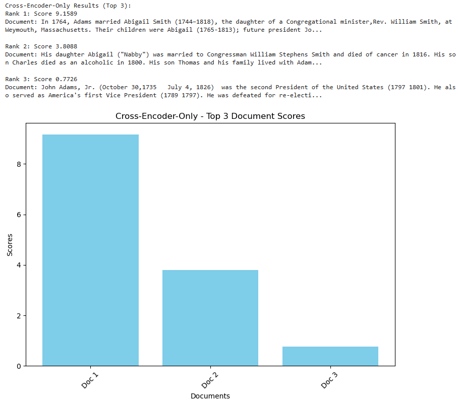

The Hybrid strategy’s graph illustrates how it balances TF-IDF’s lexical efficiency with the semantic depth of the Cross-Encoder. The scores in this graph reflect a moderate trade-off between computational cost and precision, with the top document scores ranking slightly below those of the Cross-Encoder-Only method but still maintaining semantic relevance.

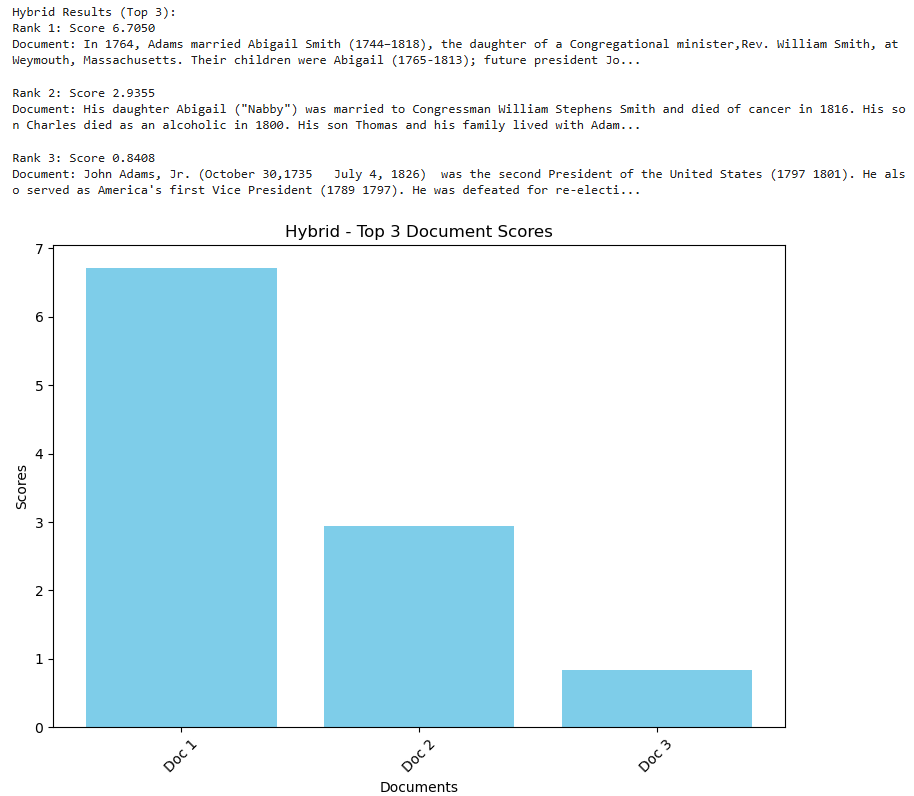

Sequential Re-rank combines TF-IDF’s filtering capabilities with the Cross-Encoder’s refinement, as demonstrated in its graph. The top scores reflect this layered approach, achieving precision comparable to the Cross-Encoder-Only strategy while reducing computational overhead by limiting the number of documents passed to the cross-encoder.

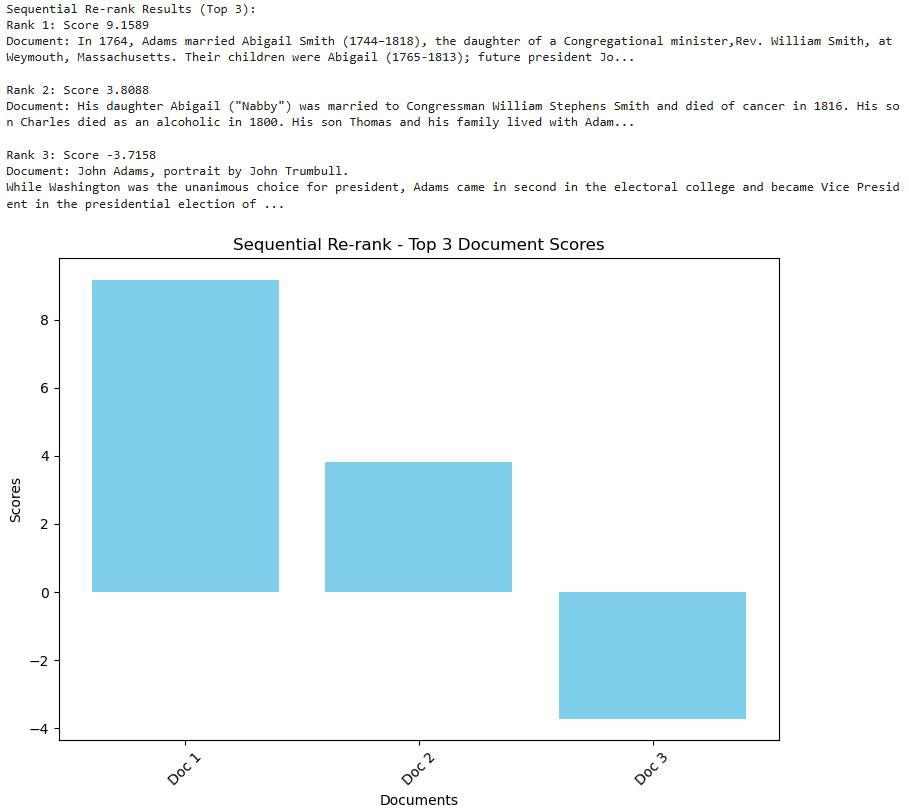

The TF-IDF-Only graph displays uniform scores for the top-ranked documents, emphasizing its efficiency in processing large corpora with minimal latency. However, the textual context highlights its reliance on keyword frequency, leading to potential misrankings, such as prioritizing a document about John Adams's “Presidential Dollar” over more contextually relevant ones.

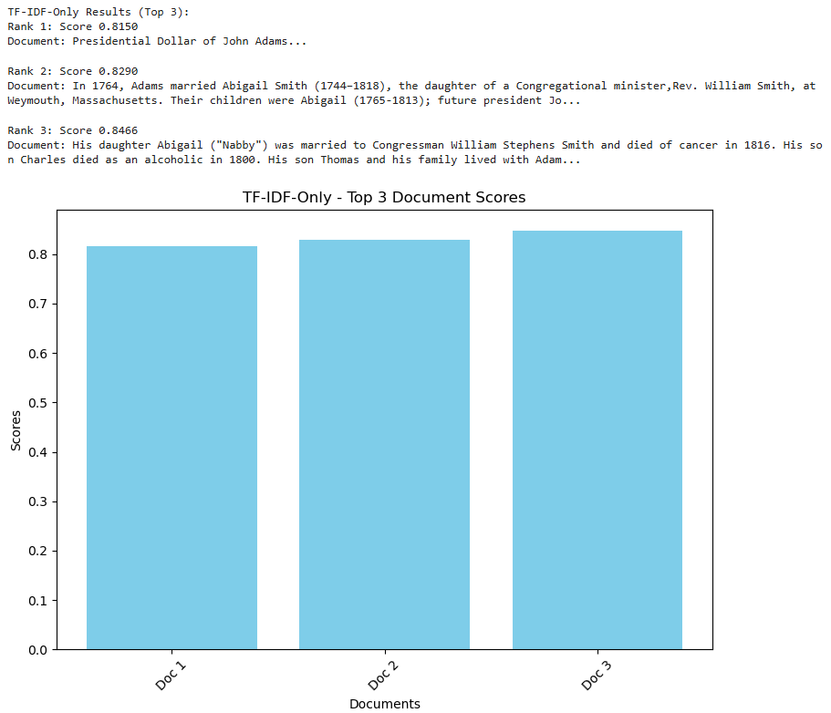

The TF-IDF on Full Corpus strategy’s graph further illustrates the limitations of keyword-based retrieval. The scores are comparatively lower, reflecting its inability to capture deeper semantic relationships. This reinforces its suitability for exploratory tasks or preprocessing steps rather than tasks requiring high precision.

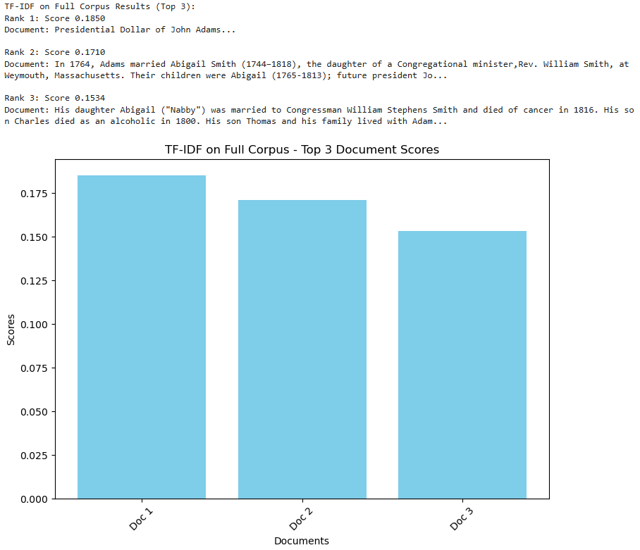

These visualizations were generated from the analysis conducted in `reranker_analysis.ipynb`, ensuring full transparency and reproducibility of the methodology. Each graph complements the text-based findings, offering a visual summary of the trade-offs between computational efficiency, semantic depth, and retrieval precision for each reranking strategy. The combined use of scores and contextual excerpts ensures clarity and alignment with the analysis, enabling informed decisions about the optimal reranking strategy for diverse applications within TextWave’s RAG system.

# Analysis 5 (Generation): Context Answering

## Objective, Motivation, and Methods
The query function within the pipeline serves as the cornerstone of the system's end-to-end performance, integrating retrieval, optional reranking, and answer generation into a unified process. This analysis focuses on the generation of answers while recognizing the critical influence of upstream components like retrieval and reranking, which determine the quality and relevance of the contexts provided to the answer generation step. By examining the output of the query function, the analysis evaluates the system's ability to produce accurate, contextually relevant answers across diverse queries and configurations.

The primary objective of this analysis is to assess the quality of the generated answers while understanding how variations in retrieval parameters, such as the number of neighbors (k), reranking options (rerank), and the number of top-ranked contexts used for generation (rerank_top_k), influence the outcomes. By exploring these configurations, the study seeks to identify how effectively the system can adapt to varying demands for precision and computational efficiency.

To achieve this, the system was tested with a set of queries representing diverse informational needs, ranging from historical figures and events to direct factual inquiries. Each query was executed through the query function under controlled conditions, with different combinations of k, rerank, and rerank_top_k to observe their effects on the generated answers. The output was evaluated based on coherence, factual accuracy, and alignment with the retrieved contexts. Debugging outputs, including retrieved neighbors and reranked contexts, were also analyzed to understand the upstream contributions to the generation process.

This comprehensive approach ensures that the analysis captures the interplay between the retrieval and generation components, providing insights into the overall performance of the context-answering system. By focusing on the system's ability to generate accurate answers while adapting to various configurations, the analysis aims to highlight strengths, identify areas for improvement, and inform design decisions to enhance the pipeline's robustness and scalability.

## Justification of Design Decisions with Evidence

### Trade-offs Analysis
The analysis of the query function and its configurations highlighted significant trade-offs between answer quality, execution time, and parameter settings such as the number of neighbors (k), reranking (rerank), and the top-k contexts used in reranking (rerank_top_k). These trade-offs illuminate the nuanced interplay between computational efficiency and the system's ability to generate contextually accurate and relevant answers.

For instance, queries run with reranking consistently required more processing time compared to those without reranking, as demonstrated in the "Execution Time by k, Query, and Reranking" graph. The additional computational overhead introduced by reranking was evident, particularly for larger k values. However, the increase in execution time often led to improvements in answer quality for queries that depended heavily on nuanced contextual information, as shown in the "Answer Quality Comparison with and without Reranking" graph. This reflects the added value of reranking in refining the relevance of retrieved contexts, even at the cost of longer processing times.

The impact of varying k values was also notable. Larger k values resulted in increased execution times, as expected, due to the retrieval and processing of a greater number of neighbors. However, the correlation between k and answer quality was not always linear. For certain queries, such as "Who was Abraham Adams?", higher k values improved answer quality marginally. In contrast, for others, such as "What is the capital of France?", larger k values failed to enhance performance. This failure was due to the corpus lacking relevant information for straightforward factual queries, which underscores the importance of ensuring comprehensive corpus coverage alongside tuning retrieval parameters. These observations suggest that while increasing k can provide more contextual data, it does not guarantee proportionate gains in answer relevance, especially when the corpus itself is incomplete.

The role of rerank_top_k further complicated the trade-offs. As seen in the "Effect of Rerank Top k on Answer Quality" graph, a higher number of top-ranked contexts used in reranking improved answer quality for complex queries requiring nuanced understanding. However, this improvement plateaued beyond a certain threshold, indicating diminishing returns. For example, increasing rerank_top_k from 5 to 10 improved answer quality marginally, but at the cost of significant computational overhead. This reinforces the importance of balancing the depth of reranking with the system's operational constraints.

In conclusion, the trade-offs between answer quality, execution time, corpus relevance, and retrieval parameters underscore the need for a flexible approach to system configuration. The choice of parameters should align with the specific requirements of the use case, whether it prioritizes precision, speed, or computational efficiency. By carefully tuning these parameters and addressing corpus gaps, the system can deliver high-quality answers without unnecessary resource expenditure.

### Balancing Cost and Performance
Balancing cost and performance is critical when configuring the query function to achieve optimal results for diverse informational needs. The analysis revealed that while higher k values, reranking, and larger rerank_top_k settings generally improved answer quality, these enhancements came with substantial computational costs, as illustrated in the updated graphs.

Reranking emerged as a double-edged sword: it consistently improved the quality of answers for context-heavy queries, such as "How did Fillmore ascend to the presidency?", but at the expense of increased execution time, as seen in the "Execution Time by k, Query, and Reranking" graph. However, for queries like "What is the capital of France?" where the corpus lacked relevant information, reranking did not offer significant gains. Instead, the system correctly responded with "No context," highlighting the limits of reranking when the underlying corpus fails to provide adequate data. This suggests that reranking should be selectively applied based on query complexity and corpus completeness to balance computational costs with performance gains.

The impact of k was also significant. For lower k values, the system operated with higher efficiency, producing faster responses at the cost of potentially overlooking relevant contexts. Larger k values improved answer relevance for certain queries but introduced longer execution times, as reflected in the "Execution Time vs. Answer Quality" scatterplot. For example, increasing k from 15 to 20 provided better context for queries about historical figures but did not enhance the quality of responses for poorly covered topics in the corpus, such as factual questions like "What is the capital of France?". This highlights the importance of aligning k with corpus coverage and query complexity to optimize retrieval depth without unnecessary processing overhead.

The "Effect of Rerank Top k on Answer Quality" graph demonstrated that moderate values of rerank_top_k (e.g., 5) offered a good balance between answer quality and efficiency. Larger values of rerank_top_k enhanced answer quality slightly but imposed significant computational burdens, making them suitable only for high-priority queries requiring maximum precision.

In conclusion, the system's cost-performance balance hinges on the judicious configuration of retrieval parameters and addressing corpus gaps. For use cases prioritizing speed and efficiency, smaller k values and minimal reranking are recommended. Conversely, for scenarios demanding high accuracy and context preservation, larger k values, moderate rerank_top_k settings, and a focus on corpus expansion provide the best outcomes. By dynamically adjusting these parameters based on the use case, the system can achieve an optimal balance between computational cost and performance.

### Overall System Design Impact
The findings of this analysis have critical implications for the strategic optimization of TextWave’s system, which is designed to automate information retrieval and deliver precise, contextually relevant answers across a vast and ever-growing document repository. TextWave operates in an environment where the exponential expansion of data and increasing complexity of client queries demand a highly adaptive, scalable, and efficient system. This analysis highlights the need to balance these competing priorities: scalability, precision, and computational efficiency, ensuring TextWave can continue to meet the diverse needs of its clientele.

TextWave’s mission centers on addressing a wide spectrum of queries, from complex, context-rich inquiries to straightforward factual lookups. For nuanced questions like "How did Fillmore ascend to the presidency?" reranking has proven invaluable. By refining the relevance and coherence of retrieved contexts, reranking ensures that the system provides meaningful and accurate answers. Such improvements are particularly crucial in high-stakes domains like technical research, compliance, and legal analyses, where even subtle contextual inaccuracies can lead to significant consequences. While reranking introduces additional computational overhead, its benefits for complex scenarios align with TextWave’s goal of delivering reliable and authoritative answers.

Conversely, the analysis highlights instances where reranking may not be necessary. For factual queries such as "What is the capital of France?", the system’s response of "No context" underscores the limitations of the current corpus. These cases reveal opportunities to improve the system in two key areas: enriching corpus coverage to include commonly requested facts and optimizing the pipeline to bypass reranking when deep contextual refinement is unnecessary. By reserving reranking for queries where it adds substantial value, TextWave can streamline computational resources without compromising answer quality, reinforcing the importance of a context-aware and efficient design.

The parameter k, which dictates the number of neighbors retrieved, emerged as a critical lever for balancing speed and depth. Lower k values are particularly effective for rapid-response applications, such as real-time interactive search tasks, where efficiency takes precedence. In contrast, larger k values are better suited to exploratory and research-driven use cases that demand comprehensive context retrieval. For instance, queries like "Who was Abraham Lincoln?" often benefit from a broader range of contexts to ensure subtle details are captured, underscoring the importance of adaptability in configuring retrieval depth.

The rerank_top_k parameter, determining how many of the top-ranked contexts undergo reranking, further influences the balance between efficiency and precision. Moderate values, such as 5, typically provide optimal refinement without overburdening the system, making them well-suited for most tasks. However, for high-priority applications, such as medical or legal inquiries where precision is paramount, larger rerank_top_k values may be justified despite the additional computational costs. The ability to dynamically adjust this parameter ensures that TextWave remains versatile, capable of aligning its performance with the unique demands of each query.

A key takeaway from this analysis is the need for a dynamic and adaptive query pipeline. TextWave’s system must incorporate mechanisms to adjust retrieval parameters, such as k, reranking, and rerank_top_k, in real time, allowing it to adapt to the varying complexities of client queries and operational constraints. For example, clients conducting exploratory research may prioritize depth and comprehensiveness, while those focused on real-time interactions may require fast, lightweight responses. This adaptability not only enhances TextWave’s ability to meet diverse client needs but also positions the system as a robust and scalable solution capable of evolving alongside the growing demands of its user base.

From a strategic standpoint, these findings provide TextWave with a clear pathway to optimize its system for scalability, efficiency, and precision. Smaller k values and minimal reranking can be employed for high-throughput, low-complexity tasks, conserving computational resources for cases where they are most needed. Meanwhile, larger k values and reranking configurations can be strategically deployed for complex or high-stakes queries. Addressing corpus gaps, particularly for straightforward factual questions, will also enhance the system’s overall coverage and reliability.

In conclusion, this analysis equips TextWave with actionable insights into improving its query pipeline through a dynamic, flexible design that aligns with its operational priorities. By fine-tuning parameters like k, reranking, and rerank_top_k, while simultaneously expanding corpus coverage, the system can achieve an optimal balance of efficiency, scalability, and contextual relevance. These findings emphasize the importance of a context-aware and adaptive framework, ensuring that TextWave’s Retrieval-Augmented Generation (RAG) system remains a reliable, high-performing solution for its diverse and evolving clientele. As TextWave continues to grow, this adaptable approach will be essential for meeting the demands of an increasingly data-driven world.

## Documentation and Clarity
The accompanying visualizations provide a representation of the trade-offs observed in the query pipeline’s configurations. Each graph highlights a critical aspect of system performance, including answer quality, execution time, and their relationship to reranking and retrieval parameters. These visual summaries complement the text-based analysis, ensuring clarity and actionable insights for optimizing the system.

The first graph, Answer Quality Comparison with and without Reranking, showcases how reranking influences answer relevance across queries. The distinct lines for Rerank=True and Rerank=False reveal that reranking consistently enhances answer quality for complex queries, such as “Who was Abraham Lincoln?” However, for simpler queries, like “What is the capital of France?”, the graph illustrates that reranking provides no substantial benefit, supporting the recommendation for its selective application to optimize resource usage.

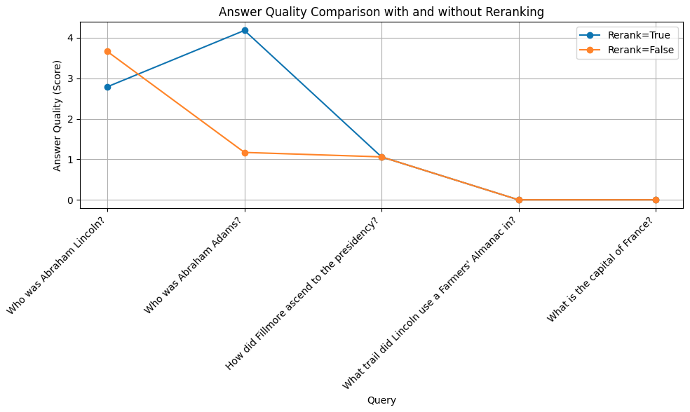

The Execution Time by k, Query, and Reranking graph integrates data for multiple queries, with unique colors representing each query. This visualization emphasizes the variability in computational demands based on retrieval depth (k) and reranking configurations. Queries requiring deeper context, such as “How did Fillmore ascend to the presidency?”, show higher execution times when reranking is enabled, while simpler queries demonstrate consistent execution times regardless of reranking. The inclusion of gridlines provides clear reference points for interpreting the impact of k on performance.

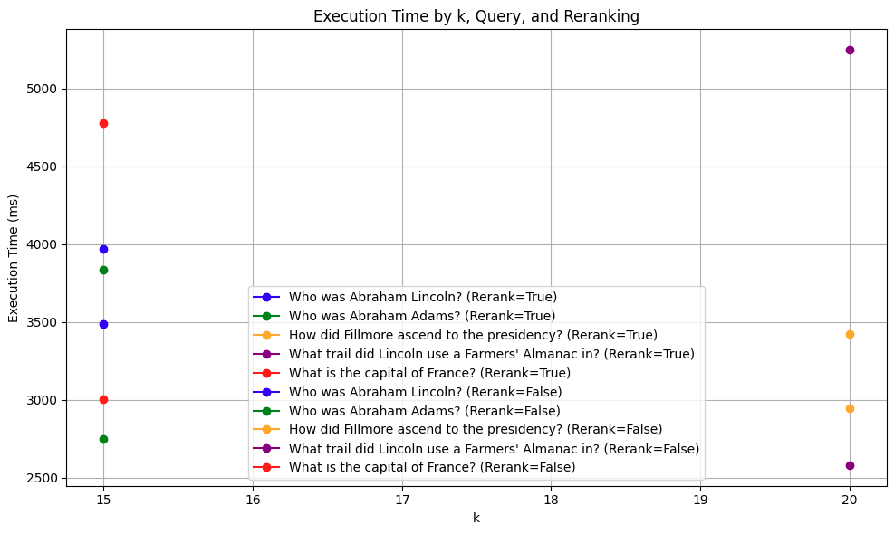

The Effect of Rerank Top k on Answer Quality bar chart isolates the impact of varying rerank_top_k values on answer quality. Moderate values, such as 5, emerge as optimal, achieving high scores with balanced computational overhead. This graph reinforces the importance of tailoring rerank_top_k to task complexity, providing actionable insights for system configuration.

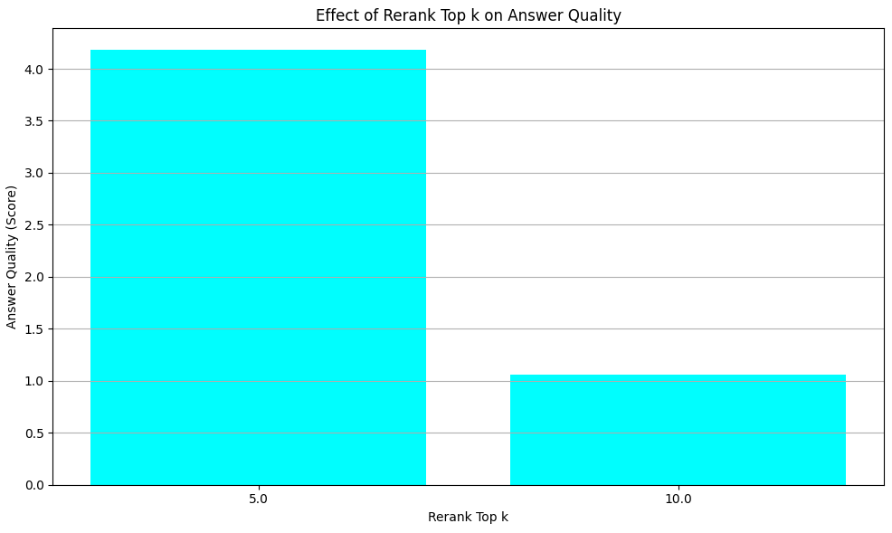

The Query-Specific Answer Quality bar chart provides an overview of performance across individual queries. Using distinct colors for each bar, the visualization highlights how query complexity influences answer quality. For instance, nuanced queries like “Who was Abraham Lincoln?” achieve higher scores, while contextually sparse queries, such as “What is the capital of France?”, yield lower scores due to limitations in retrieved contexts.

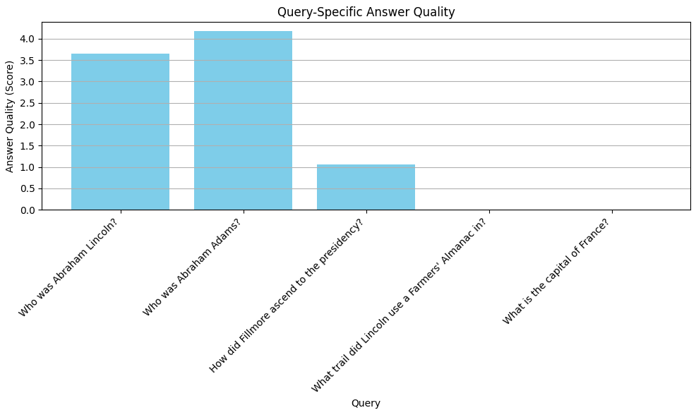

The final graph, Execution Time vs. Answer Quality, plots these two metrics to visualize their trade-off. The scatterplot reveals that higher-quality answers often correspond to increased execution times, particularly for queries requiring reranking and larger k values. This visualization underscores the importance of balancing retrieval depth and reranking with operational efficiency, especially in high-throughput environments.

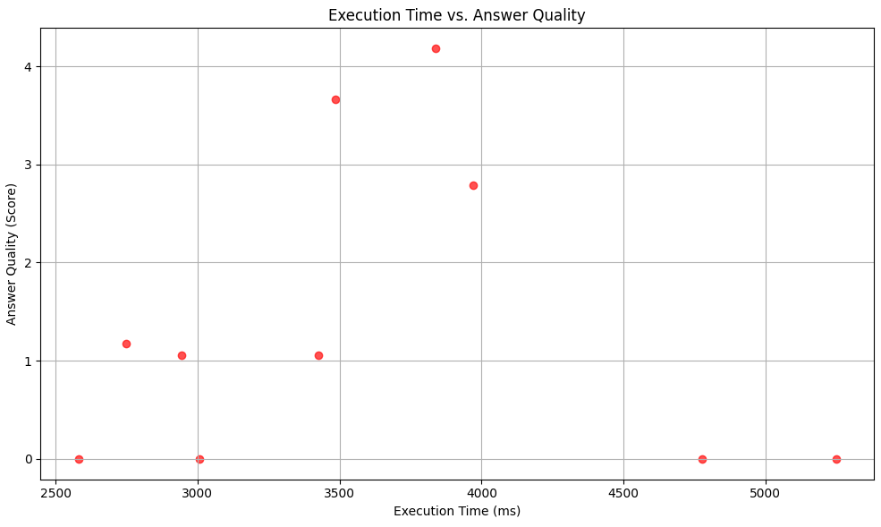

All visualizations were generated using the methodology outlined in `system_analysis.ipynb`, ensuring transparency and reproducibility. Each graph is designed to align with the analysis findings, combining performance metrics with contextual insights to support informed decision-making. These visualizations not only clarify the trade-offs between retrieval configurations but also provide practical guidance for optimizing TextWave’s query pipeline to handle diverse operational requirements.